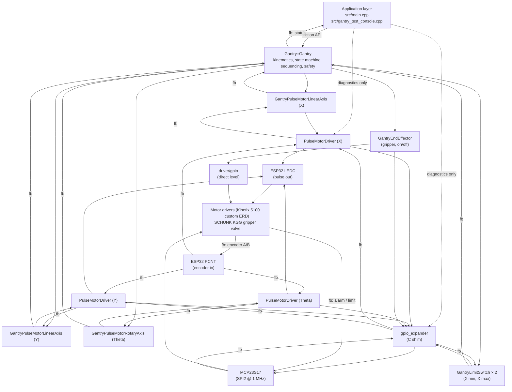
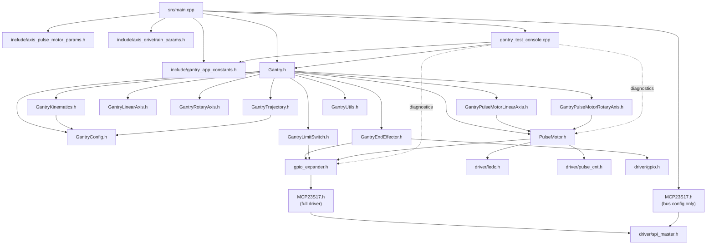

# Libraries Overview — WT32-ETH01 Gantry Controller

**Scope:** what each library is for, how the libraries stack on top of each other, and when you'd reach for each one.

For exact function signatures, pin numbers, and build/flash steps, see `PROGRAMMING_REFERENCE.md`. This file is the "big picture" companion.

> *The canonical control-and-feedback flow, signal routing table, and layered invariants live in [`lib/Gantry/docs/ARCHITECTURE_FLOW.md`](lib/Gantry/docs/ARCHITECTURE_FLOW.md). This file's §1 diagram and §3 dependency graph are derived from that source; if they drift, treat ARCHITECTURE_FLOW.md as authoritative.*

---

## 1. System Architecture at a Glance



Reading the tree: the application commands `Gantry` **and only `Gantry`**. `Gantry` owns three downstream siblings — three axis wrappers (one per physical axis), one `GantryEndEffector` for the digital gripper, and the `GantryLimitSwitch` objects for homing and safety. Each axis wrapper owns exactly one `PulseMotorDriver`, which in turn owns LEDC (pulse output) and PCNT (encoder input) directly and uses `gpio_expander` for every other digital line (DIR, ENABLE/SON, ALARM, ALARM_RESET). `gpio_expander` is the single owner of the MCP23S17 handle and decides whether an integer pin is an MCP logical pin (`0..15`), a direct ESP32 GPIO (`>= 0x10` or flagged via `GPIO_EXPANDER_DIRECT_PIN`), or unwired (`-1`). Each axis independently picks its drivetrain topology (ballscrew, belt, rack-pinion, rotary-direct) via a `DrivetrainType` enum in `include/axis_drivetrain_params.h`, so mix-and-match is native.

The **dotted** arrows from the application layer to `gpio_expander` and `PulseMotor` represent the `gantry_test_console` diagnostic commands (`mcp_reg`, `mcp_dump`, `mcp_pin_mode`, `gpio_drive`, `x_pulse_raw`, …). This is a deliberately-separate diagnostic channel used for bring-up and register-level debugging; it is **not** the motion control path and must not be imitated by new application code.

Every `fb:`-prefixed edge is an **upstream feedback** edge: encoders flow `HW → PCNT → PulseMotor`, alarms and limit states flow `HW → MCP → gpio_expander → PulseMotor / GantryLimitSwitch`, and from there the signal climbs the axis wrappers into `Gantry` and finally surfaces as status telemetry at the application layer (e.g. the `LIVE POS` output, the `status` console command, and — when the MQTT plan lands — the outbound `gantry/status` topic). `GantryEndEffector` has no feedback edge because the gripper is a digital output with no sensed state in this revision. See [`lib/Gantry/docs/ARCHITECTURE_FLOW.md`](lib/Gantry/docs/ARCHITECTURE_FLOW.md) §3 for the full signal routing table.

---

## 2. Library Catalogue

### 2.1 `lib/MCP23S17` — SPI GPIO expander driver

**Role:** Low-level driver for the Microchip MCP23S17 16-bit SPI GPIO expander chip. Knows the chip's register map and how to talk to it over an ESP-IDF SPI master bus.

**Language:** C (ESP-IDF style), works from both C and C++ callers.

**What it provides**

- A `mcp23s17_handle_t` opaque handle per device.
- Per-pin direction, pull-up, write, read.
- Port-level (8-bit) read/write for fast group operations.
- Interrupt configuration (pin-change).
- Debug-level raw register read/write (`IOCON`, `IODIR`, `GPPU`, `OLAT`, `GPIO`).
- **Internal FreeRTOS mutex** per device that wraps every `spi_device_transmit` call, so multiple tasks can share one expander safely.

**What it does not do**

- It does **not** know anything about which of its pins correspond to which signal in your application. The pin-to-role mapping lives in `include/gantry_app_constants.h` at the application layer.
- It does **not** know about direct ESP32 GPIO. That's the `gpio_expander` layer's job.
- It does **not** manage addresses for multiple MCP devices on the same bus beyond the `device_address` field in its config — the application owns the handle list.

**When to use**

- Any time you need to touch a pin on the MCP23S17 — but in practice you should go through `gpio_expander` instead so the "is this MCP or direct?" question has one answer.
- Direct use is appropriate only for register-level diagnostics (see the `mcp_reg`, `mcp_dump` console commands which call the `*_debug_*_register` helpers).

**Key files**

- `lib/MCP23S17/src/MCP23S17.h` — public C API
- `lib/MCP23S17/src/MCP23S17.cpp` — SPI transaction glue + mutex

**Why the mutex matters**

Without the per-device mutex, concurrent SPI transactions from `GantryUpdate` (reading limit/alarm pins) and `SerialCmd` (register dumps, `grip`) trigger `spi_device_transmit ... ret_trans == trans_desc` assertions. The mutex serializes every read/write register path inside the driver, so callers don't have to coordinate.

---

### 2.2 `include/gpio_expander.h` + `src/gpio_expander.c` — GPIO routing shim

**Role:** Tiny C abstraction sitting between the application and `MCP23S17`. Its job is to own **one** global MCP handle and decide whether a given pin integer means "MCP pin" or "this is invalid, talk to `driver/gpio.h` instead".

**Language:** C.

**API surface (5 functions + encoding macros)**

```c
bool      gpio_expander_init          (const mcp23s17_config_t*);
void      gpio_expander_deinit        (void);
esp_err_t gpio_expander_set_direction (int pin, bool is_output);
esp_err_t gpio_expander_set_pullup    (int pin, bool enable);
esp_err_t gpio_expander_write         (int pin, uint8_t level);
uint8_t   gpio_expander_read          (int pin);
```

Plus two helper macros:

- `GPIO_DIRECT_PIN_BASE = 0x10` — anything at or above this range is a direct ESP32 GPIO number.
- `GPIO_EXPANDER_DIRECT_PIN(n)` — flag a direct GPIO so callers can distinguish it from MCP pin `n` when the bare number would collide (e.g. GPIO2 vs. MCP A.2).

**Semantics**

- `0..15` → routes to `mcp23s17_*` on the single global handle.
- Anything else → returns `ESP_ERR_INVALID_ARG`. The caller is expected to handle direct GPIO themselves via Arduino (`pinMode`/`digitalWrite`) or IDF (`gpio_config`/`gpio_set_level`). `GantryEndEffector` is the canonical example of a consumer that branches on `isMcpLogicalPin` vs the encoded-direct flag.

**When to use**

- Whenever you have an application-level pin integer that *could* be an MCP pin (e.g. the values stored in `DriverConfig.output_pin_nos[]`). The shim isolates the decision.

**When not to use**

- High-frequency pulse outputs (step/PWM) — these need LEDC/GPIO hardware and must never go through SPI.

---

### 2.3 `lib/PulseMotor` — generic pulse+direction motor driver

**Role:** Hardware-agnostic driver for any motor whose command interface is a pulse train plus a direction line. Generates the pulse train, handles direction, monitors alarm/position-reached inputs, runs trapezoidal velocity profiles, counts encoder feedback via PCNT, and can measure axis travel length between limit switches. The same driver is instantiated three times inside the Gantry library — once per axis — and each instance is paired with a `DrivetrainConfig` that tells consumers how to translate pulses to mm or degrees.

**Verified target hardware**

| Driver | Actuator / motor | Role in this project |
|---|---|---|
| Bergerda SDF08NK8X | Bergerda F-series motor | Legacy X-axis driver; kept as a verified pulse-train reference. |
| Allen-Bradley Kinetix 5100 | Allen-Bradley Kinetix motor + SCHUNK Beta 100-ZRS belt actuator | Shipping X-axis drive. |
| Allen-Bradley Kinetix 5100 | Allen-Bradley Kinetix motor + SCHUNK Beta 80-SRS ballscrew actuator | Shipping Y-axis drive. |
| Custom pulse-train driver | SCHUNK ERD 04-40-D-H-N miniature rotary module | Shipping Theta-axis drive. |

**Language:** C++ (`namespace PulseMotor`), Arduino-compatible but lives comfortably under ESP-IDF when the Arduino component is present.

**What it provides**

- `PulseMotor::PulseMotorDriver` — one instance per physical drive.
- `DriverConfig` struct with **named pin fields**: `pulse_pin`, `dir_pin`, `enable_pin`, `alarm_pin`, `alarm_reset_pin`, `encoder_a_pin`, `encoder_b_pin`, etc.
- `DrivetrainConfig` (tagged by `DrivetrainType`) for mm/deg conversion at the consumer side. Drivetrain types: `DRIVETRAIN_BALLSCREW`, `DRIVETRAIN_BELT`, `DRIVETRAIN_RACKPINION`, `DRIVETRAIN_ROTARY_DIRECT`.
- Inline helpers `PulseMotor::pulsesPerMm` / `PulseMotor::pulsesPerDeg` for consumer-side scaling.
- **Pulse generation via LEDC** (hardware PWM, 2-bit resolution, high frequency).
- **Encoder counting via `pulse_cnt`** (ESP-IDF v5+ API) with a 64-bit accumulator on top of the 16-bit hardware counter.
- **Trapezoidal motion profile** via `esp_timer` callback at 5 ms, with ACCEL/CRUISE/DECEL phases.
- `moveToPosition`, `moveRelative`, `stopMotion`, `eStop` (homing / travel-measurement live in the Gantry layer).
- Alarm / position-reached / status callbacks, all invoked from timer-ISR context (must be ISR-safe).
- Optional FreeRTOS mutex (`PULSE_MOTOR_USE_FREERTOS=1`; legacy `SDF08NK8X_USE_FREERTOS` is honoured as an alias).

**What it does not do**

- It does **not** know about workspace coordinates, mm, or degrees. Everything is in pulses. Unit conversion happens one layer up in `GantryPulseMotorLinearAxis` / `GantryPulseMotorRotaryAxis` using `DrivetrainConfig`.
- It does **not** own limit switches. Limit ownership lives in `GantryLimitSwitch` at the gantry layer.
- It does **not** do kinematics or multi-axis coordination — it is a single-axis driver.

**Use cases**

- **Any gantry axis** — `main.cpp` builds one `DriverConfig` + `DrivetrainConfig` per axis (X, Y, Theta) and hands them to `Gantry::Gantry`.
- **Standalone testing** — see `examples/BasicDriverTest/` and `examples/Move100Steps/` for bench-verification sketches.

**Key files**

- `lib/PulseMotor/src/PulseMotor.h`
- `lib/PulseMotor/src/PulseMotor.cpp`
- `lib/PulseMotor/README.md`

---

### 2.4 `lib/Gantry` — multi-axis motion controller

**Role:** Top-level controller that composes three PulseMotor-backed axes, an end-effector, and two limit switches into a 3-DoF pick-and-place system with safe-height motion sequencing, kinematics, and trajectory planning.

**Language:** C++ (`namespace Gantry`).

#### 2.4.1 Core class: `Gantry::Gantry`

Holds three polymorphic axis pointers — `std::unique_ptr<GantryLinearAxis> axisX_`, `std::unique_ptr<GantryLinearAxis> axisY_`, `std::unique_ptr<GantryRotaryAxis> axisTheta_` — plus a `GantryEndEffector` and two `GantryLimitSwitch`es for X. Concrete implementations (`GantryPulseMotorLinearAxis`, `GantryPulseMotorRotaryAxis`) are selected at construction time based on each axis's `DrivetrainType`.

The interesting piece is the **sequential motion state machine**:

```
IDLE
  ↓  startSequentialMotion()
Y_DESCENDING       ← Y moves down to target if target < current
  ↓
GRIPPER_ACTUATING  ← grip open/close; timeout from GANTRY_GRIPPER_OPEN_TIME_MS / GANTRY_GRIPPER_CLOSE_TIME_MS
  ↓
Y_RETRACTING       ← Y returns to safeYHeight_mm_ before X is allowed to move
  ↓
X_MOVING           ← axisX_.moveRelative(...)
  ↓
THETA_MOVING       ← can happen in parallel; doesn't block the others
  ↓
IDLE
```

That's why an "X-only" looking move still gates on Y being at safe height first — it's there to stop the gripper from dragging through pallets or parts during X travel.

#### 2.4.2 Sub-modules (each a single-responsibility class)

| Class | Purpose | Backing hardware |
|---|---|---|
| `GantryLinearAxis` | Abstract interface for any linear (mm-domain) axis. | — |
| `GantryRotaryAxis` | Abstract interface for any rotary (deg-domain) axis. | — |
| `GantryPulseMotorLinearAxis` | Implementation of `GantryLinearAxis` backed by `PulseMotor::PulseMotorDriver` + a `DrivetrainConfig`. Handles mm↔pulse conversion for ballscrew / belt / rack-pinion. | Pulse + direction via LEDC, encoder via PCNT. |
| `GantryPulseMotorRotaryAxis` | Implementation of `GantryRotaryAxis` backed by `PulseMotor::PulseMotorDriver` + a `DrivetrainConfig` (rotary-direct). Handles deg↔pulse conversion. | Pulse + direction via LEDC, encoder via PCNT. |
| `GantryEndEffector` | On/off digital output, active-high or active-low. Correctly branches to MCP expander for pins `<16` and to direct GPIO for pins `≥16` (or flagged direct). | MCP pin or direct GPIO. |
| `GantryLimitSwitch` | Active-low input with pull-up and N-sample debounce. Centralizes limit ownership so X, Y, and Theta can share one implementation. | MCP input pin. |

#### 2.4.3 Math helpers

- `Gantry::Kinematics::forward` / `::inverse` — map between joint space `(x_mm, y_mm, theta_deg)` and workspace `(x, y, z, theta)` using `KinematicParameters` (Y-axis Z offset, theta-X offset, gripper offsets, ball-screw pitch).
- `Gantry::Kinematics::validate` — bounds-check a `JointConfig` against `JointLimits`.
- `Gantry::TrajectoryPlanner::calculateProfile` / `::interpolate` — trapezoidal profile math (returns a `TrapezoidalProfile` struct usable for time-based interpolation of a single axis).

#### 2.4.4 Waypoint queue

`Gantry::Waypoint` + `Gantry::WaypointQueue<MAX_WAYPOINTS = 16>` — template-sized circular buffer for future multi-segment trajectory work. Not yet consumed by `Gantry::Gantry` itself; it's infrastructure for an upcoming multi-waypoint execution path.

**Use cases**

- **Pick-and-place with safe-height guarantee**: `moveTo(JointConfig{x, y, theta}, ...)` does the Y-down-grip-retract-X-move sequence automatically.
- **Direct joint positioning**: `moveTo(x, y, theta, speed_pps)` bypasses mm conversion and is useful for bench tests when you want to think in pulses.
- **Workspace positioning**: `moveTo(EndEffectorPose{...})` for code that reasons in (x, y, z, theta) workspace coordinates. Calls `inverseKinematics` under the hood.
- **Homing + calibration** flow: `home()` then `calibrate()` then normal `moveTo(...)` usage. The calibration result becomes the authoritative X max after `calibrate()` completes.

**Key files**

- `lib/Gantry/src/Gantry.{h,cpp}` — main class
- `lib/Gantry/src/GantryConfig.h` — all structs
- `lib/Gantry/src/GantryKinematics.{h,cpp}`
- `lib/Gantry/src/GantryTrajectory.{h,cpp}`
- `lib/Gantry/src/GantryLinearAxis.h` — linear-axis interface
- `lib/Gantry/src/GantryRotaryAxis.h` — rotary-axis interface
- `lib/Gantry/src/GantryPulseMotorLinearAxis.{h,cpp}` — linear-axis impl on PulseMotor
- `lib/Gantry/src/GantryPulseMotorRotaryAxis.{h,cpp}` — rotary-axis impl on PulseMotor
- `lib/Gantry/src/GantryEndEffector.{h,cpp}`
- `lib/Gantry/src/GantryLimitSwitch.{h,cpp}`
- `lib/Gantry/src/GantryUtils.h` — constants + assert macros
- `lib/Gantry/docs/` — additional deep-dive docs (`ARCHITECTURE.md`, `API_REFERENCE.md`, `CONFIGURATION_GUIDE.md`, `EXAMPLES.md`, `DEVELOPMENT_JOURNAL.md`).

---

## 3. Dependency Graph

The include graph mirrors the ownership tree in §1: `main.cpp` pulls in `Gantry.h` and the two parameter headers, and `Gantry.h` transitively pulls in every library module the motion core needs. The only header the application layer still includes directly outside the Gantry namespace is `MCP23S17.h` — to populate the one `mcp23s17_config_t` required to bring up the SPI bus before `Gantry::preparePinsForBoot()` is called.



`gpio_expander` is deliberately a **single** C module with a global handle — there is exactly one MCP23S17 per controller board, and centralising it here keeps the "which pin lives where" logic out of every consumer. Note that `main.cpp` does **not** include `gpio_expander.h` on the normal control path: boot-time pin seeding is funnelled through `Gantry::preparePinsForBoot()` (see `lib/Gantry/docs/ARCHITECTURE_FLOW.md` §2, invariant 6). The dotted `console ⇢ exp_h / pm_h` arrows are the diagnostic commands from §1.

---

## 4. Data Flow for a Typical `move 50 0 0` Command

This walks top-down through the tree in §1, then back up through the feedback path.

### 4.1 Downstream — command entry to motor pulses

1. **`gantry_test_console.cpp`** parses `move 50 0 0`, confirms `home`+`calibrate` both ran this session, converts from the currently-selected unit to mm (`convertSelectedToMm`), builds a `Gantry::JointConfig`, and calls `gantry->moveTo(target, speedMmPerS, speedDegPerS, accel, decel)`.
2. **`Gantry::Gantry::moveTo(JointConfig, ...)`** validates with `Kinematics::validate(joint, config_.limits)`, stores targets, and calls `startSequentialMotion()`.
3. **Sequential motion state machine** advances from `IDLE` through `Y_DESCENDING` / `GRIPPER_ACTUATING` / `Y_RETRACTING` as needed, finally reaching `X_MOVING` and invoking `startXAxisMotion()`. Theta motion, if any, runs in parallel once Y is at safe height.
4. **`startXAxisMotion()`** reads the current X encoder position, computes `deltaX` in pulses using the X axis wrapper's `DrivetrainConfig`, converts speed/accel from mm-units to pulses, and calls `axisX_->moveRelative(deltaX, speed_pps, accel_pps, decel_pps)` — still entirely within the Gantry library.
5. **`GantryPulseMotorLinearAxis::moveRelative`** forwards the call into its owned `PulseMotor::PulseMotorDriver`.
6. **`PulseMotor::PulseMotorDriver::moveRelative`**:
   - writes `DIR` via `gpio_expander_write` (→ `mcp23s17_write_pin`, serialised by the per-device SPI mutex) — this reaches the motor driver DIR input through the MCP23S17;
   - ensures `ENABLE / SON` is asserted the same way;
   - arms the `esp_timer` ramp callback at 5 ms that updates the trapezoidal velocity profile;
   - programmes `LEDC` to emit the pulse train on `PIN_X_PULSE` (GPIO14) — this is a **direct ESP32 peripheral** and does not involve the MCP23S17.
7. **`GantryEndEffector::setActive(...)`** is the sibling path taken when the sequence includes `GRIPPER_ACTUATING`. It writes the gripper level via `gpio_expander_write` (MCP pin 7) — it does **not** go through `PulseMotor`.

### 4.2 Concurrent loops

- **`GantryUpdate` task @100 Hz** calls `gantry.update()`, which calls each axis wrapper's `update()`, debounces the X limit switches through `GantryLimitSwitch`, and advances the motion state machine.
- **Each PulseMotor's 5 ms `esp_timer` callback** updates that axis's motion profile and emits pulses — independent of the 100 Hz task.

### 4.3 Upstream — feedback back into the application

1. **Encoder A/B pulses** from the motor encoder are counted by `pulse_cnt` (ESP32 PCNT) into a 16-bit hardware counter, which `PulseMotorDriver` accumulates into a 64-bit software value.
2. `GantryPulseMotorLinearAxis::getEncoderPulses()` converts pulses back to mm using its `DrivetrainConfig`.
3. `Gantry::getXEncoder()` / `getXEncoderMm()` expose the result to the application (`LIVE POS` telemetry, the `status` console command, and — when the MQTT bridge lands — the outbound status topic).
4. **Alarm status** is read from the MCP23S17 by `PulseMotorDriver` via `gpio_expander_read` and surfaced as `Gantry::isAlarmActive()` / `Gantry::clearAlarm()`.
5. **Limit switch state** is read by `GantryLimitSwitch::read()` (owned by `Gantry`, **not** by `PulseMotor`) with N-sample debounce, and consumed by `home()` / `calibrate()` / the safety-abort path.
6. On completion, the driver's position-reached path flips `motionState_` back to `IDLE` and `gantry.isBusy()` returns `false`.

(See §11.1 of `PROGRAMMING_REFERENCE.md` for why this chain currently fails in practice for the `move` command.)

---

## 5. Use-Case Matrix

| What you want to do | Library / entry point | Example |
|---|---|---|
| Drive one MCP pin for bring-up | `gpio_expander_*` from any C/C++ file, or the `mcp_pin_mode` / `gpio_drive` console commands | `mcp_pin_mode 7 out1` turns the gripper on. |
| Inspect MCP internal state | `mcp23s17_debug_read_register` via `mcp_reg r 0x00` or `mcp_dump a` | Read IOCON/IODIR/GPPU/OLAT/GPIO per port. |
| Move a single axis without the full gantry stack | Instantiate `PulseMotor::PulseMotorDriver` directly with a `DriverConfig` | Useful for verifying a freshly-wired drive before involving Gantry. See `examples/BasicDriverTest/` and `examples/Move100Steps/`. |
| Pick-and-place move in workspace coordinates | `Gantry::Gantry::moveTo(EndEffectorPose{...})` | Calls inverse kinematics; the state machine handles safe-Y. |
| Pick-and-place move in joint space | `Gantry::Gantry::moveTo(JointConfig{...})` | Skips inverse kinematics. |
| Test kinematics / trajectory math with no hardware | `runBasicTests()` or console `selftest` | Exercises `Kinematics::forward` and `TrajectoryPlanner::calculateProfile`. |
| Measure the physical X travel for setup | `gantry.calibrate()` or console `calibrate` | Drives MIN→MAX between limit switches, stores the result as the new X max. |
| Home the X axis | `gantry.home()` or console `home` | Drives to MIN limit at `GANTRY_HOMING_SPEED_PPS`. |
| Grip/release | `gantry.grip(bool)` or console `grip 1`/`grip 0` | Digital write to `PIN_GRIPPER` through `GantryEndEffector`. |
| Clear a servo alarm | `gantry.clearAlarm()` or console `arst` | Pulses ARST on MCP pin 5 via the driver. |
| Abort any in-flight motion safely | `gantry.requestAbort()` + `gantry.disable()` (console `stop`) | Also cancels active calibration. |

---

## 6. What *Isn't* in This Repo (intentional)

- **Networking / MQTT / Ethernet** — no MQTT client or Ethernet stack is wired up in the current firmware. Historical versions had an MQTT client running on the WT32's LAN8720; it was removed to keep bring-up focused on motion. Adding it back is a reintegration job, not a toggle.
- **OTA firmware update** — dependency explicitly removed (`a85cf68f chore(idf): remove unused mqtt dependency and OTA compile flag`).
- **Multi-MCP23S17 support** — the shim is single-device by design. If a second expander is added, `gpio_expander.c` will need a second global handle and an explicit pin-to-handle routing policy.
- **Waypoint trajectory execution** — the `WaypointQueue` is scaffolding; the `Gantry::Gantry` class doesn't consume it yet. Hooking it into the motion state machine is the next real motion-planning task.
- **Retired classes** — `GantryAxisStepper` (cooperative step/dir stepper for Y) and `GantryRotaryServo` (PWM hobby-servo for Theta) were removed once all three axes moved to PulseMotor. Add new `GantryLinearAxis` / `GantryRotaryAxis` implementations if a different driver topology is needed later.

---

## 7. Where the Documentation Lives

| Document | What it covers |
|---|---|
| `PROGRAMMING_REFERENCE.md` | Build/flash, pin map, exact API signatures, console commands, known bugs, diagnostic toggles. |
| `LIBRARIES_OVERVIEW.md` (this file) | Purpose of each library, how they fit together, data flow, use cases. |
| `RESET_LOOP_DIAGNOSTICS.md` | The MCP23S17 boot-reset investigation and the GPIO-7 + SPI-mutex fixes. |
| `WT32_ETH01_PINOUT.md` | Full pinout of the WT32-ETH01 carrier. |
| `pinout.csv` | Machine-readable copy of the application pin assignments. |
| `lib/Gantry/README.md` | Gantry-library-local README. |
| `lib/Gantry/CHANGELOG.md` | Gantry library version history. |
| `lib/Gantry/docs/ARCHITECTURE.md` | Internal architecture of the Gantry library. |
| `lib/Gantry/docs/API_REFERENCE.md` | Deeper API walk-through with examples. |
| `lib/Gantry/docs/CONFIGURATION_GUIDE.md` | How to tune motion/kinematic parameters. |
| `lib/Gantry/docs/EXAMPLES.md` | Code snippets for common tasks. |
| `lib/Gantry/docs/DEVELOPMENT_JOURNAL.md` | Chronological engineering journal. |
| `lib/PulseMotor/README.md` | Generic pulse+direction driver library notes (target drivers: SDF08NK8X, Kinetix 5100, custom ERD driver). |
| `lib/MCP23S17/README.md` | MCP23S17 library usage. |
| `driver_datasheets_and_calculations/INDEX.md` | Index of hardware datasheets (present + pending) and the commissioning values they supply. |
| `include/axis_pulse_motor_params.h` | Per-axis electrical tuning (encoder PPR, pulse bandwidth, gear, inversion, homing, debounce). |
| `include/axis_drivetrain_params.h` | Per-axis mechanical tuning (drivetrain type, ballscrew lead / belt lead / rotary ratio, travel envelope, motion caps, gripper timing, kinematic offsets). |

When in doubt: start at `PROGRAMMING_REFERENCE.md` for "what's the exact name / pin / command?" and at this file for "why does this thing exist?"
