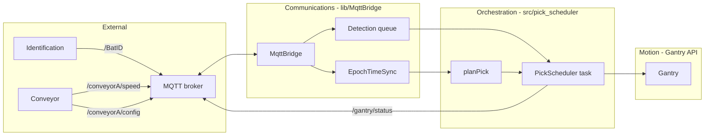

# MQTT communications and pick pipeline

This document describes how the planned communications stack works from first power-on through a completed pick, assuming the architecture in the MQTT plan: **Ethernet + MQTT in `lib/MqttBridge`**, **typed hand-off to a pick scheduler in `src/pick_scheduler.cpp`**, **embedded intercept math (`planPick`) in the same module**, and **motion only through the existing `Gantry` public API**.

## Actors and topics

| Actor | Role |
|-------|------|
| Identification system | Publishes battery **size, position, orientation** on `/BatID` |
| Conveyor controller | Publishes belt **speed** on `/conveyorA/speed`; answers **width** on `/conveyorA/config` (same topic, request/response) |
| MQTT broker | Routes publish/subscribe between all clients |
| WT32-ETH01 gantry firmware | Subscribes, plans, moves, publishes status |

Topics:

| Topic | Direction (gantry) | Payload role |
|-------|----------------------|----------------|
| `/BatID` | Subscribe | One JSON object per detection: dimensions, **`s_bat_mm`** (global along-belt), `y_across_mm`, `theta_deg`, `t_epoch_us` — see [Along-belt frame and BatID](#along-belt-frame-and-batid) |
| `/conveyorA/speed` | Subscribe | Belt speed + `t_epoch_us` |
| `/conveyorA/config` | Subscribe + publish | Gantry publishes **request**; conveyor publishes **response** (same topic; correlate with `request_id`) |
| `/gantry/status` | Publish | State machine + skip reasons + timestamps for operators and upstream automation |

All external timestamps are **epoch microseconds** (`uint64_t`). Inside the gantry, deadlines are converted to **local monotonic time** (`esp_timer_get_time()`, microseconds) for "wake at T" behavior.

## Along-belt frame and BatID

These conventions are agreed for integration; mirror them in `include/conveyor_intercept_params.h` (or Kconfig) as compile-time / calibration constants.

### Global axis `s` (mm)

- **Origin:** belt **roller axis** datum projected into the belt plane (single agreed mechanical reference).
- **`+s`:** **downstream** along the belt — the direction of motion that carries the battery **toward the pickup plane**.
- **Pickup is downstream of the camera** (so `s_pick > s_cam` in this frame).

### Measured along-belt distances from the roller datum (as-built)

| Symbol | Approx. value (mm) | Meaning |
|--------|-------------------|---------|
| `s_cam_mm` | **336.55** | Along-belt position of the **camera optical center** projected onto the belt (confirmed along-belt component, not a diagonal 3D mix). |
| `s_pick_mm` | **1016** | Along-belt position of the **gantry pickup plane** (same datum, same axis). |

Fixed span camera → pickup (for sanity checks and docs):

\[
L_{\mathrm{cam}\rightarrow\mathrm{pick}} = s_{\mathrm{pick}} - s_{\mathrm{cam}} \approx 679.45\ \mathrm{mm}
\]

### Authoritative field: `s_bat_mm`

The identification system publishes **`s_bat_mm`**: the battery **reference point** along **`s`** at **`t_epoch_us`**, in the **same global frame** as `s_cam_mm` / `s_pick_mm`.

- The battery may appear **anywhere in the camera FOV**. The vision stack shall **fold the within-FOV along-belt offset into `s_bat_mm` before publish** (e.g. \(s_{\mathrm{bat}} = s_{\mathrm{cam}} + \Delta s_{\mathrm{fov}}\) plus any other calibrated biases). The gantry **does not** apply a separate FOV delta.
- **Production `/BatID`:** treat **`s_bat_mm` as the single authoritative along-belt coordinate** — avoid also publishing a second along-belt delta that could conflict (optional non-authoritative `debug` fields on another topic are fine).

### Intercept distance for timing

\[
D_{\mathrm{mm}} = s_{\mathrm{pick,mm}} - s_{\mathrm{bat,mm}}
\]

Then \(\tau \approx D / v\) with belt speed \(v\) from `/conveyorA/speed` (same `t_epoch_us` / staleness rules as elsewhere). Example: at **5 ft/s** \(\approx\) **1524 mm/s**, if \(\Delta s_{\mathrm{fov}} = 0\) (battery reference on the camera centerline at detection), \(\tau \approx 679.45 / 1524 \approx 0.45\) s before the reference reaches the pickup plane — before gantry motion and grip margins.

### One-line spec (vision / identification)

> **`s_bat_mm` shall be the global along-belt coordinate (mm, `+s` downstream from the roller datum) of the battery reference point at `t_epoch_us`, already including the within-camera-FOV along-belt offset relative to the camera optical centerline projection; the gantry computes \(D = s_{\mathrm{pick}} - s_{\mathrm{bat}}\) with no further FOV correction.**

### Across-belt and size (unchanged intent)

- **`y_across_mm`:** lateral across the belt for gantry **X** mapping (0 at agreed belt edge; validate against `width_mm` from `/conveyorA/config`).
- **Dimensions + `theta_deg`:** as in the MQTT plan; define battery reference point for `s_bat_mm` (e.g. downstream lead edge vs center) in the same spec and keep it stable.

## High-level data flow



---

## Phase A — Boot and link bring-up

1. **`app_main`** initializes MCP, builds `Gantry`, calls `gantry.begin()` / `gantry.enable()`, starts the existing **100 Hz `gantryUpdateTask`** (unchanged).
2. **`EthernetLink`** starts the LAN8720 on the WT32-ETH01 RMII pins, creates `esp_netif`, waits for `IP_EVENT_ETH_GOT_IP`. Until then, `isUp() == false` and the MQTT client should not connect (or should retry).
3. **`MqttBridge`** starts `esp_mqtt_client` toward the broker URI from config (`include/mqtt_topics.h` or Kconfig).
4. On **`MQTT_EVENT_CONNECTED`**:
   - Subscribe to `/BatID`, `/conveyorA/speed`, `/conveyorA/config`.
   - Publish a **config request** on `/conveyorA/config` with a fresh `request_id` and `t_epoch_us` (or local time if epoch is not yet synced — see Phase B).
5. **`PickScheduler` task** is already running; it may idle until link + MQTT + minimal prerequisites exist.

---

## Phase B — Time base (epoch ↔ local)

MQTT messages carry **epoch µs**. The scheduler needs **“execute grip at local time T”**.

**`EpochTimeSync`** (owned by `MqttBridge` or shared with the scheduler) maintains:

- `offset_epoch_minus_local_us` ≈ `t_epoch_us - esp_timer_get_time()` at message receive time, updated with filtering when new samples arrive.
- A **valid** flag if the offset is stable (not jumping wildly) and if epoch timestamps look sane.

Rules of thumb:

- If sync is **invalid**, the scheduler should **not** auto-pick; it publishes `SKIP:time_not_synced` (or similar) on `/gantry/status`.
- Optional later: SNTP on the ESP32 to anchor wall time; the same offset machinery still applies.

---

## Phase C — Conveyor config (width)

1. After MQTT connect, `MqttBridge` publishes a **request** JSON on `/conveyorA/config`:
   - `request_id`, `request: "config"`, `t_epoch_us`.
2. The conveyor responds on the **same topic** with matching `request_id` and `width_mm`.
3. `MqttBridge` filters incoming config traffic:
   - Ignore its own outbound request shape (`request` field without `width_mm`).
   - Accept responses with `width_mm` and optional `t_epoch_us`.
4. Latest **`ConveyorConfig { width_mm, t_epoch_us }`** is stored under a mutex (or atomic snapshot) for the scheduler to read.

If width is unknown after a timeout, the scheduler refuses new picks and publishes `SKIP:no_conveyor_config` until a valid width arrives.

---

## Phase D — Steady-state telemetry ingestion

### `/conveyorA/speed`

- Each message updates **`ConveyorSpeed { speed_mm_per_s, t_epoch_us }`** (mutex-guarded “latest” struct).
- Staleness guard: if `now_epoch - t_epoch_us` (or local-age heuristic) exceeds a threshold, mark speed **stale**; scheduler skips with `SKIP:stale_conveyor_speed`.

### `/BatID`

- MQTT callback parses JSON into **`BatteryDetection`** (dimensions, **`s_bat_mm`**, `y_across_mm`, `theta_deg`, `t_epoch_us`, optional `bat_id` / `seq`).
- Validation rejects NaNs, negative sizes, impossible geometry, out-of-range **`y_across_mm`** once **`width_mm`** is known, and **`s_bat_mm`** outside a plausible along-belt window around the camera FOV (for example not between `s_cam_mm - X_conv/2` and `s_cam_mm + X_conv/2`, plus margin once **`X_conv`** is calibrated; tune in firmware).
- Valid detection is **`xQueueSend`** to the **detection queue** (the “typedQueues” node: a FreeRTOS queue of structs, not raw MQTT bytes).

Queue policy (from plan):

- Prefer **bounded** depth; on overload, **drop oldest** or **overwrite with newest** so the scheduler never runs hours behind reality.

---

## Phase E — Pick scheduler loop (`xQueueReceive`)

The **PickScheduler** FreeRTOS task is the consumer:

```text
loop forever:
  block on xQueueReceive(detectionQueue, timeout)
  if no message this cycle:
      optional housekeeping (heartbeat, stale checks)
      continue

  snapshot: latest ConveyorSpeed, ConveyorConfig, EpochTimeSync validity
  read: current gantry pose via Gantry public API (e.g. getCurrentJointConfig)
  plan = planPick(detection, speed, config, pose, now_local, timeSync)

  if !plan.feasible:
      publish /gantry/status with SKIP + plan.skip_reason
      continue

  if !gantry_ready (home+calibrate gates, alarms, limits):
      publish SKIP:gantry_not_ready
      continue

  run pick state machine until done or abort
```

---

## Phase F — Pick state machine (motion sequencing)

After `planPick` returns **feasible** and gantry readiness passes, the scheduler drives **only** the existing `Gantry` API (`moveTo`, `grip`, `isBusy`, `requestAbort`, etc.). Typical sequence:

1. **`APPROACH`** — `moveTo(x_target, safeY, theta_target)` with configured approach speeds. Publish `/gantry/status` `state: APPROACH`. Wait until `!gantry.isBusy()` (and handle alarm/timeout).
2. **`WAIT_DEADLINE`** — Block or poll until `esp_timer_get_time() >= t_pick_local_us - margin` (margin accounts for grip latency and controller jitter). Publish `state: WAIT_DEADLINE` if useful for debugging.
3. **`DESCEND`** — `moveTo(x_target, y_pick, theta_target)`. Publish `state: DESCEND`.
4. **`GRIP`** — `grip(true)`; wait grip actuation time (pneumatic timing from drivetrain constants). Publish `state: GRIP`.
5. **`RETRACT`** — `moveTo(x_target, safeY, theta_target)`. Publish `state: RETRACT`.
6. **`TRANSFER`** — `moveTo(bin_x, safeY, bin_theta)` (bin pose from `conveyor_intercept_params.h` or future config). Publish `state: TRANSFER`.
7. **`RELEASE`** — `grip(false)`; wait open time; publish `state: IDLE` or `COMPLETE`.

If any step fails (alarm, timeout, `moveTo` error), publish `/gantry/status` with `state: ABORT` and a reason, call `requestAbort()` / `stop` path as appropriate, and return to **IDLE** without leaving the gripper in an undefined state.

---

## Phase G — End-to-end timeline (one battery)

```text
T0  Identification system sees battery; publishes /BatID JSON (t_epoch_us = detection time).
T1  Conveyor publishes /conveyorA/speed (may arrive before or after BatID).
T2  MqttBridge receives BatID, validates, xQueueSend(detectionQueue).
T3  PickScheduler wakes on xQueueReceive; snapshots speed, config width, time sync.
T4  planPick computes tau from D = s_pick_mm - s_bat_mm and speed v; maps y_across_mm to gantry X, etc.
T5  Scheduler issues APPROACH move; gantryUpdateTask keeps calling gantry.update() at 100 Hz.
T6  At local deadline: DESCEND, GRIP, RETRACT, TRANSFER, RELEASE.
T7  /gantry/status publishes COMPLETE (or IDLE) with correlation ids and timestamps for traceability.
```

---

## Subsystem map (who owns what)

| Subsystem | Location | Responsibility |
|-----------|----------|------------------|
| External | Identification + conveyor + broker | Publish telemetry; answer config |
| Communications | `lib/MqttBridge` | Ethernet, MQTT, JSON parse, `EpochTimeSync`, queues, config request, status publish |
| Orchestration + planning | `src/pick_scheduler.cpp` | `xQueueReceive`, `planPick` (static), pick state machine |
| Motion | `lib/Gantry` public API | Kinematics, limits, pulses — **unchanged** by MQTT |

---

## Failure and edge behavior (summary)

| Condition | Typical behavior |
|-----------|------------------|
| Ethernet down | Do not start picks; optional `Gantry::requestAbort()` if mid-pick; status `LINK_DOWN` |
| MQTT disconnected | Same; reconnect re-subscribes and re-requests `/conveyorA/config` |
| Stale `/conveyorA/speed` | Skip new picks; `SKIP:stale_conveyor_speed` |
| Unknown conveyor width | Skip; `SKIP:no_conveyor_config` |
| Invalid time sync | Skip; `SKIP:time_not_synced` |
| `planPick` infeasible | Skip; reason from planner (e.g. outside pick zone, speed ~ 0, **`s_bat_mm`** implausible vs FOV) |
| Gantry not homed/calibrated | Skip; `SKIP:gantry_not_ready` |
| Detection queue overload | Drop oldest or overwrite with newest (policy from plan) |
| Operator `pickenable 0` (if implemented) | Scheduler idle; still logs or publishes disabled state |

---

## Related documents

- Cursor plan (implementation todos and CMake details): `mqtt_communications_pipeline_5284ce15.plan.md` under your Cursor plans directory (same content as the agreed MQTT pipeline design).
- After implementation: add a formal section to [PROGRAMMING_REFERENCE.md](PROGRAMMING_REFERENCE.md) and pin exact JSON field names for interoperability with the identification and conveyor teams.