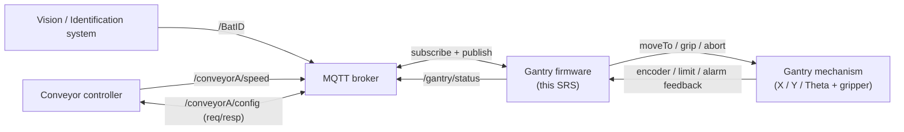

# Software Requirements Specification — Pickup Algorithm & MQTT Bridge Subsystem

**Project:** WT32-ETH01 Gantry Controller (consumer-battery sorting MVP)
**Subsystem under specification:** Communications bridge (Ethernet + MQTT + JSON) and battery-pickup planning / sequencing layer on the gantry firmware.
**Document status:** Draft for intermediate development.
**Revision:** 0.1 — 2026-05-13.

**DOCX export (diagrams as embedded images):** From the repository root run `.\tools\srs_build\build.ps1` (requires Node.js + npm + pandoc). See `tools/srs_build/README.md`.

---

## 1. Introduction

### 1.1 Purpose

This document specifies the requirements for two coupled software subsystems that extend the existing WT32-ETH01 gantry firmware:

1. **MQTT Bridge** — the network adapter that connects the gantry firmware to an external MQTT broker, ingests battery detections and conveyor telemetry, requests conveyor configuration data, and publishes gantry status.
2. **Pickup Algorithm / Pick Scheduler** — the orchestration layer that converts validated detections into time-feasible pick plans and drives the gantry through a pick state machine via the existing `Gantry` public API.

This SRS is the contract that downstream design, implementation, and acceptance testing must satisfy. It is self-contained: implementers should not need any other repository document to begin coding the bridge or the scheduler.

### 1.2 Scope

**In scope**

- Ethernet link bring-up on the WT32-ETH01 LAN8720 PHY.
- MQTT client lifecycle (connect, reconnect, subscribe, publish).
- JSON parsing and validation for four topics defined in §4.
- Time-base synchronization between MQTT epoch timestamps and local monotonic time.
- Conveyor configuration (belt width) request / response on a single shared topic.
- Detection-queue management between the network thread and the scheduler.
- The `planPick` pure-function intercept planner.
- A FreeRTOS `PickScheduler` task that runs the pick state machine.
- Publication of structured `/gantry/status` messages.

**Out of scope**

- Modifications to the kinematic, motion-profile, limit-switch, or driver layers of the `Gantry` library. Those are consumed read-only via the existing public API.
- Vision / identification algorithm internals (the bridge consumes detections; it does not produce them).
- Conveyor PLC firmware (the bridge consumes telemetry; it does not produce it).
- Operator HMI / dashboard (the `/gantry/status` topic is the only operator-facing output).

### 1.3 Definitions, acronyms, and conventions

| Term | Meaning |
|------|---------|
| **Bridge** | The MQTT Bridge subsystem implemented in `lib/MqttBridge`. |
| **Scheduler** | The Pick Scheduler subsystem implemented in `src/pick_scheduler.{h,cpp}`. |
| **Planner** | The pure function `planPick(...)` exposed by `lib/Gantry` or by the scheduler module. |
| **Detection** | A `BatteryDetection` struct produced by the bridge from a `/BatID` JSON payload. |
| **Pick zone** | The along-belt window in which a detection can still be reached by the gantry before passing the pickup plane. |
| **Pickup plane** | The fixed along-belt position at which the gantry physically picks. |
| **Camera plane** | The fixed along-belt position at which the vision system reports detections. |
| **Local time** | `esp_timer_get_time()` in microseconds; monotonic from boot. |
| **Epoch time** | `t_epoch_us` carried in external MQTT payloads; UTC microseconds. |
| `s` | Along-belt scalar coordinate in mm. |
| `+s` | Downstream direction (toward the pickup plane). |
| `D_mm` | Along-belt intercept distance: `s_pick_mm − s_bat_mm`. |
| `τ` (tau) | Time-to-intercept: `D_mm / v_belt`. |
| **Stale** | A telemetry sample whose age exceeds the configured freshness threshold. |
| **SKIP** | A `/gantry/status` message that reports a non-fatal refusal to execute a pick, with a machine-readable reason code. |

### 1.4 Document conventions

- Requirements are labelled `REQ-<area>-<NNN>`, where `<area>` is one of `MB` (MQTT Bridge), `PS` (Pick Scheduler), `PL` (Planner), `TS` (Time Sync), `IF` (Interface), `NF` (Non-functional), `FM` (Failure Mode), or `VT` (Verification Target). IDs are stable; never re-use a retired ID.
- “Shall” indicates a binding requirement. “Should” indicates a recommendation. “May” indicates a permissive option. “Will” describes externally-imposed behavior.
- All units are SI unless explicitly stated. Lengths in millimetres, times in microseconds (`_us`) or milliseconds (`_ms`), speeds in mm/s, angles in degrees.

---

## 2. Overall description

### 2.1 System context

The gantry firmware runs on an ESP32 (WT32-ETH01 module) and physically picks batteries from a moving conveyor belt under a single overhead vision system. Three external actors interact with the firmware over an MQTT broker on the local Ethernet network:



The firmware is the **only** moving party on the network; the vision system and conveyor controller are passive publishers of telemetry. The gantry hardware is commanded exclusively through the existing `Gantry` C++ public API.

### 2.2 Subsystem decomposition

| Subsystem | Location | Responsibility |
|-----------|----------|----------------|
| `EthernetLink` | `lib/MqttBridge` | LAN8720 PHY init, `esp_netif` lifecycle, `IP_EVENT_ETH_GOT_IP` gating. |
| `MqttBridge` | `lib/MqttBridge` | `esp_mqtt_client` lifecycle, topic subscribe/publish, JSON parse, validation, snapshot stores, detection queue producer. |
| `EpochTimeSync` | `lib/MqttBridge` | Maintains the running offset between epoch microseconds and local microseconds. |
| `planPick` | `lib/Gantry` (`GantryConveyorInterceptor`) **or** `src/pick_scheduler.cpp` | Pure-function intercept planner with no I/O. |
| `PickScheduler` | `src/pick_scheduler.{h,cpp}` | FreeRTOS task, detection-queue consumer, gantry readiness gating, pick state machine, `/gantry/status` publisher. |

### 2.3 Operating environment

| Item | Constraint |
|------|------------|
| MCU | ESP32 (WT32-ETH01 module). Single Xtensa LX6 dual-core. |
| RTOS | FreeRTOS bundled with ESP-IDF v5.x. |
| Network | 100 Mbps Ethernet via on-module LAN8720 PHY. Static or DHCP IP — both shall be supported. |
| MQTT broker | TCP, MQTT v3.1.1 minimum. TLS not required for the MVP but shall not be precluded by the design. |
| Belt speed range | 0 – 1800 mm/s (≈ 0 – 6 ft/s) nominal; design target is **1524 mm/s** (5 ft/s). |
| Geometry | Along-belt span camera → pickup plane: **~680 mm**. Lateral conveyor width: read at runtime from `/conveyorA/config`. |

### 2.4 Design constraints

- The firmware **shall not bypass** the existing `Gantry::Gantry` public API for motion, gripping, homing, calibration, or status queries.
- The 100 Hz `gantryUpdateTask` is owned by the motion layer and **shall remain unchanged** by anything in this SRS.
- New code shall be added under `lib/MqttBridge/` and `src/pick_scheduler.{h,cpp}`; the `idf/main/CMakeLists.txt` shall list `MqttBridge` in `REQUIRES`.
- All compile-time constants used by the planner (`s_cam_mm`, `s_pick_mm`, bin pose, grip latency margin, freshness thresholds) shall live in a single header `include/conveyor_intercept_params.h` analogous to the existing axis-parameter headers, with no runtime setters.
- No dynamic allocation in any callback or ISR path. The detection queue and snapshot stores use static FreeRTOS primitives or fixed-size buffers.

### 2.5 Assumptions and dependencies

- The vision and conveyor teams own their MQTT topic payloads. Schema changes on those topics require a coordinated update to the JSON schema (Appendix A) and the parser unit tests before this firmware accepts them.
- A single conveyor instance named `conveyorA` exists; multi-conveyor support is a future extension (§9).
- A single pickup destination (one bin pose) exists at MVP; multi-bin routing is a future extension.
- Network time (SNTP) anchoring is **not** assumed; the system shall function purely on the epoch offset learned from message timestamps. SNTP, when added later, plugs into the same `EpochTimeSync` interface.

---

## 3. Coordinate frames, units, and time

### 3.1 Along-belt frame

REQ-IF-001 — The firmware shall use a single along-belt scalar coordinate `s` measured in millimetres, with the origin at the belt roller axis datum projected into the belt plane, `+s` pointing **downstream** (toward the pickup plane), so that `s_pick_mm > s_cam_mm`.

REQ-IF-002 — Two compile-time constants in `include/conveyor_intercept_params.h` shall pin the camera plane and pickup plane onto the `s` axis:

| Symbol | Constant | Nominal as-built value (mm) |
|--------|----------|------------------------------|
| `s_cam_mm` | `CONVEYOR_S_CAM_MM` | 336.55 |
| `s_pick_mm` | `CONVEYOR_S_PICK_MM` | 1016.00 |

REQ-IF-003 — The intercept distance shall be computed as `D_mm = s_pick_mm − s_bat_mm`, where `s_bat_mm` is the authoritative along-belt coordinate of the battery reference point at `t_epoch_us`, published by the vision system on `/BatID`. The firmware **shall not** apply any additional camera-FOV correction to `s_bat_mm`; that fold-in is the vision system’s responsibility.

REQ-IF-004 — Time-to-intercept shall be computed as `τ = D_mm / v_belt`, where `v_belt > 0` is the latest non-stale conveyor speed. `τ ≤ 0` shall be treated as infeasible (`SKIP:past_pickup_plane`).

### 3.2 Across-belt and gantry mapping

REQ-IF-005 — The vision system publishes `y_across_mm` as the lateral position of the battery across the belt. The mapping from `y_across_mm` to gantry X target shall be implemented as a single calibration constant `CONVEYOR_Y_TO_GANTRY_X_OFFSET_MM` plus an optional sign flag, validated against the runtime `width_mm` from `/conveyorA/config`.

REQ-IF-006 — Detections with `y_across_mm < 0` or `y_across_mm > width_mm` shall be rejected at validation time with `SKIP:y_across_out_of_range`.

### 3.3 Time

REQ-IF-007 — All external timestamps carried in MQTT payloads shall be **epoch microseconds (`uint64_t`)** under the field name `t_epoch_us`.

REQ-IF-008 — All internal deadlines (pick instant, wait-until points, freshness ages) shall be expressed in **local monotonic microseconds** as returned by `esp_timer_get_time()`.

REQ-TS-001 — `EpochTimeSync` shall maintain `offset_epoch_minus_local_us`, updated on each accepted MQTT message that carries `t_epoch_us`, using a filtering policy that suppresses single-sample jumps greater than 50 ms (configurable).

REQ-TS-002 — `EpochTimeSync` shall expose a boolean `isValid()` that is **false** until at least 3 samples have been accepted within a 5-second window with mutual agreement to within 50 ms, and that returns to **false** if no valid sample has been observed in 30 seconds.

REQ-TS-003 — `EpochTimeSync` shall expose two conversion helpers:

```cpp
int64_t epochToLocalUs(uint64_t t_epoch_us) const;
uint64_t localToEpochUs(int64_t t_local_us) const;
```

returning meaningful values only when `isValid()` is true.

---

## 4. External interfaces

### 4.1 MQTT broker

REQ-MB-001 — The bridge shall connect to a single broker URI configured at compile time in `include/mqtt_topics.h` (default `mqtt://192.168.1.10:1883`) or via Kconfig.

REQ-MB-002 — On connection loss the bridge shall attempt reconnection indefinitely with exponential backoff (1 s, 2 s, 4 s, … capped at 30 s).

REQ-MB-003 — On `MQTT_EVENT_CONNECTED` the bridge shall:

1. Subscribe to `/BatID` (QoS 0).
2. Subscribe to `/conveyorA/speed` (QoS 0).
3. Subscribe to `/conveyorA/config` (QoS 1).
4. Publish exactly one fresh `/conveyorA/config` **request** (see §4.4).
5. Publish one `/gantry/status` message with `state: "LINK_UP"`.

### 4.2 Topic `/BatID` (subscribe)

REQ-MB-010 — The bridge shall parse `/BatID` payloads as JSON objects with the schema given in Appendix A.1.

REQ-MB-011 — A `/BatID` payload shall be accepted only if **all** of the following hold:

- All required fields are present and of the expected types.
- `t_epoch_us > 0`.
- `s_bat_mm` falls within `[s_cam_mm − X_conv_margin, s_cam_mm + X_conv_margin]`, where `X_conv_margin` is a compile-time constant (default 300 mm) approximating half the camera FOV plus tolerance.
- `y_across_mm` is within `[0, width_mm]` when conveyor width is known; otherwise within `[0, MAX_PLAUSIBLE_WIDTH_MM]` (default 1500 mm).
- No dimension is NaN, negative, or implausibly large (length / width / height each ≤ 500 mm by default).
- `theta_deg ∈ [−180, 180]`.

REQ-MB-012 — Accepted `/BatID` payloads shall be transformed into a `BatteryDetection` struct (Appendix A.4) and enqueued onto the detection queue (§5.5).

REQ-MB-013 — Rejected `/BatID` payloads shall be logged at `ESP_LOG_WARN` with a reason code and shall **not** be enqueued.

### 4.3 Topic `/conveyorA/speed` (subscribe)

REQ-MB-020 — The bridge shall parse `/conveyorA/speed` payloads as JSON objects with the schema given in Appendix A.2 (`speed_mm_per_s`, `t_epoch_us`).

REQ-MB-021 — Each accepted payload shall update a single mutex-guarded `ConveyorSpeed` snapshot. The bridge shall **not** queue speed messages.

REQ-MB-022 — A speed sample shall be marked **stale** when its local-time age (computed via `EpochTimeSync`) exceeds `CONVEYOR_SPEED_STALENESS_MS` (default 250 ms).

### 4.4 Topic `/conveyorA/config` (subscribe + publish)

REQ-MB-030 — A **config request** published by the bridge shall be a JSON object containing `request_id` (uint64), `request: "config"`, and `t_epoch_us` (best-effort; the bridge may use `0` until `EpochTimeSync` is valid).

REQ-MB-031 — A **config response** received on the same topic shall include `width_mm` and `request_id`. Responses whose `request_id` does not match an outstanding request **may** still be accepted if `width_mm` is present and plausible (`50 ≤ width_mm ≤ 1500`).

REQ-MB-032 — The bridge shall ignore inbound messages on `/conveyorA/config` whose shape matches its own outbound request (i.e. lack of `width_mm`).

REQ-MB-033 — Accepted responses shall update a single mutex-guarded `ConveyorConfig` snapshot (`width_mm`, `t_epoch_us`).

REQ-MB-034 — If no valid `ConveyorConfig` has been received within `CONVEYOR_CONFIG_TIMEOUT_MS` (default 5000 ms) of MQTT connect, the bridge shall publish one additional config request and continue every `CONVEYOR_CONFIG_RETRY_MS` (default 5000 ms) until a valid response arrives.

### 4.5 Topic `/gantry/status` (publish)

REQ-MB-040 — The bridge shall provide a `publishStatus(GantryStatusMessage)` method that serializes a typed struct to JSON and publishes on `/gantry/status` (QoS 0) with `retain = false`.

REQ-MB-041 — The status JSON shall include at minimum: `state` (string), `t_epoch_us` (uint64; `0` if not yet synced), `seq` (monotonic uint32), and an optional `reason` (string) for `SKIP` and `ABORT` states. Pick-context fields (`bat_id`, `s_bat_mm`, `tau_us`, `D_mm`) shall be included when relevant.

REQ-MB-042 — The set of valid `state` values shall be: `LINK_UP`, `LINK_DOWN`, `IDLE`, `APPROACH`, `WAIT_DEADLINE`, `DESCEND`, `GRIP`, `RETRACT`, `TRANSFER`, `RELEASE`, `COMPLETE`, `SKIP`, `ABORT`, `DISABLED`.

### 4.6 Internal interface to motion layer

REQ-IF-010 — The scheduler shall command motion exclusively through the existing `Gantry::Gantry` public methods: `moveTo(JointConfig, ...)`, `grip(bool)`, `isBusy()`, `requestAbort()`, `isAlarmActive()`, `isEnabled()`, `getCurrentJointConfig()`. No direct access to `PulseMotor`, `gpio_expander`, or `MCP23S17` is permitted from scheduler or bridge code.

REQ-IF-011 — The scheduler shall treat `gantry.requestAbort()` followed by `gantry.disable()` as the canonical safe-stop sequence at any error state.

---

## 5. Functional requirements

### 5.1 Link & connection management

REQ-MB-100 — `EthernetLink::start()` shall configure the LAN8720 PHY on the WT32-ETH01 RMII pins, install the network interface, and wait for `IP_EVENT_ETH_GOT_IP` before reporting `isUp() == true`.

REQ-MB-101 — The bridge shall not call `esp_mqtt_client_start()` until `EthernetLink::isUp()` is true.

REQ-MB-102 — If the Ethernet link goes down mid-operation, the bridge shall publish `LINK_DOWN` and the scheduler shall refuse all new picks (`SKIP:link_down`) until link recovery is complete and a fresh `/conveyorA/config` response has arrived.

### 5.2 Time synchronization

REQ-TS-010 — `EpochTimeSync::onSample(t_epoch_us, t_local_us)` shall be called from each MQTT-event callback that delivers an accepted message carrying `t_epoch_us`.

REQ-TS-011 — The scheduler shall refuse to execute picks while `EpochTimeSync::isValid() == false`, publishing `SKIP:time_not_synced`.

REQ-TS-012 — `epochToLocalUs(t_epoch_us)` shall be the **only** sanctioned mechanism for computing local-time deadlines from external timestamps.

### 5.3 Conveyor configuration acquisition

REQ-MB-110 — On successful MQTT connect the bridge shall publish exactly one `/conveyorA/config` request (REQ-MB-030).

REQ-MB-111 — Until a valid response is stored, every `/gantry/status` publication that *would* report `IDLE` shall instead report `SKIP:no_conveyor_config`, at most once per `STATUS_THROTTLE_MS` (default 1000 ms).

REQ-MB-112 — The bridge shall publish a fresh config request after every reconnect (REQ-MB-003).

### 5.4 Telemetry ingestion & validation

REQ-MB-120 — The bridge shall maintain three independent snapshot stores: `ConveyorSpeed`, `ConveyorConfig`, and `LatestBatteryDetection` (most-recent only; the queue is separate). Each snapshot shall be protected by a single mutex with bounded acquisition time (`xSemaphoreTake(..., pdMS_TO_TICKS(5))`).

REQ-MB-121 — Validation failures shall always log a structured reason. Validation paths must never raise C++ exceptions.

### 5.5 Detection queue management

REQ-MB-130 — The bridge shall own a single FreeRTOS queue `detectionQueue` of `BatteryDetection` structs, with depth `DETECTION_QUEUE_DEPTH` (default 8).

REQ-MB-131 — On queue full, the bridge shall **drop the oldest item** (or overwrite the front, equivalently) so that the most recent detections are preferred. Drop events shall be logged.

REQ-MB-132 — The scheduler shall be the **only** consumer of `detectionQueue`.

### 5.6 Pickup planning (`planPick`)

REQ-PL-001 — The planner shall be a **pure function** with the signature:

```cpp
PickPlan planPick(const BatteryDetection&        det,
                  const ConveyorSpeed&           speed,
                  const ConveyorConfig&          config,
                  const Gantry::JointConfig&     currentPose,
                  int64_t                        now_local_us,
                  const EpochTimeSync&           ts);
```

It shall have no I/O, no logging side effects other than via the returned struct, and no access to global state.

REQ-PL-002 — `PickPlan` shall contain at minimum:

```cpp
struct PickPlan {
    bool                  feasible;
    SkipReason            skip_reason;        // valid iff !feasible
    Gantry::JointConfig   approach_pose;      // X, safeY, theta_target
    Gantry::JointConfig   descend_pose;       // X, y_pick, theta_target
    int64_t               t_pick_local_us;    // deadline for DESCEND start
    float                 D_mm;
    float                 tau_us_f;
};
```

REQ-PL-003 — Infeasibility shall be reported (not exceptioned) for at least the following conditions:

| `SkipReason` | Trigger |
|--------------|---------|
| `past_pickup_plane` | `D_mm ≤ 0` |
| `speed_invalid` | `speed.speed_mm_per_s ≤ 1` or stale |
| `time_not_synced` | `ts.isValid() == false` |
| `outside_pick_zone` | Computed `t_pick_local_us` is in the past, or `tau < tau_min` (default 100 ms = grip latency floor) |
| `y_out_of_range` | `det.y_across_mm` outside `[0, width_mm]` after width is known |
| `pose_unreachable` | Approach or descend pose violates the soft-limit envelope reported by `Gantry::JointLimits` |

REQ-PL-004 — The planner shall **not** require, query, or modify any hardware. It is intended to be exercisable in host-side unit tests.

### 5.7 Pick state machine

REQ-PS-001 — `PickScheduler` shall be a FreeRTOS task pinned to core 0 with a stack of at least 4096 bytes and priority no higher than the existing `SerialCmd` console task.

REQ-PS-002 — The task loop shall:

1. Block on `xQueueReceive(detectionQueue, …, timeout)` with timeout `SCHEDULER_TICK_MS` (default 50 ms).
2. On timeout, perform housekeeping: publish a heartbeat `IDLE` status at most every `STATUS_HEARTBEAT_MS` (default 1000 ms); check staleness of speed/config; continue.
3. On dequeue, snapshot `ConveyorSpeed`, `ConveyorConfig`, current pose, and `now_local_us`.
4. Call `planPick(...)`. If infeasible, publish `SKIP` with `skip_reason` and return to step 1.
5. Verify gantry readiness gates (REQ-PS-010). If any fails, publish `SKIP:gantry_not_ready` and return to step 1.
6. Execute the state machine of REQ-PS-020 through REQ-PS-026.

REQ-PS-010 — Gantry readiness shall require: `isEnabled() == true`, `isAlarmActive() == false`, X-axis homed and calibrated **this session** (the existing console gate), and the operator pickup-enable flag (REQ-PS-030) set to true.

REQ-PS-020 — `APPROACH`: `gantry.moveTo(approach_pose, approach_speed, …)`. Publish `state: APPROACH` with pick context. Block on `gantry.isBusy() == false` with timeout `APPROACH_TIMEOUT_MS` (default 2500 ms). On timeout publish `ABORT:approach_timeout` and execute the safe-stop sequence.

REQ-PS-021 — `WAIT_DEADLINE`: Compute `wait_us = t_pick_local_us − esp_timer_get_time() − GRIP_LATENCY_MARGIN_US` (default `GRIP_LATENCY_MARGIN_US = 50000`). If `wait_us > 0`, `vTaskDelay(pdMS_TO_TICKS(wait_us / 1000))` in chunks no larger than 100 ms, re-checking abort conditions each chunk. Publish `state: WAIT_DEADLINE` once at entry.

REQ-PS-022 — `DESCEND`: `gantry.moveTo(descend_pose, descend_speed, …)`. Publish `state: DESCEND`. Block on `isBusy() == false` with timeout `DESCEND_TIMEOUT_MS` (default 1500 ms).

REQ-PS-023 — `GRIP`: `gantry.grip(true)`. Wait `GANTRY_GRIPPER_CLOSE_TIME_MS` (from existing drivetrain params). Publish `state: GRIP`.

REQ-PS-024 — `RETRACT`: `gantry.moveTo(approach_pose, retract_speed, …)`. Publish `state: RETRACT`. Block as in REQ-PS-022.

REQ-PS-025 — `TRANSFER`: `gantry.moveTo(bin_pose, transfer_speed, …)`. Publish `state: TRANSFER`. Block as in REQ-PS-022.

REQ-PS-026 — `RELEASE`: `gantry.grip(false)`. Wait `GANTRY_GRIPPER_OPEN_TIME_MS`. Publish `state: RELEASE`, then `state: COMPLETE` with the final pick context.

REQ-PS-027 — At any state, if `gantry.isAlarmActive()` becomes true or a `moveTo` returns a non-`OK` `GantryError`, the scheduler shall publish `ABORT` with a reason code, execute the safe-stop sequence (REQ-IF-011), and return to step 1 of the task loop.

REQ-PS-030 — A console command `pickenable <0|1>` (extending the existing gantry console) shall toggle a global enable flag. When false, the scheduler shall publish `DISABLED` at the heartbeat cadence and shall not initiate any motion.

### 5.8 Status reporting

REQ-PS-040 — Every state transition listed in REQ-PS-020 through REQ-PS-026 shall result in exactly one `/gantry/status` publication.

REQ-PS-041 — Each status message shall increment a monotonic `seq` counter (uint32, wraparound permitted). Operators consuming `/gantry/status` may rely on `seq` for ordering.

REQ-PS-042 — Status messages shall be published at most every `STATUS_THROTTLE_MS` for IDLE/DISABLED heartbeats, but **shall not** be throttled for state transitions or ABORT.

---

## 6. Non-functional requirements

### 6.1 Performance / timing

REQ-NF-001 — End-to-end latency from `MQTT_EVENT_DATA` on `/BatID` to the corresponding `BatteryDetection` available at the head of `detectionQueue` shall be ≤ 10 ms on a 100 Mbps link with a payload ≤ 512 bytes.

REQ-NF-002 — The scheduler shall be able to plan and start an `APPROACH` move within 20 ms of dequeuing a detection (excluding the planned `WAIT_DEADLINE` portion).

REQ-NF-003 — The pick state machine shall be able to handle a sustained detection rate of at least 1 Hz at the design belt speed of 1524 mm/s.

REQ-NF-004 — `GRIP_LATENCY_MARGIN_US` (default 50 000 µs) shall provide adequate margin such that at the design speed (1524 mm/s) the battery has not moved more than ±5 mm past the planned pick point at the moment `gantry.grip(true)` is issued.

### 6.2 Safety

REQ-NF-010 — Loss of Ethernet, loss of MQTT, stale conveyor speed, invalid time sync, or planner infeasibility shall **never** result in commanded motion. The default failure mode is to publish a `SKIP` and idle.

REQ-NF-011 — Mid-pick loss of Ethernet shall trigger `gantry.requestAbort()` followed by `gantry.disable()`, then publish `ABORT:link_lost_mid_pick`.

REQ-NF-012 — The scheduler shall honor the existing `home`+`calibrate` session gate; if either is missing the scheduler is in the `SKIP:gantry_not_ready` state regardless of all other inputs.

### 6.3 Reliability

REQ-NF-020 — The bridge shall recover automatically from broker restart, network cable disconnect, and broker-side QoS resets without firmware reboot.

REQ-NF-021 — The detection queue and snapshot stores shall not be subject to dynamic allocation. Memory used by the bridge and scheduler after `app_main` returns shall be bounded and predictable.

### 6.4 Resource constraints

REQ-NF-030 — The bridge shall use no more than 12 KiB of stack across all its tasks combined.

REQ-NF-031 — The combined bridge + scheduler shall add no more than 80 KiB to the application binary size.

### 6.5 Maintainability / testability

REQ-NF-040 — `planPick`, `EpochTimeSync`, and the JSON parsers shall be exercisable in host-side unit tests with no ESP-IDF dependency. A small fixture set of canonical JSON payloads (Appendix A) shall be checked in under `tools/test_fixtures/`.

REQ-NF-041 — A test console command `simpick <s_bat_mm> <y_across_mm> <theta_deg> <speed_mm_per_s>` shall be added to the existing gantry console for HIL planning tests that bypass MQTT but still drive the scheduler and planner end-to-end.

REQ-NF-042 — A test console command `mqttdump <0|1>` shall enable verbose logging of every accepted and rejected MQTT payload, with the rejection reason for rejected ones.

REQ-NF-043 — `/gantry/status` shall be the single source of truth for what the firmware is doing at any moment, observable from any MQTT client (e.g. `mosquitto_sub -t /gantry/status`).

---

## 7. Failure modes and skip-reason catalogue

REQ-FM-001 — The bridge and scheduler shall emit `SKIP` messages drawn from the following closed set; new reasons require a documentation update **before** code changes.

| `reason` | When raised | Producer |
|----------|-------------|----------|
| `link_down` | Ethernet not up or MQTT not connected | scheduler |
| `time_not_synced` | `EpochTimeSync::isValid() == false` | scheduler |
| `no_conveyor_config` | Width unknown after timeout | scheduler |
| `stale_conveyor_speed` | Speed sample age > threshold | scheduler |
| `gantry_not_ready` | Not enabled, alarm active, or home/calibrate gate not satisfied | scheduler |
| `pose_unreachable` | Planner rejected on soft limits | planner |
| `outside_pick_zone` | `τ < τ_min` or `t_pick_local_us` in the past | planner |
| `past_pickup_plane` | `D_mm ≤ 0` | planner |
| `speed_invalid` | `v ≤ 1 mm/s` or NaN | planner |
| `y_across_out_of_range` | `y_across_mm` not in `[0, width_mm]` | bridge |
| `bat_id_validation_failed` | Schema/range/sanity rejection of `/BatID` | bridge |
| `queue_overflow` | A detection was dropped from `detectionQueue` | bridge |

REQ-FM-002 — `ABORT` messages shall include one of the reasons: `approach_timeout`, `descend_timeout`, `retract_timeout`, `transfer_timeout`, `alarm_active`, `link_lost_mid_pick`, `move_error_<code>`.

---

## 8. Verification and acceptance criteria

REQ-VT-001 — Unit tests on host shall cover `planPick` with at least one positive case and one case per `SkipReason` defined for the planner (REQ-PL-003). Build target: `tools/host_tests/test_planpick`.

REQ-VT-002 — Unit tests on host shall cover the JSON parsers for `/BatID`, `/conveyorA/speed`, and `/conveyorA/config` with canonical and corrupted payloads under `tools/test_fixtures/`.

REQ-VT-003 — Unit tests on host shall cover `EpochTimeSync` with synthetic sample streams demonstrating (a) convergence to a stable offset, (b) `isValid()` becoming false after silence, and (c) outlier rejection.

REQ-VT-004 — HIL test 1 — *Link bring-up*: Power-cycle the gantry. Observe within 5 s on `/gantry/status`: `LINK_UP` followed by either `SKIP:time_not_synced` or `SKIP:no_conveyor_config`. The gantry shall not have moved.

REQ-VT-005 — HIL test 2 — *Config round-trip*: Bridge publishes `/conveyorA/config` request; an external script publishes a response with `width_mm = 600`. Observe `IDLE` heartbeats within 2 s of the response.

REQ-VT-006 — HIL test 3 — *Plan-only*: Run `simpick 400 300 0 1524` with the gantry **disabled**. Observe a `SKIP:gantry_not_ready` with populated `D_mm`, `tau_us`, and `bat_id` fields, confirming the planner ran end-to-end.

REQ-VT-007 — HIL test 4 — *Battery #1 end-to-end pick*: With a single battery on the belt at design speed and the gantry enabled+homed+calibrated, observe the full transition `LINK_UP → IDLE → APPROACH → WAIT_DEADLINE → DESCEND → GRIP → RETRACT → TRANSFER → RELEASE → COMPLETE` on `/gantry/status`, and verify the physical pick.

REQ-VT-008 — HIL test 5 — *Failure injection*: kill the conveyor speed publisher mid-operation; observe `SKIP:stale_conveyor_speed` within `CONVEYOR_SPEED_STALENESS_MS + STATUS_THROTTLE_MS` and confirm no motion is commanded.

REQ-VT-009 — HIL test 6 — *Queue overflow*: replay a recorded burst of 50 detections within 1 s; observe at least one `SKIP:queue_overflow`, confirm the scheduler is still alive and consuming newest detections.

REQ-VT-010 — Acceptance gate: tests REQ-VT-001 through REQ-VT-009 shall pass on `main` before the **Validate one battery sorting (battery #1)** project milestone is marked complete.

---

## 9. Open issues / future extensions

| ID | Item | Status |
|----|------|--------|
| OI-1 | Multi-conveyor support (`conveyorA`, `conveyorB`, …). MQTT topic shape with conveyor ID is reserved. | Deferred. |
| OI-2 | Multi-bin routing. Bin pose currently a single compile-time constant. | Deferred. |
| OI-3 | SNTP-anchored wall time on the ESP32. Will plug into the existing `EpochTimeSync` interface. | Deferred. |
| OI-4 | TLS-secured broker. Design must allow swap-in of `esp_mqtt_client_config_t.transport = MQTT_TRANSPORT_OVER_SSL`. | Deferred. |
| OI-5 | Retained `/gantry/status` for cold-start operator visibility. | Deferred; requires broker-side coordination. |
| OI-6 | Operator HMI subscribing to `/gantry/status`. | External (out of scope). |

---

## Appendix A — JSON schema sketch

> Field types are JSON-native (`number`, `string`, `integer`, `boolean`, `object`, `array`). Where ranges are given they are validation bounds enforced by the bridge.

### A.1 `/BatID` (subscribe)

```json
{
  "t_epoch_us":   1747166400123456,
  "bat_id":       "batch-2026-05-13-00042",
  "seq":          42,
  "s_bat_mm":     820.5,
  "y_across_mm":  310.0,
  "theta_deg":    12.4,
  "length_mm":    65.0,
  "width_mm":     18.0,
  "height_mm":    18.0,
  "class":        "AA"
}
```

- Required: `t_epoch_us`, `s_bat_mm`, `y_across_mm`, `theta_deg`, `length_mm`, `width_mm`, `height_mm`.
- Optional: `bat_id`, `seq`, `class`.
- Ranges (validation): see REQ-MB-011.

### A.2 `/conveyorA/speed` (subscribe)

```json
{
  "t_epoch_us":     1747166400000000,
  "speed_mm_per_s": 1524.0
}
```

- Required: both fields.
- Range: `speed_mm_per_s ∈ [0, 2500]`.

### A.3 `/conveyorA/config` (subscribe + publish)

**Outbound request (from gantry):**

```json
{
  "request_id":  73,
  "request":     "config",
  "t_epoch_us":  1747166400000000
}
```

**Inbound response (from conveyor controller):**

```json
{
  "request_id":  73,
  "width_mm":    600.0,
  "t_epoch_us":  1747166400010000
}
```

- Range: `width_mm ∈ [50, 1500]`.

### A.4 Internal `BatteryDetection` struct

```cpp
struct BatteryDetection {
    uint64_t t_epoch_us;
    int64_t  t_local_us;       // filled at MQTT-receive time
    float    s_bat_mm;
    float    y_across_mm;
    float    theta_deg;
    float    length_mm;
    float    width_mm;
    float    height_mm;
    uint32_t seq;              // 0 if absent in JSON
    char     bat_id[32];       // '\0' if absent in JSON
    char     bat_class[16];    // '\0' if absent in JSON
};
```

### A.5 `/gantry/status` (publish)

```json
{
  "seq":          18,
  "t_epoch_us":   1747166400500000,
  "state":        "DESCEND",
  "bat_id":       "batch-2026-05-13-00042",
  "D_mm":         195.5,
  "tau_us":       128280,
  "reason":       null
}
```

---

## Appendix B — Requirement ID index

| Area | Range allocated |
|------|------------------|
| `REQ-IF-` | 001 – 099 (interfaces, frames, time) |
| `REQ-MB-` | 001 – 099 (broker / lifecycle), 010 – 029 (`/BatID`, `/speed`), 030 – 049 (`/config`, `/status`), 100 – 199 (link & connection) |
| `REQ-TS-` | 001 – 099 (`EpochTimeSync`) |
| `REQ-PL-` | 001 – 099 (`planPick`) |
| `REQ-PS-` | 001 – 099 (scheduler task & state machine) |
| `REQ-NF-` | 001 – 099 (non-functional) |
| `REQ-FM-` | 001 – 099 (failure modes) |
| `REQ-VT-` | 001 – 099 (verification targets) |

Future requirements shall use unallocated IDs in the appropriate range. Once allocated, an ID is permanent: retired requirements are marked `[RETIRED]` rather than reused.

---

*End of SRS, revision 0.1.*
