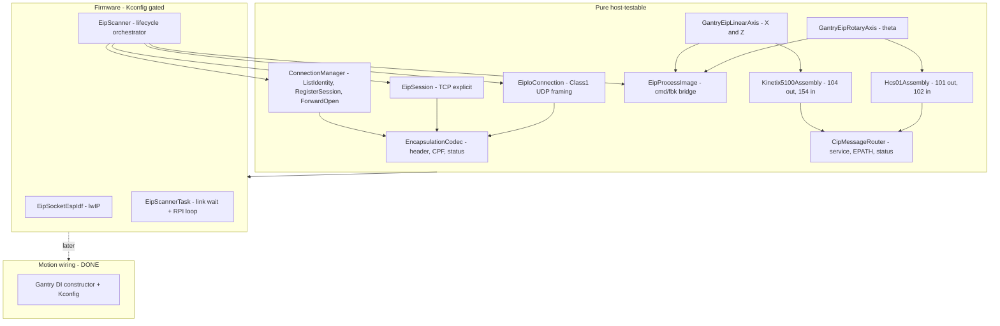

# EtherNet/IP Migration

Status: **feasibility spike complete + host-testable encoding foundation landed.**
This document records what was confirmed from the drive manuals, the
build-vs-port decision, the per-drive go/no-go, the byte maps the firmware
encodes/decodes, and the phased roadmap for the rest of the migration.

For the EtherNet/IP exchange, the ESP32 (WT32-ETH01) acts as the
**originator / scanner**: it opens connections to the drives (the **targets /
adapters**) and exchanges I/O.

The WT32 is the **gantry controller**: it runs motion control (kinematics, trajectory, the per-axis
drivers) and an **MQTT layer** ([lib/MqttBridge](../lib/MqttBridge)) on the same
MCU, over the same single Ethernet PHY. The EtherNet/IP originator must coexist
with those - it shares the CPU, the FreeRTOS scheduler, and the netif/socket
stack. That coexistence (cyclic scanner task priority/period vs. MQTT and motion
timing, and sharing `EthernetLink`) is a first-class concern of the deferred
**transport phase**, not an afterthought.

---

## 1. Feasibility summary

| Drive | Axis | EtherNet/IP role | Verdict |
|-------|------|------------------|---------|
| Allen-Bradley Kinetix 5100 (`2198-E1020-ERS`) | X | Class 1 adapter, fixed assemblies | **GO** |
| Allen-Bradley Kinetix 5100 (`2198-E1004-ERS`) | Z | Class 1 adapter, fixed assemblies | **GO** |
| Bosch Rexroth HCS01 (`HCS01.1E-W0005-A-03-B-ET-EC`) | theta | Multi-Ethernet (ET), configurable assemblies | **GO** - deferred (config-gated) |

### Kinetix 5100 (X, Z) - GO

From [AB_Kinetix5100_user_manual.md](../driver_datasheets_and_calculations/pdf_markdown/AB_Kinetix5100_user_manual.md):

- "The Kinetix 5100 drive is a **Class 1 EtherNet/IP** device and uses a
  Requested Packet Interval (RPI) to exchange data" (line 812). It is **not**
  CIP Motion and does **not** join a Motion Group (line 9160) - it is a plain
  Class 1 I/O device, which is exactly what a lightweight originator can drive.
- Fixed, **documented** assembly instances (Tables 102-106):
  - Output (O->T, originator->drive): **instance 104** (40 bytes) or
    **instance 106** (84 bytes, adds camming/gearing).
  - Input (T->O, drive->originator): **instance 154** (52 bytes).
- Default **RPI 20 ms** is recommended ("a simple I/O device, not integrated
  motion", line 6856); min 2.0 ms.
- Class 3 **explicit messaging** is also supported for parameter access
  (line 718), and IO-mode monitor parameters (ID060..ID064) surface in the
  input assembly (line 14579).

This is a standard ODVA Class 1 target. A minimal custom originator
(ListIdentity -> RegisterSession -> ForwardOpen -> cyclic UDP I/O) is
sufficient; no vendor stack is required.

### HCS01 / IndraDrive Cs (theta) - GO, deferred

Type code (project planning manual line 1326): `HCS01.1E-W0005-A-03-**B-ET**-EC`
= **BASIC** control section + **ET = Multi-Ethernet** module + **EC** encoder.
The Multi-Ethernet module supports EtherNet/IP (project planning line 4865).

The spike originally rated theta CONDITIONAL pending the "Functional
Description" + EDS. Two of those documents are now in-repo and confirm
feasibility with a concrete data design:

- [MPx-18 Functions Application Manual](../driver_datasheets_and_calculations/pdf_markdown/R911338673_01_EN_Rexroth%20IndraDrive%20MPx-18%20Functions_Application%20Manual.md)
  section **4.8** is the EtherNet/IP functional description.
- [MPx-16..21 Parameters Reference Book](../driver_datasheets_and_calculations/pdf_markdown/R911328651_15_EN_IndraDrive%20MPx-16%20to%20MPx-21%20and%20PSB%20Parameters_Reference%20Book.md)
  gives the exact control/status word bit maps.

Key confirmed facts (Functions manual 4.8):

- "Generic Device" profile (ODVA 2.0), Level 2 server; Class 1 implicit I/O +
  Class 3 explicit messaging (lines 5671-5677). Standard CIP objects only:
  Identity 0x01, Message Router 0x02, Connection Manager 0x06, Assembly 0x04,
  TCP/IP 0xF5, Ethernet Link 0xF6, Port 0xF4 (lines 5852-5864).
- **Static assembly instances**: Output (master->drive, consumed) =
  **class 0x04, instance 101**; Input (drive->master, produced) =
  **class 0x04, instance 102** (line 5938).
- Crucially, the assembly **contents are configurable**, not fixed: they are
  defined by `P-0-4081` (cyclic command values) and `P-0-4080` (cyclic actual
  values), up to 15 params / 24 words / 48 bytes per direction (lines 5681,
  5830, 5936).
- Connection: Exclusive Owner (Transport Class 1); unicast O->T, multicast T->O
  over UDP (lines 5868-5890). Min API **2 ms**, set via `P-0-4076` (2-65 ms,
  1 ms steps, line 5832). 32-bit Run/Idle header used (line 5896).
- Field-bus scalar format is **Intel / little-endian** (`i32`/`u32` =
  "Intel format", lines 4501-4507) - matches our `EipByteBuffer` codec.

So theta-over-EtherNet/IP is feasible. It stays **deferred** only because it is
gated on bench config (EDS import + IndraWorks parameter setup), not on any
capability or protocol gap. The concrete data design is in section 4 below.

**Recommendation:** implement the Kinetix path first (fixed assemblies, zero
drive-side config), then HCS01 once the process data is commissioned. The
step/dir-on-X31 fallback in [docs/MOTION_IO_INTERFACE.md](MOTION_IO_INTERFACE.md)
remains available if bench bring-up over EtherNet/IP stalls. A **hybrid bus**
(X/Z on EtherNet/IP, theta on either path) is the working assumption.

---

## 2. Build vs. port decision

**Decision: build a minimal custom originator** tailored to these drives.

Rationale:

- The only firmly-required target (Kinetix 5100) is a *simple* Class 1 device
  with a small, fixed assembly set and a slow RPI (20 ms). The protocol surface
  we must implement is small.
- Mature open-source options do not fit cleanly: **OpENer** is an
  adapter/target stack (wrong side - we need the originator/scanner), and
  **EIPScanner** is a Linux/POSIX C++ scanner that would need a non-trivial
  ESP-IDF/lwIP port and pulls in more than we need.
- A custom layer lets us keep the *protocol framing* completely free of ESP-IDF
  so it is **host-unit-testable** in the existing CI lane, with only the socket
  transport living in firmware later.

Scope of the originator subset we will implement (across phases):

- Encapsulation: `ListIdentity` (0x0063), `RegisterSession` (0x0065),
  `UnRegisterSession` (0x0066), `SendRRData` (0x006F, explicit),
  `SendUnitData` (0x0070, connected/implicit framing).
- Common Packet Format (CPF) item encode/decode.
- CIP Message Router request/response (service, EPATH, general status).
- Connection Manager `ForwardOpen` (0x54) / `ForwardClose` (0x4E).
- Kinetix 5100 assembly (de)serialization for instances 104 and 154.

---

## 3. Byte maps encoded by the firmware (Kinetix 5100)

All multi-byte scalars are **little-endian** (CIP/EtherNet/IP convention).

### 3.1 Output assembly - instance 104 (O->T, 40 bytes)

| Offset | Type | Field |
|-------:|------|-------|
| 0  | SINT | OperatingMode (1=Position, 2=Speed, 3=Home, 4=Torque, ...) |
| 1  | byte (bits) | Control: bit0 ServoOn, bit1 ServoOff, bit2 StopMotion, bit3 FaultReset, bit4 StartMotion |
| 2  | -    | reserved |
| 3  | SINT | HomingMethod |
| 4  | DINT | SpeedReference (0.1 RPM) |
| 8  | DINT | AccelReference (0.1 RPM/s) |
| 12 | DINT | DecelReference (0.1 RPM/s) |
| 16 | DINT | PositionReference (user units / PUU) |
| 20 | DINT | HomeReturnSpeed (0.1 RPM) |
| 24 | SINT | NonCyclicMoveType (0=Absolute, 1=Relative, 2=Incremental, 3=HS capture) |
| 25 | SINT | CyclicMoveType |
| 26 | SINT | TravelMode (2=non-cyclic, 10=cyclic) |
| 27 | byte (bits) | bit0 PositionCommandOverride, bit1 PositionCommandOverlap, bit2 CapturedPositionSelect |
| 28 | DINT | TorqueReference (0.1% rated) |
| 32 | DINT | TorqueRampTime (ms) |
| 36 | SINT | StartingIndex (PR 0..99) + 3 pad bytes |

Instance **106** is a superset (84 bytes): identical 0..39 layout, then adds
cam/gear fields (40..83). The foundation models 104; 106 is a later extension.

### 3.2 Input assembly - instance 154 (T->O, 52 bytes)

| Offset | Type | Field |
|-------:|------|-------|
| 0  | byte (bits) | bit0 RunMode, bit1 ConnectionFaulted, bit2 DiagnosticActive |
| 1  | SINT | DiagnosticSequenceCount |
| 2-7 | -   | pad / LINT alignment (bit3 of byte2 = UncertainFault) |
| 8  | byte (bits) | bit1 Fault, bit2 Uncertain |
| 9  | byte (bits) | bit1 WarningPresent, bit2 Active, bit3 Ready, bit4 CommandInProgress, bit5 HomedStatus, bit6 Stopped, bit7 AtReference |
| 11 | SINT | OperatingMode (echoed) |
| 12 | SINT | ActiveIndex (PR) |
| 15 | SINT | MotorType (0 none, 1 rotary, 2 linear) |
| 16 | DINT | ActualSpeed (RPM) |
| 20 | UINT | FaultCode |
| 22 | UINT | WarningCode |
| 24 | DINT | ActualPosition (PUU) |
| 28 | DINT | ActualTorque (% rated) |
| 32 | DINT | ParameterMonitor1Value |
| 36 | DINT | ParameterMonitor2Value |
| 40 | DINT | ParameterMonitor3Value |
| 44 | DINT | ParameterMonitor4Value |
| 48 | DINT | ParameterMonitor5Value |

> The `CommandInProgress` bit *toggles* (0<->1) each time a new motion command
> is accepted; it does not pulse. Edge-detect it rather than level-check it.

---

## 4. Process data design (HCS01 / IndraDrive)

Unlike the Kinetix's fixed assemblies, the HCS01 builds assembly instances
**101** (O->T, command) and **102** (T->O, actual) from a process-data list we
choose and commission via IndraWorks. "The data required" is therefore a
**configuration we design**, not a table to read off. All scalars are
little-endian (Intel format).

### 4.1 Profile and configuration parameters

Use profile type **`P-0-4084 = 0xFFFE`** (freely configurable). The cyclic data
is then defined by two list parameters (Functions manual 4.8, lines 4729-4755):

| Parameter | Direction | Role |
|-----------|-----------|------|
| `P-0-4081` | master -> drive (instance 101) | config list of cyclic command values |
| `P-0-4080` | drive -> master (instance 102) | config list of cyclic actual values |
| `P-0-4077` | command word 1 | field-bus control word (state machine) |
| `P-0-4078` | actual word 1 | field-bus status word |
| `P-0-4076` | - | process-data update clock / API (min 2 ms) |
| `P-0-4074` | - | data format (verify endianness/word order) |
| `P-0-4089.0.13/.14/.15` | - | IP / netmask / gateway |
| `S-0-1020` | - | separate engineering IP (IndraWorks) |

`P-0-4077`/`P-0-4078` must always be the **first word** in their respective
lists (Parameters ref. lines 81182, 81215).

### 4.2 Recommended map - drive-controlled positioning (theta is rotary)

From the exemplary config (Functions manual Tab. 4-21/4-22, lines 4940-4963):

**Command - instance 101 (`P-0-4081`), 10 bytes:**

| Offset | Param | Field | Type |
|-------:|-------|-------|------|
| 0 | `P-0-4077` | Field bus control word | u16 |
| 2 | `S-0-0282` | Positioning command value | i32 |
| 6 | `S-0-0259` | Positioning velocity | i32 |

**Actual - instance 102 (`P-0-4080`), 14 bytes:**

| Offset | Param | Field | Type |
|-------:|-------|-------|------|
| 0 | `P-0-4078` | Field bus status word | u16 |
| 2 | `S-0-0051` | Position feedback value 1 | i32 |
| 6 | `S-0-0040` | Velocity feedback value | i32 |
| 10 | `S-0-0390` | Diagnostic message number | u32 |

Using `S-0-0282` (positioning command value) rather than `S-0-0258` (target
position) lets control-word bits 0/3/4 switch absolute/relative inline
(Functions manual line 4934).

### 4.3 Control word `P-0-4077` bit map (Parameters ref. Tab. 4-357)

| Bit | Function |
|----:|----------|
| 0 | Command value acceptance (toggle -> activate positioning block / take over command) |
| 1 | Operating mode setting (0->1 operating mode, 1->0 parameter mode) |
| 2 | Homing - start/terminate command C6 |
| 3 | Absolute (0) / relative (1) - only with `S-0-0282` |
| 4 | Immediate block change - only with `S-0-0282` |
| 5 | Clear errors - start command C5 |
| 7/6 | Positioning(00) / jog+(01) / jog-(10) / positioning halt(11) |
| 9/8 | Command operation mode (00 primary, 01/10/11 secondary 1..3) |
| 12 | IPOSYNC (toggles on new cyclic command values) |
| 13 | Drive Halt (0->1 start, 1->0 halt / immediate shutdown) |
| 14 | Drive enable (auto-set internally once field-bus comm is active) |
| 15 | Drive ON (0->1 controller enable, 1->0 best-possible decel) |

Enable sequence for motion: assert **bit 15 (Drive ON)**, then **bit 13 (Drive
Halt = Drive Start)**; bit 14 follows automatically. On bus failure (`F4009` /
`E4005`) the originator must clear bits 13/14/15 to prevent auto-restart
(Functions manual line 4805).

### 4.4 Status word `P-0-4078` bit map (Parameters ref. Tab. 4-358)

| Bit | Function |
|----:|----------|
| 1/0 | Operating mode acknowledgment (10 operating, 00 parameter) |
| 2 | In reference (1 = homed) |
| 3 | In standstill (actual velocity < standstill window) |
| 4 | Command value reached / in position (mode-dependent) |
| 5 | Command change bit |
| 6 | Operating mode error |
| 7 | Status of command value processing (1 = drive not following, e.g. Drive Halt) |
| 9/8 | Actual operation mode (00 primary, 01/10/11 secondary 1..3) |
| 10 | Command value acknowledgment (toggles to ack `S-0-0282` acceptance) |
| 11 | Class 3 diagnostics message present |
| 12 | Class 2 diagnostics warning present |
| 13 | Class 1 diagnostics drive error (drive interlock) |
| 15/14 | Ready for operation (00 not ready, 01 bb, 10 Ab, 11 AF / in operation) |

Motion handshake: toggle command word bit 0 to issue a move; wait for status
word **bit 10** to toggle (command accepted), then **bit 4** (in position).

### 4.5 How this maps onto `lib/EtherNetIP/`

Implemented in `Hcs01ControlStatus` + `Hcs01Assembly` (host-tested in
`test/host/test_hcs01_assembly.cpp`): control/status word encode/decode and the
recommended drive-controlled-positioning map (10 B command / 14 B actual).

---

## 5. Protocol layering

Standard ports: explicit + session over **TCP 44818**, cyclic Class 1 I/O over
**UDP 2222**, `ListIdentity` discovery over **UDP 44818** (broadcast).

---

## 6. Roadmap

### Phase 0 - Feasibility spike (DONE)
Confirmed Kinetix 5100 Class 1 assemblies and HCS01 Multi-Ethernet capability;
chose build-over-port; documented byte maps above. HCS01 process-data design
now resolved from the MPx-18 Functions manual + Parameters Reference Book
(section 4).

### Phase 1 - Host-testable encoding foundation (DONE)
Pure `lib/EtherNetIP/` component: encapsulation + CPF + CIP MR + ListIdentity /
RegisterSession / ForwardOpen builders+parsers + Kinetix 5100 104/154 structs,
with byte-exact host unit tests in the existing CTest/CI lane.

### Phase 2 - Transport (DONE, code-complete)
`EipSession` (TCP explicit), `EipIoConnection` (Class 1 UDP framing),
`EipScanner` (RegisterSession -> ForwardOpen -> cyclic RPI exchange ->
ForwardClose lifecycle), `EipSocketEspIdf`, and a Kconfig-gated `EipScannerTask`
(default off) that waits on Ethernet link-up then drives the scanner at RPI.
Host tests in `test_eip_transport.cpp`. Firmware links the component; scanner is
off by default so PulseMotor + MQTT behavior is unchanged. Cyclic O->T payload
is an idle (servo-off) buffer until Phase 3 motion integration.

**Bench validation still open:** confirm ForwardOpen connection path, config-
assembly instance, and Run/Idle header against Kinetix/HCS01 EDS + hardware.
These do not block closing Phase 2 as a software deliverable.

### Phase 3 - Motion integration (DONE)
`EipProcessImage` (mutex-guarded command/feedback bridge), `GantryEipLinearAxis`
(Kinetix 5100 104/154 — covers **both X belt and Z ballscrew** via config),
`GantryEipRotaryAxis` (HCS01 101/102 theta), and `EipScanner::setProcessImage()`
integration are implemented and host-tested in `test_eip_axis.cpp`.

The `Gantry` **dependency-injection constructor** accepts pre-built
`unique_ptr<GantryLinearAxis>` (X, Z) and `unique_ptr<GantryRotaryAxis>` (theta)
objects. Public static factories `makePulseMotorLinearAxis()` /
`makePulseMotorRotaryAxis()` let `app_main` build non-EIP axes independently.

Per-axis Kconfig (`EIP_AXIS_SELECT` choice: None / X / Z / Theta) selects one
axis at run time for EtherNet/IP; all others stay on PulseMotor. The selected
EIP axis gets a static `EipProcessImage` shared with the scanner task.
`EipScannerTask` picks the correct assemblies and drive family (Kinetix 104/154
or HCS01 101/102) from the Kconfig choice. PulseMotor remains the default
unchanged path when `EIP_AXIS_NONE` is selected.

**Still deferred:** console commands, and bench validation on real drives.
See [EIP_VALIDATION_CHECKLIST.md](EIP_VALIDATION_CHECKLIST.md) for the step-by-step
bench bring-up sequence. Start live integration with X when hardware + EDS are available.

### Phase 4 - HCS01 / theta assembly layer (DONE for positioning map)
`Hcs01ControlStatus` + `Hcs01Assembly` implement the section-4 positioning map
(host-tested). Remaining: IndraWorks commissioning (EDS import, `P-0-408x`
setup) and bench validation. Fallback to step/dir on X31 if bring-up stalls.

### Phase 5 - EtherCAT/SOEM de-scoped (2026-07-03)

Per [DRIVE_PROTOCOL_AND_ENDSTOP_REVIEW.md](DRIVE_PROTOCOL_AND_ENDSTOP_REVIEW.md),
the EtherCAT path via SOEM/W5500 has been de-scoped from active build targets:

- The Kinetix 5100 drives (X, Z) do not support EtherCAT -- only the HCS01 (Theta) does.
- The HCS01 already supports EtherNet/IP via its Multi-Ethernet module, making
  EtherNet/IP the only unified bus covering all three drives.
- The `lib/SOEM/` component is removed from `EXTRA_COMPONENT_DIRS` and no
  longer compiles into the firmware image. Source files remain in the repo for
  reference.
- The `lib/W5500/` SPI driver and its host tests (`test_w5500_spi`) are kept
  for potential future use (e.g. W5500-as-Ethernet-PHY), but no EtherCAT master
  stack is built on top of it.
- The standalone `test/w5500_loopback/` validation project remains available
  for hardware verification of the WIZ850io module.

---

## 7. Open items / documents still needed

| Item | Status | Needed for |
|------|--------|------------|
| Rexroth EtherNet/IP **EDS** (`IndraDrive_EIP_MPx18.EDS`) | MISSING | Exact connection points + config-assembly instance for ForwardOpen (Functions manual line 5816) |
| Verify `P-0-4074` data format / 32-bit word order | TO CONFIRM | Tab. 4-20/4-22 list `(H)` before `(L)` per i32, in tension with "Intel format" - pin against EDS + bench capture before trusting the codec for HCS01 |
| HCS01 scaling setup (`S-0-0282`, `S-0-0259` units) | TO CONFIG | Map theta degrees/PUU + velocity units in IndraWorks |
| Kinetix 5100 **EDS** | MISSING | Bench validation: ForwardOpen config-assembly instance, connection path, Run/Idle header (currently PROVISIONAL defaults in `EipScanner`) |
| Bench validation (Kinetix + HCS01) | TO DO | Confirm Class 1 lifecycle against real drives on the wire — see [EIP_VALIDATION_CHECKLIST.md](EIP_VALIDATION_CHECKLIST.md) |
| Rexroth **MPB Functional Description** | NICE TO HAVE | X31 step/dir pin assignment (only needed if taking the fallback path) |
| Safe Torque Off (STO) wiring | OUT OF SCOPE | Remains hardwired regardless of bus |

> Resolved since the spike: the MPx-18 Functions Application Manual (EtherNet/IP
> section 4.8) and the MPx-16..21 Parameters Reference Book (control/status word
> bit maps) are now in-repo and fully cover the HCS01 process-data design.
