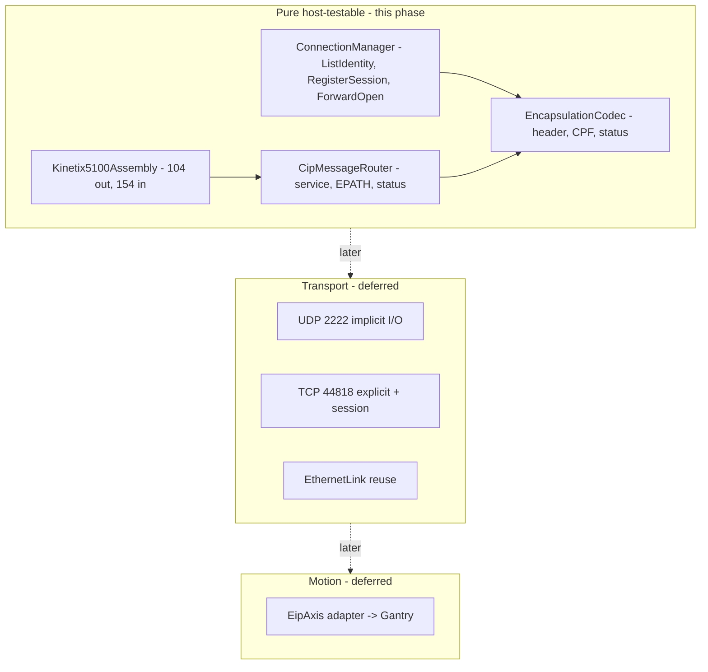

# EtherNet/IP Migration

Status: **feasibility spike complete + host-testable encoding foundation landed.**
This document records what was confirmed from the drive manuals, the
build-vs-port decision, the per-drive go/no-go, the byte maps the firmware
encodes/decodes, and the phased roadmap for the rest of the migration.

The ESP32 (WT32-ETH01) acts as the EtherNet/IP **originator / scanner**: it
opens connections to the drives (the **targets / adapters**) and exchanges I/O.

---

## 1. Feasibility summary

| Drive | Axis | EtherNet/IP role | Verdict |
|-------|------|------------------|---------|
| Allen-Bradley Kinetix 5100 (`2198-E1020-ERS`) | X | Class 1 adapter, fixed assemblies | **GO** |
| Allen-Bradley Kinetix 5100 (`2198-E1004-ERS`) | Z | Class 1 adapter, fixed assemblies | **GO** |
| Bosch Rexroth HCS01 (`HCS01.1E-W0005-A-03-B-ET-EC`) | theta | Multi-Ethernet (ET), configurable assemblies | **CONDITIONAL** - deferred |

### Kinetix 5100 (X, Z) - GO

From [AB_Kinetix5100_user_manual.md](../driver_datasheets_and_calculations/pdf_markdown/AB_Kinetix5100_user_manual.md):

- "The Kinetix 5100 drive is a **Class 1 EtherNet/IP** device and uses a
  Requested Packet Interval (RPI) to exchange data" (line 812). It is **not**
  CIP Motion and does **not** join a Motion Group (line 9160) - it is a plain
  Class 1 I/O device, which is exactly what a lightweight originator can drive.
- Fixed, **documented** assembly instances (Tables 102-106):
  - Output (O->T, originator->drive): **instance 104** (40 bytes) or
    **instance 106** (84 bytes, adds camming/gearing).
  - Input (T->O, drive->originator): **instance 154** (52 bytes).
- Default **RPI 20 ms** is recommended ("a simple I/O device, not integrated
  motion", line 6856); min 2.0 ms.
- Class 3 **explicit messaging** is also supported for parameter access
  (line 718), and IO-mode monitor parameters (ID060..ID064) surface in the
  input assembly (line 14579).

This is a standard ODVA Class 1 target. A minimal custom originator
(ListIdentity -> RegisterSession -> ForwardOpen -> cyclic UDP I/O) is
sufficient; no vendor stack is required.

### HCS01 / IndraDrive Cs (theta) - CONDITIONAL, deferred

From [Rexroth HCS-01 Drive Project Planning Manual](../driver_datasheets_and_calculations/pdf_markdown/Rexroth%20HCS-01%20Drive%20Project%20Planning%20Manual%20R911322210_03.md):

- The unit `HCS01.1E-W0005-A-03-**B-ET**-EC` decodes (type-code table, line
  1326) as **BASIC** control section with the **ET = Multi-Ethernet** module
  and **EC** encoder option.
- The Multi-Ethernet module explicitly supports EtherNet/IP: "drive controllers
  can be integrated in different Ethernet field bus systems (e.g. sercos III,
  EtherCAT, **EtherNet/IP** or PROFINET)" (line 4865; also listed line 341).
- Physical interface: RJ-45, 100Base-TX, dual-port (X24 P2 / X25 P1 per the
  communication table, line 4870; an earlier table also references X22/X23 for
  the ET option - confirm against the actual unit). Topology Input/Output is
  "arbitrary" for EtherNet/IP (lines 4884-4886).

So theta-over-EtherNet/IP is **firmware-supported**. The blocker is *data
definition*, not capability:

- Unlike the Kinetix's fixed assemblies, the Rexroth EtherNet/IP cyclic process
  data is **freely configurable** (the "arbitrary" I/O above). The actual
  assembly instance numbers and byte layout are defined by the configured
  real-time process-data channel, not fixed in these manuals.
- Defining and mapping that process data requires the **MPB Functional
  Description** (already recorded as missing in
  [docs/MOTION_IO_INTERFACE.md](MOTION_IO_INTERFACE.md)), the Rexroth
  EtherNet/IP **EDS**, and IndraWorks configuration - none of which are on hand.

**Recommendation:** implement the Kinetix path first (fully documented), and
keep theta deferred. Two theta options remain open and are *not* foreclosed by
this foundation work:

1. **theta over EtherNet/IP** (preferred goal) - unblock once the MPB
   Functional Description + EtherNet/IP EDS are obtained and the process-data
   map is fixed in IndraWorks.
2. **theta on step/dir via X31** (fallback) - the hybrid already sketched in
   [docs/MOTION_IO_INTERFACE.md](MOTION_IO_INTERFACE.md); also needs the MPB
   Functional Description for the X31 pin assignment.

A **hybrid bus** (X/Z on EtherNet/IP, theta on either path) is therefore the
working assumption.

---

## 2. Build vs. port decision

**Decision: build a minimal custom originator** tailored to these drives.

Rationale:

- The only firmly-required target (Kinetix 5100) is a *simple* Class 1 device
  with a small, fixed assembly set and a slow RPI (20 ms). The protocol surface
  we must implement is small.
- Mature open-source options do not fit cleanly: **OpENer** is an
  adapter/target stack (wrong side - we need the originator/scanner), and
  **EIPScanner** is a Linux/POSIX C++ scanner that would need a non-trivial
  ESP-IDF/lwIP port and pulls in more than we need.
- A custom layer lets us keep the *protocol framing* completely free of ESP-IDF
  so it is **host-unit-testable** in the existing CI lane, with only the socket
  transport living in firmware later.

Scope of the originator subset we will implement (across phases):

- Encapsulation: `ListIdentity` (0x0063), `RegisterSession` (0x0065),
  `UnRegisterSession` (0x0066), `SendRRData` (0x006F, explicit),
  `SendUnitData` (0x0070, connected/implicit framing).
- Common Packet Format (CPF) item encode/decode.
- CIP Message Router request/response (service, EPATH, general status).
- Connection Manager `ForwardOpen` (0x54) / `ForwardClose` (0x4E).
- Kinetix 5100 assembly (de)serialization for instances 104 and 154.

---

## 3. Byte maps encoded by the firmware (Kinetix 5100)

All multi-byte scalars are **little-endian** (CIP/EtherNet/IP convention).

### 3.1 Output assembly - instance 104 (O->T, 40 bytes)

| Offset | Type | Field |
|-------:|------|-------|
| 0  | SINT | OperatingMode (1=Position, 2=Speed, 3=Home, 4=Torque, ...) |
| 1  | byte (bits) | Control: bit0 ServoOn, bit1 ServoOff, bit2 StopMotion, bit3 FaultReset, bit4 StartMotion |
| 2  | -    | reserved |
| 3  | SINT | HomingMethod |
| 4  | DINT | SpeedReference (0.1 RPM) |
| 8  | DINT | AccelReference (0.1 RPM/s) |
| 12 | DINT | DecelReference (0.1 RPM/s) |
| 16 | DINT | PositionReference (user units / PUU) |
| 20 | DINT | HomeReturnSpeed (0.1 RPM) |
| 24 | SINT | NonCyclicMoveType (0=Absolute, 1=Relative, 2=Incremental, 3=HS capture) |
| 25 | SINT | CyclicMoveType |
| 26 | SINT | TravelMode (2=non-cyclic, 10=cyclic) |
| 27 | byte (bits) | bit0 PositionCommandOverride, bit1 PositionCommandOverlap, bit2 CapturedPositionSelect |
| 28 | DINT | TorqueReference (0.1% rated) |
| 32 | DINT | TorqueRampTime (ms) |
| 36 | SINT | StartingIndex (PR 0..99) + 3 pad bytes |

Instance **106** is a superset (84 bytes): identical 0..39 layout, then adds
cam/gear fields (40..83). The foundation models 104; 106 is a later extension.

### 3.2 Input assembly - instance 154 (T->O, 52 bytes)

| Offset | Type | Field |
|-------:|------|-------|
| 0  | byte (bits) | bit0 RunMode, bit1 ConnectionFaulted, bit2 DiagnosticActive |
| 1  | SINT | DiagnosticSequenceCount |
| 2-7 | -   | pad / LINT alignment (bit3 of byte2 = UncertainFault) |
| 8  | byte (bits) | bit1 Fault, bit2 Uncertain |
| 9  | byte (bits) | bit1 WarningPresent, bit2 Active, bit3 Ready, bit4 CommandInProgress, bit5 HomedStatus, bit6 Stopped, bit7 AtReference |
| 11 | SINT | OperatingMode (echoed) |
| 12 | SINT | ActiveIndex (PR) |
| 15 | SINT | MotorType (0 none, 1 rotary, 2 linear) |
| 16 | DINT | ActualSpeed (RPM) |
| 20 | UINT | FaultCode |
| 22 | UINT | WarningCode |
| 24 | DINT | ActualPosition (PUU) |
| 28 | DINT | ActualTorque (% rated) |
| 32 | DINT | ParameterMonitor1Value |
| 36 | DINT | ParameterMonitor2Value |
| 40 | DINT | ParameterMonitor3Value |
| 44 | DINT | ParameterMonitor4Value |
| 48 | DINT | ParameterMonitor5Value |

> The `CommandInProgress` bit *toggles* (0<->1) each time a new motion command
> is accepted; it does not pulse. Edge-detect it rather than level-check it.

---

## 4. Protocol layering

Standard ports (for the deferred transport phase): explicit + session over
**TCP 44818**, cyclic Class 1 I/O over **UDP 2222**, `ListIdentity` discovery
over **UDP 44818** (broadcast).

---

## 5. Roadmap

### Phase 0 - Feasibility spike (DONE)
Confirmed Kinetix 5100 Class 1 assemblies and HCS01 Multi-Ethernet capability;
chose build-over-port; documented byte maps above.

### Phase 1 - Host-testable encoding foundation (THIS SESSION)
Pure `lib/EtherNetIP/` component: encapsulation + CPF + CIP MR + ListIdentity /
RegisterSession / ForwardOpen builders+parsers + Kinetix 5100 104/154 structs,
with byte-exact host unit tests in the existing CTest/CI lane. No ESP-IDF
dependency; firmware behavior unchanged (`PulseMotor` remains the live path).

### Phase 2 - Transport (deferred)
ESP-IDF UDP/TCP sockets and a cyclic scanner task at RPI; reuse/generalize
`MqttBridge::EthernetLink` for shared PHY/netif bring-up. Bench-validate the
ForwardOpen connection path and config-assembly instance against the drive EDS.

### Phase 3 - Motion integration (deferred)
`EipAxis` adapter feeding `Gantry`, console commands, and a Kconfig switch to
select the EtherNet/IP path vs. the pulse/dir path per axis. Start with X.

### Phase 4 - theta decision (deferred, doc-gated)
Resolve theta path once the MPB Functional Description + Rexroth EtherNet/IP
EDS are available: either theta-over-EtherNet/IP (preferred) or step/dir on X31
(fallback).

---

## 6. Open items / documents still needed

| Item | Needed for |
|------|------------|
| Kinetix 5100 **EDS** | Exact ForwardOpen config-assembly instance + connection parameters at bench bring-up |
| Rexroth **MPB Functional Description** | theta X31 pin assignment (step/dir fallback) AND EtherNet/IP process-data map |
| Rexroth EtherNet/IP **EDS** | theta assembly instances + byte layout if going EtherNet/IP |
| Safe Torque Off (STO) wiring | Remains hardwired regardless of bus (out of scope here) |
