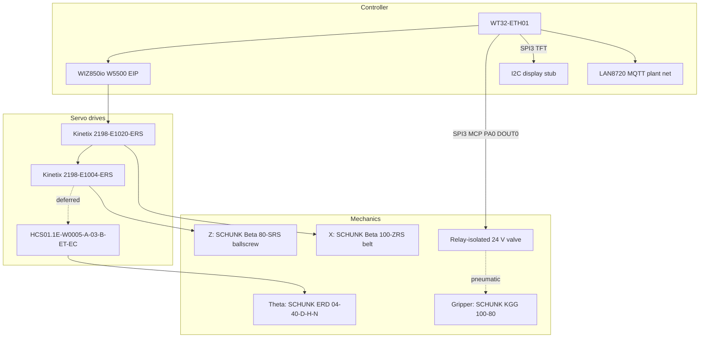

# Expected Electro-mechanical Assembly

**Status:** Canonical product-design document (EIP production architecture).  
**Companion docs:** [HV_LV_SCHEMATICS.md](HV_LV_SCHEMATICS.md), [LOW_LEVEL_GANTRY_CONTROL.md](LOW_LEVEL_GANTRY_CONTROL.md).  
**Vendor catalog:** [`driver_datasheets_and_calculations/INDEX.md`](../driver_datasheets_and_calculations/INDEX.md).

This document describes the **expected** gantry electro-mechanical build for the
Lawrence Tech battery pick project. Firmware mechanical constants live in
[`include/axis_drivetrain_params.h`](../include/axis_drivetrain_params.h).

---

## 1. Decision: EtherNet/IP over Pulse-Train

Production motion control uses **EtherNet/IP Class 1 I/O** (W5500 → Kinetix /
HCS01), **not** WT32 step/direction through an opto interface board.

| Why EIP won                                       | Why Pulse-Train was rejected                               |
| ------------------------------------------------- | ---------------------------------------------------------- |
| Drive-native Position Absolute profiles to target | Host Speed+TM10 + StopMotion undershoot/overshoot at speed |
| Fault / Homed / AtReference over assembly 154     | Custom opto board, MCP23S17, and PTI wiring complexity     |
| Drive-side endstops (TBIO / X31)                  | MCP GPIO limit path removed in 2026-07 refactor            |
| One daisy-chain for X (+ deferred Z/theta peers)  | Parallel pulse/dir/SON/ARST/ALM harness per axis           |

Legacy MCP23S17 **as a motion / limit / PTI path** is obsolete. MCP23S17 on
**SPI3 for Field 24 V I/O ×8 + TFT control** is current — see §5 and `pinout.csv`.

---

## 2. System overview

**Coordinate frame (right-handed):**

| Axis  | Meaning                       | Actuator        |
| ----- | ----------------------------- | --------------- |
| X     | Across belt                   | Beta 100-ZRS    |
| Y     | Along belt, **−Y downstream** | None (conveyor) |
| Z     | Vertical, **+Z up**           | Beta 80-SRS     |
| Theta | About Z                       | ERD 04-40       |

Joint space is `(x, z, theta)`. Soft-home zeros the **firmware** joint frame;
drive Absolute legality uses HomingMethod 34 (see software doc).

---

## 3. Networks

| Interface | Role | Notes |
|-----------|------|-------|
| WIZ850io (W5500 SPI) | EtherNet/IP Class 1 to X/Z | SPI2: MOSI17 MISO35 SCLK5 **CS15** (VDM needs CS edges; not hardwireable); **RST=MCP PB7**; INT unused |
| SPI3 MCP23S17 + TFT | Field I/O ×8 + operator display | SCLK14 MOSI4 MISO36; CS_MCP2; TFT CS=MCP PB2; BLK hardwired; KO=PB6 |
| LAN8720 (RMII) | MQTT / plant / TCP console | Separate from EIP daisy-chain |

EIP daisy-chain: WIZ850io → X PORT1 → X PORT2 → Z PORT1 → Z PORT2 (→ HCS01).
Plant switch (LAN8720 + PC + MQTT): **never** add drive Port 2 / WIZ — same `192.168.1.x` as plant causes IP clash (see LOW_LEVEL § Dual Ethernet).

---

## 4. Endstops and sensors

**Production intent:** wire NC limit switches to **drive digital inputs**, not
to the ESP32. Firmware does **not** dual-poll the same switches on GPIO.

| Axis | Connector | Drive PL (A014) | Drive NL (A015) | Config |
|------|-----------|-----------------|-----------------|--------|
| X | TBIO | INPUT1 pin 9 | INPUT2 pin 10 | KNX5100C **Positive/Forward Limit (PL)** / **Negative/Reverse Limit (NL)** |
| Z | TBIO | INPUT3 pin 34 | INPUT4 pin 8 | Same on Z drive |
| Theta | X31 | X31.5 (E3) | X31.6 (E4) | Deferred with HCS01 |

**Drive vs joint frame (X bench, 2026-08):** UM004D defines PL as the drive’s
most-**positive** travel and NL as most-**negative**. On X the motor sense is
inverted relative to gantry joint +X, so:

| Joint end | Warning | Drive name | Home/cal role |
|-----------|---------|------------|---------------|
| **−X** (min) | A014 | PL / positive | `home` zero |
| **+X** (max) | A015 | NL / negative | `calibrate` max |

Do not assume PL = joint +X. Z mapping is TBD after screw mount.

**Wiring (sinking NC):** `+24 V → NC switch → INPUTx`; `DCOM / 0 V` common.
Healthy travel: DI “on” (no overtravel). At limit: DI opens → A014/A015 →
drive stops and allows motion only away from the trip.

### 4.1 KNX5100C commissioning checklist

On **each** of X and Z drives (KNX5100C):

1. Assign TBIO inputs as **Positive/Forward Limit (PL)** / **Negative/Reverse Limit (NL)** (not generic DI).
2. Confirm sinking input + DCOM common; match sensor (NC dry vs 3-wire).
3. Trip magnet present/absent and confirm Status / overtravel polarity matches NC.
4. On X, jog toward joint −X and +X and confirm A014 @ −X and A015 @ +X (see table above).
5. Save parameters to non-volatile memory.

### 4.2 Bench validation procedure

Safe speeds only (≤50 mm/s); STO ready; clear travel. Console on UART or TCP `:2323`.

1. `enable` → Class 1 online; `faults` clear; `status` ready.
2. Trip each **X** end (manual magnet or slow jog) → drive stop/fault; EIP
   `faults` / `status` show not ready; keypad A014/A015 as applicable.
3. Release switch; `alarmreset` / clear; re-`enable` if needed.
4. Repeat for both **Z** ends.
5. Optional: `move` toward a limit under firmware — drive must stop; app must
   not keep Absolute-commanding into a latched fault.

**Acceptance:** all four ends trip + recover.

| Item | Status |
|------|--------|
| X drive TBIO limits (KNX PL/NL on INPUT1/2) | **PASS** (trip/recover) — re-run after RPI=5000 flash as regression |
| Z drive TBIO limits | **DEFERRED** — Z motor not mounted on screw; active item DEV_TRACKER #2 |
| Firmware drive-managed path | `CONFIG_EIP_ENDSTOP_FROM_DRIVE` → `GantryLimitSwitch` + move gate |

### 4.3 X-only bench (until Z is mounted)

Safe speeds only (≤50 mm/s); STO ready; clear X travel. Leave Z disabled / do not jog Z.

1. `enable` → Class 1 online; focus on **X** `faults` / `status`.
2. Trip **X−** (A014 / PL) and **X+** (A015 / NL) — manual magnet or slow jog.
3. Confirm A014/A015 (or EIP fault/stopped); release; `alarmreset`; re-`enable` if needed.
4. Optional: firmware `move` toward an X limit and confirm drive stop + app abort.

When both X ends pass trip/recover, update the X row to **PASS** with date. Revisit Z after the ballscrew is mounted and Z KNX PL/NL is assigned.

---

## 5. Field 24 V I/O and SPI3 UI

ESP SPI3 (shared): SCLK14 MOSI4 MISO36; **CS_MCP=2** (default client);
**TFT CS = MCP PB2** (software CS); **BLK hardwired ON**; KO = **MCP PB6**.
W5500 RST = **MCP PB7** (external pull-up).
Free ESP ADC: **12, 32, 33, 39**. ETH REFCLK = GPIO0_IN (not CLK-out on 17).

| Channel | MCP pin | Role |
|---------|---------|------|
| DOUT0–3 | PA0–PA3 | Field 24 V outs (DOUT0 = gripper; boot LOW) |
| DIN0–3 | PA4–PA7 | Field 24 V ins (isolator → 3.3 V) |
| TFT DC / RES | PB0 / PB1 | Display control |
| TFT CS | PB2 | Idle HIGH; assert only during display update |
| Encoder A/B/PUSH | PB3–PB5 | Amazon TFT module UI |
| KO | PB6 | Module key input |
| W5500 RSTn | PB7 | Active-low; MCP-driven (not hardwired) |

IO0 reserved for boot/DTR + ETH REFCLK. UART0 on GPIO1/3. W5500 MOSI on GPIO17.
Class 1 (SPI2) has priority over SPI3 (task prio + SPI3 deferral during exchange).
See [`pinout.csv`](../pinout.csv).

### Bench smoke (SPI3 + MCP)

1. `mcp_dump a` / `mcp_dump b` — Port A DOUT outs / DIN ins; Port B TFT + encoder + RST.
2. `field_dout 0 1` / `field_dout 0 0` — DOUT0 toggles; all DOUT boot LOW.
3. `field_din` — DIN and encoder A/B/PUSH/KO respond; TFT_CS(PB2) high idle; W5500_RST high idle.
4. Confirm TFT CS not stuck low after display stub; W5500 Class 1 still healthy.
5. UART0 console + IO0 boot unchanged.

---

## 6. Scaling (firmware-facing)

See [`include/axis_drivetrain_params.h`](../include/axis_drivetrain_params.h) and
[LOW_LEVEL_GANTRY_CONTROL.md](LOW_LEVEL_GANTRY_CONTROL.md).

---

