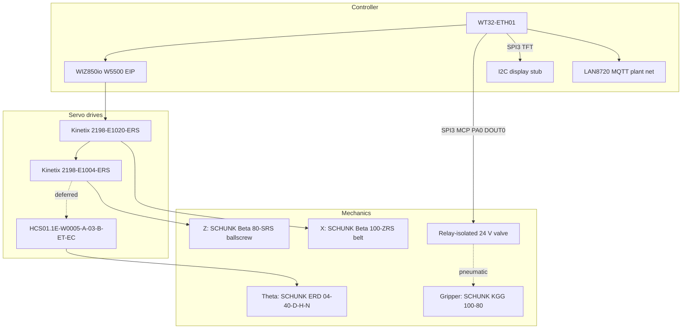

# Expected Electro-mechanical Assembly

**Status:** Canonical product-design document (EIP production architecture).  
**Companion docs:** [HV_LV_SCHEMATICS.md](HV_LV_SCHEMATICS.md), [LOW_LEVEL_GANTRY_CONTROL.md](LOW_LEVEL_GANTRY_CONTROL.md).  
**Vendor catalog:** [`driver_datasheets_and_calculations/INDEX.md`](../driver_datasheets_and_calculations/INDEX.md).

This document describes the **expected** gantry electro-mechanical build for the
Lawrence Tech battery pick project. Firmware mechanical constants live in
[`include/axis_drivetrain_params.h`](../include/axis_drivetrain_params.h).

---

## 1. Decision: EtherNet/IP over Pulse-Train

Production motion control uses **EtherNet/IP Class 1 I/O** (W5500 → Kinetix /
HCS01), **not** WT32 step/direction through an opto interface board.


| Why EIP won                                       | Why Pulse-Train was rejected                               |
| ------------------------------------------------- | ---------------------------------------------------------- |
| Drive-native Position Absolute profiles to target | Host Speed+TM10 + StopMotion undershoot/overshoot at speed |
| Fault / Homed / AtReference over assembly 154     | Custom opto board, MCP23S17, and PTI wiring complexity     |
| Drive-side endstops (TBIO / X31)                  | MCP GPIO limit path removed in 2026-07 refactor            |
| One daisy-chain for X / Z / HCS01 theta     | Parallel pulse/dir/SON/ARST/ALM harness per axis           |


Legacy MCP23S17 **as a motion / limit / PTI path** is obsolete. MCP23S17 on
**SPI3 for Field 24 V I/O ×8 + TFT control** is current — see §5 and `pinout.csv`.

---


## 2. System overview




**Coordinate frame (right-handed):**


| Axis  | Meaning                       | Actuator        |
| ----- | ----------------------------- | --------------- |
| X     | Across belt (sign unchanged)     | Beta 100-ZRS    |
| Y     | Along belt, **+Y downstream**    | None (conveyor) |
| Z     | Vertical, **+Z down** (belt)     | Beta 80-SRS     |
| Theta | About Z                       | ERD 04-40       |


Joint space is `(x, z, theta)`. Soft-home zeros the **firmware** joint frame;
drive Absolute legality uses HomingMethod 34 (see software doc).

---

## 3. Networks & Cell Topology

The WT32-ETH01 Gantry Controller operates across two physically isolated network segments:

```
                  ┌────────────────────────────────────────────────────────┐
                  │          External Factory / Plant Network (Layer 4)    │
                  │             (SCADA / MES / Web Dashboard)             │
                  └───────────────────────────┬────────────────────────────┘
                                              │  (Single Wired L4 Drop)
                                              ▼
┌──────────────────────────────────────────────────────────────────────────────────────────┐
│                   CLOSED CELL NETWORK (Layer-2 Switch / Unmanaged 100BASE-TX)            │
│                                                                                          │
│   ┌────────────────────┐   ┌────────────────────┐   ┌────────────────────────────────┐   │
│   │   Ubuntu IPC       │   │  Conveyor WT32     │   │     Raspberry Pi               │   │
│   │ (Vision Detection) │   │ (500-PPR Tracking) │   │ (Identifier / Cell Gate)       │   │
│   │  zDdsNode_vision   │   │  zDdsNode_conveyor │   │  zDdsNode_supervisor           │   │
│   └─────────┬──────────┘   └─────────┬──────────┘   │  • Closed L2 Sockets (0x88B5)  │   │
│             │                        │              │  • External L4 Sockets on eth0 │   │
│             │                        │              └───────────────┬────────────────┘   │
│             │                        │                              │                    │
│             ▼                        ▼                              ▼                    │
│   ═══════════════════════════ UNMANAGED SWITCH ═══════════════════════════════════════   │
│                                      ▲                                                   │
│                                      │ (LAN8720 RMII Drop)                               │
│                                      ▼                                                   │
│                        ┌───────────────────────────┐                                     │
│                        │     GANTRY CONTROLLER     │                                     │
│                        │      (This WT32-ETH01)    │                                     │
│                        │      zDdsNode_gantry      │                                     │
│                        └─────────────┬─────────────┘                                     │
└──────────────────────────────────────┼───────────────────────────────────────────────────┘
                                       │ (W5500 SPI Drop - Isolated Segment)
                                       ▼
┌──────────────────────────────────────────────────────────────────────────────────────────┐
│                        MOTION BUS (Dedicated EtherNet/IP Daisy-Chain)                    │
│                                                                                          │
│      WIZ850io (W5500) ──────► Kinetix X ──────► Kinetix Z ──────► Rexroth Theta (HCS01)  │
│        (192.168.1.10)       (192.168.1.20)    (192.168.1.21)         (192.168.1.23)      │
└──────────────────────────────────────────────────────────────────────────────────────────┘
```

| Interface | Role | Physical Link | Segment & Protocol |
|-----------|------|---------------|--------------------|
| **LAN8720 (RMII)** | Closed Cell Subsystem Bus | Onboard RJ45 $\rightarrow$ Unmanaged Switch | Closed Cell Switch: Zenoh-DDS / Layer-2 frames (`0x88B5`) to Vision, Conveyor, and Raspberry Pi |
| **WIZ850io (W5500 SPI)** | Dedicated Motion Bus | SPI2 $\rightarrow$ Drive PORT1 daisy-chain | Private EIP segment: EtherNet/IP Class 1 cyclic I/O ($2\text{ ms}$ RPI) strictly to X/Z/Theta servo drives |
| **SPI3 MCP23S17 + TFT** | Field I/O + Operator UI | SCLK14 MOSI4 MISO36 CS2 | Local 24 V Field I/O (gripper valve, sensors) + local ST7789 display |

**Network Isolation Rule:** The EIP daisy-chain (W5500 and Drive Port 2) must **never** be plugged into the cell unmanaged switch. The Motion Bus must remain an isolated daisy-chain loop to guarantee zero jitter and prevent MAC/IP conflicts.

---

## 3.1 Service, Maintenance & OTA Architecture

In production, the sorting cell utilizes a **Centralized Web HMI Architecture** hosted on the **Raspberry Pi Cell Coordinator**:

1. **Zero-Install Service Interface:** 
   - Maintenance engineers and operators connect a service laptop or tablet to the plant network and navigate to `https://<raspberry-pi-ip>/` in any standard browser.
   - The Web HMI displays real-time health, telemetry, and active firmware versions for all cell subsystems (Ubuntu Vision, Conveyor WT32, Gantry WT32).
2. **Centralized OTA Orchestration:**
   - When updating embedded firmware, the service engineer uploads the compiled `.bin` file directly via the Raspberry Pi Web HMI.
   - The Raspberry Pi validates cell safety (asserting conveyor is halted, gantry is parked/disabled), streams the binary image across the closed Layer-2 switch to the target WT32, verifies the post-update boot handshake, and records the new version in the maintenance audit log.
3. **Embedded MCU Lean Principle:**
   - The WT32 firmware remains deterministic and lightweight. It runs **no** HTTP web servers or heavy asset stores, exposing only a lean, authenticated binary OTA stream receiver behind its motion safety interlocks.

---

## 4. Endstops and sensors

**Production intent:** wire NC limit switches to **drive digital inputs**, not
to the ESP32. Firmware does **not** dual-poll the same switches on GPIO.

| Axis | Connector | Drive PL (A014) | Drive NL (A015) | Config |
|------|-----------|-----------------|-----------------|--------|
| X | TBIO | INPUT1 pin 9 | INPUT2 pin 10 | KNX5100C **Positive/Forward Limit (PL)** / **Negative/Reverse Limit (NL)** |
| Z | TBIO | INPUT3 pin 34 | INPUT4 pin 8 | Same on Z drive |
| Theta | X31 | X31.5 (E3) | X31.6 (E4) | Unused — HIPERFACE absolute; firmware soft-homes, does not seek X31 |

**Drive vs joint frame (X + Z bench, 2026-08):** UM004D defines PL as the drive’s
most-**positive** travel and NL as most-**negative**. On **X**, motor sense vs
joint is inverted so joint −X → A014 and joint +X → A015. On **Z**, the live
assignment is the opposite polarity vs that X map:

| Joint end | Warning | Drive name | Home/cal role |
|-----------|---------|------------|---------------|
| **−X** (min) | A014 | PL / positive | `home x` zero |
| **+X** (max) | A015 | NL / negative | `calibrate x` max |
| **−Z** (min / retracted / away from belt) | A015 | NL / negative | `home z` zero |
| **+Z** (max / toward belt / down) | A014 | PL / positive | `calibrate z` max |

Do not assume PL = joint +X/+Z. Firmware maps Z min→A015 / max→A014; if a
physical end raises the wrong warning, reassign PL/NL on that drive (do not
invert seek signs in firmware).

**Z TBIO limits (2026-08-10):** the two Z sensors are **axis travel dead-centers**
(screw / actuator stroke ends). They are **not** conveyor or pick height. They are
adjusted so the end-effector cannot crash into the belt — measured Z home/cal
length is a **safe envelope**, not product Z zero at the conveyor. Live
precision home/cal (2026-08-10): joint max ≈ **147 mm**.

**Future:** a dedicated **conveyor-height / belt-presence sensor** is present on the
machine but **not yet wired** into Field I/O or either drive. Wire it (MCP Field DIN
or spare TBIO) before relying on Z for production picks.

**Wiring (sinking NC):** `+24 V → NC switch → INPUTx`; `DCOM / 0 V` common.
Healthy travel: DI “on” (no overtravel). At limit: DI opens → A014/A015 →
drive stops and allows motion only away from the trip.

### 4.1 KNX5100C commissioning checklist

On **each** of X and Z drives (KNX5100C):

1. Assign TBIO inputs as **Positive/Forward Limit (PL)** / **Negative/Reverse Limit (NL)** (not generic DI).
2. Confirm sinking input + DCOM common; match sensor (NC dry vs 3-wire).
3. Trip magnet present/absent and confirm Status / overtravel polarity matches NC.
4. Jog toward joint min/max on X and Z: confirm **X** A014@min / A015@max and
   **Z** A015@min / A014@max (or reassign drive PL/NL).
   (same map both axes — see table above).
5. Save parameters to non-volatile memory.

### 4.2 Bench validation procedure

Safe speeds only (≤50 mm/s); STO ready; clear travel. Console on UART or TCP `:2323`.

1. `enable` → Class 1 online; `faults` clear; `status` ready.
2. Trip each **X** end (manual magnet or slow jog) → drive stop/fault; EIP
   `faults` / `status` show not ready; keypad A014/A015 as applicable.
3. Release switch; `alarmreset` / clear; re-`enable` if needed.
4. Repeat for both **Z** ends.
5. Optional: `move` toward a limit under firmware — drive must stop; app must
   not keep Absolute-commanding into a latched fault.

**Acceptance:** all four ends trip + recover.

| Item | Status |
|------|--------|
| X drive TBIO limits (KNX PL/NL on INPUT1/2) | **PASS** (2026-08-10 reconfirm after PL/NL swap; home/cal length ≈420 mm) |
| Z drive TBIO limits | **PASS** (2026-08-10; A015 @ −Z retract, A014 @ +Z toward belt; Z Absolute invert; SAFE_Z = 30 mm from Z−) |
| Firmware drive-managed path | `CONFIG_EIP_ENDSTOP_FROM_DRIVE` → `GantryLimitSwitch` + move gate (X and Z) |

### 4.3 Bench validation (X + Z complete)

Safe speeds only (≤50 mm/s); STO ready; clear travel.

**X** — complete. A014 @ joint −X, A015 @ joint +X, home/cal length ≈420 mm.

**Z** — complete (2026-08-10; map updated same day). **A015 @ joint −Z**
(retracted), **A014 @ joint +Z** (toward belt / down; swapped vs X).
Z Absolute invert so − seeks A015. SAFE_Z = 30 mm from Z− (traverse /
retract band). Bring-up: `calibrate all`.
Measured soft max ≈ **147 mm** (axis dead-center stroke — not conveyor height).
Conveyor-height sensor remains **unwired** (future Field DIN / TBIO).

---

## 5. Field 24 V I/O and SPI3 UI

ESP SPI3 (shared): SCLK14 MOSI4 MISO36; **CS_MCP=2** (default client);
**TFT CS = MCP PB2** (software CS); **BLK hardwired ON**; KO = **MCP PB6**.
W5500 RST = **MCP PB7** (external pull-up).
Free ESP ADC: **12, 32, 33, 39**. ETH REFCLK = GPIO0_IN (not CLK-out on 17).

| Channel | MCP pin | Role |
|---------|---------|------|
| DOUT0–3 | PA0–PA3 | Field 24 V outs (DOUT0 = gripper; boot LOW) |
| DIN0–3 | PA4–PA7 | Field 24 V ins (isolator → 3.3 V) |
| TFT DC / RES | PB0 / PB1 | Display control |
| TFT CS | PB2 | Idle HIGH; assert only during display update |
| Encoder A/B/PUSH | PB3–PB5 | Amazon TFT module UI |
| KO | PB6 | Module key input |
| W5500 RSTn | PB7 | Active-low; MCP-driven (not hardwired) |

IO0 = ETH REFCLK IN after boot. **Deployment:** programming harness (incl. IO0) unplugged at runtime so plant LAN works — accepted limitation, no carrier PCB change. Bench flash: RTS→EN / DTR policy per LOW_LEVEL; UART0 on GPIO1/3. W5500 MOSI on GPIO17.
Class 1 (SPI2) has priority over SPI3 (task prio + SPI3 deferral during exchange).
See [`pinout.csv`](../pinout.csv).

### Bench smoke (SPI3 + MCP)

1. `mcp_dump a` / `mcp_dump b` — Port A DOUT outs / DIN ins; Port B TFT + encoder + RST.
2. `field_dout 0 1` / `field_dout 0 0` — DOUT0 toggles; all DOUT boot LOW.
3. `field_din` — DIN and encoder A/B/PUSH/KO respond; TFT_CS(PB2) high idle; W5500_RST high idle.
4. Confirm TFT CS not stuck low after display stub; W5500 Class 1 still healthy.
5. UART0 console + IO0 boot unchanged.

---

## 6. Scaling (firmware-facing)

See [`include/axis_drivetrain_params.h`](../include/axis_drivetrain_params.h) and
[LOW_LEVEL_GANTRY_CONTROL.md](LOW_LEVEL_GANTRY_CONTROL.md).

---

