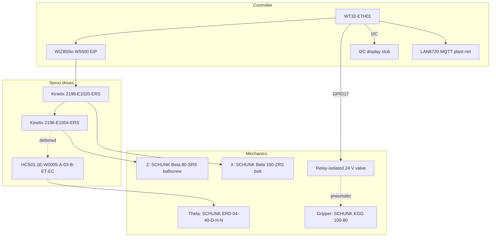

# Expected Electro-mechanical Assembly

**Status:** Canonical product-design document (EIP production architecture).  
**Companion docs:** [HV_LV_SCHEMATICS.md](HV_LV_SCHEMATICS.md), [LOW_LEVEL_GANTRY_CONTROL.md](LOW_LEVEL_GANTRY_CONTROL.md).  
**Vendor catalog:** [`driver_datasheets_and_calculations/INDEX.md`](../driver_datasheets_and_calculations/INDEX.md).

This document describes the **expected** gantry electro-mechanical build for the
Lawrence Tech battery pick project. Firmware mechanical constants live in
[`include/axis_drivetrain_params.h`](../include/axis_drivetrain_params.h).

---

## 1. Decision: EtherNet/IP over Pulse-Train

Production motion control uses **EtherNet/IP Class 1 I/O** (W5500 → Kinetix /
HCS01), **not** WT32 step/direction through an opto interface board.

| Why EIP won | Why Pulse-Train was rejected |
|-------------|------------------------------|
| Drive-native Position Absolute profiles to target | Host Speed+TM10 + StopMotion undershoot/overshoot at speed |
| Fault / Homed / AtReference over assembly 154 | Custom opto board, MCP23S17, and PTI wiring complexity |
| Drive-side endstops (TBIO / X31) | MCP GPIO limit path removed in 2026-07 refactor |
| One daisy-chain for X (+ deferred Z/theta peers) | Parallel pulse/dir/SON/ARST/ALM harness per axis |

Legacy MCP23S17 / PTI / opto-interface documentation is **obsolete** and must
not be used for new panel or harness work.

---

## 2. System overview

**Coordinate frame (right-handed):**

| Axis | Meaning | Actuator |
|------|---------|----------|
| X | Across belt | Beta 100-ZRS |
| Y | Along belt, **−Y downstream** | None (conveyor) |
| Z | Vertical, **+Z up** | Beta 80-SRS |
| Theta | About Z | ERD 04-40 |

Joint space is `(x, z, theta)`. Soft-home zeros the **firmware** joint frame;
drive Absolute legality uses HomingMethod 34 (see software doc).

---

## 3. Bill of expected hardware

### 3.1 Linear / rotary actuators (SCHUNK)

| Axis | Order / datasheet identity | Lead / pitch | Stroke / envelope | Notes |
|------|----------------------------|--------------|-------------------|-------|
| X | Beta 100-ZRS-40AT10-200-550-… | 200 mm/rev | 550 mm | AT10 belt, 20-tooth pulley |
| Z | Beta 80-SRS-M-2020-150-530-… | 20 mm pitch | 150 mm | Critical RPM 3000; **direct drive i=1** on bench |
| Theta | ERD 04-40-D-H-N | Direct | Software ±180° | Unlimited hardware rotation; cable wind-up clamp |
| Gripper | KGG 100-80 | — | Parallel | Open ~190 ms / close ~150 ms |

Commercial records: OA 1693058, McMc order acknowledgement (under
`driver_datasheets_and_calculations/`).

### 3.2 Servo drives and motors

| Axis | Drive | Motor (ordered) | Gear | Bench status |
|------|-------|-----------------|------|--------------|
| X | 2198-E1020-ERS | MPL-A320P-SK72AA | Neugart **5:1** | **Verified** EIP Position Absolute |
| Z | 2198-E1004-ERS | MPL-A310F-SK72AA | **i=1 direct** (no holding brake) | **Verified** EIP Position Absolute |
| Theta | HCS01.1E-W0005-A-03-B-ET-EC-NN-NN | ERD integrated | 1:1 | **Deferred** — 3-phase power / IndraWorks |

I/O blocks: 2× `2198-TBIO` (X, Z). Factory motor/feedback cables per McMc /
Youngblood POs (see wire schedule).

### 3.3 Controller and networks

| Item | Role | Address / pin |
|------|------|---------------|
| WT32-ETH01 | Gantry MCU | — |
| WIZ850io (W5500 SPI) | EIP originator | SPI: MOSI12 MISO35 SCLK5 CS15 RST32 INT33 |
| LAN8720 (on-module) | MQTT / plant Ethernet + TCP console `:2323` | Separate physical net from EIP; gantry `192.168.1.100` |
| I2C display | Operator UI stub (`lib/I2cDisplay`) | SDA **GPIO4**, SCL **GPIO14** |
| Gripper valve chain | 5 V relay → high-current 24 V relay → solenoid valve | ESP32 **GPIO17** |

EIP daisy-chain (bench): `W5500 → X PORT1 → X PORT2 → Z PORT1 → Z PORT2 → (PC)`.  
IPs: WT32 `192.168.1.10`, X `.20`, Z `.21`, theta reserved `.30`.

### 3.4 Panel power (expected — see schematics)

Supply class: **200–240 VAC three-phase** (matches Kinetix E10xx 170–253 V),
**not** 480Y/277 V feeder for the drives.

| Tag | Function | Catalog (BOM) |
|-----|----------|---------------|
| DISC1 | Main disconnect | TBD lockable |
| CB0 | Main MCCB ~40 A | 140UT-D7D3-C40 |
| CB1 / CB2 / CB3 | X / Z / Theta branches | 1489-M2D400 / M2D100 / M2D020 |
| CB4 | 24 V PSU feed | Size ≥2 A (BOM notes 1 A undersized) |
| K1–K3 | Safety contactors | 100S-C43 / C16 / C09 |
| LF1–LF3 | Line filters | 2198-DB127-F, DB111-F, NFD03.1… |
| PS1 | 24 VDC ~240 W | 1606-XLE240E |
| PS2 | 5 VDC for controller | Phoenix STEP3 5 V 3 A |

Full panel BOM is generated from [`tools/generate_bom.py`](../tools/generate_bom.py)
→ [`BOM.xlsx`](../driver_datasheets_and_calculations/BOM.xlsx).

---

## 4. Endstops and sensors

**Production intent:** wire NC limit switches to **drive digital inputs**, not
to the ESP32.

| Axis | Connector | Forward / + | Reverse / − | Config |
|------|-----------|-------------|-------------|--------|
| X | TBIO | INPUT1 pin 9 | INPUT2 pin 10 | KNX5100C Forward/Reverse Limit |
| Z | TBIO | INPUT3 pin 34 | INPUT4 pin 8 | Same on Z drive |
| Theta | X31 | X31.5 (E3) | X31.6 (E4) | P-0-0222 if cable sensors used |

Wiring (sinking NC): `+24 V → NC switch → INPUTx`; `DCOM / 0 V` common.

**Bench today:** soft-home (no physical limits on controller). Drive HomingMethod
34 unlocks Absolute. When TBIO limits are installed, firmware reads Fault /
Stopped via assembly feedback (`CONFIG_EIP_ENDSTOP_SOURCE`).

Actuator order codes include integrated switch options (2EO10 / 1ES10 on X/Z).

---

## 5. Scaling and kinematics (firmware-facing)

| Parameter | X | Z |
|-----------|---|---|
| Lead | 200 mm/rev | 20 mm/rev |
| Motor reducer | **5** | **1** (direct) |
| PUU / motor-rev | 2097152 | 2097152 |
| PUU/mm (Kconfig) | **52428.8** | **104857.6** |
| speed_ref per mm/s | 15 | 30 |
| Hard stroke | 0…550 mm | 0…150 mm |
| Position tol (datasheet) | ±0.08 mm | ±0.03 mm |

Z drive electronic gear in KNX5100C must be **1:1** (firmware scale alone is
not enough). Z motor: **no holding brake** — keep Servo On under load.

Geometry offsets in `axis_drivetrain_params.h` are **development-rig
placeholders** until `GANTRY_GEOMETRY_FROZEN` is attested.

Reserved / missing: SCHUNK Trap Move inertia/torque attachments; full ERD
datasheet beyond header macros.

---

## 6. Verification status

| Item | Status | Evidence |
|------|--------|----------|
| X/Z EIP Class 1 + Position Absolute @ 200 mm/s | **PASS** | Console: `move 150 150 0` / `move 0 0 0` within ±1 mm (2026-07-20) |
| Soft-home joint datum | **PASS** | Console soft-home path |
| Theta EIP on wire | **Deferred** | Power / IndraWorks / EDS |
| Drive-wired endstops | **Planned** | Not installed on soft-home bench |
| Geometry freeze | **Open** | Dev-rig offsets |
| MQTT LAN8720 | **Open** | Link often down on bench; EIP unaffected |
| TCP console `:2323` on LAN8720 | **When ETH up** | Password auth; same commands as UART; see LOW_LEVEL §9 |
| Panel HV/LV construction | **Preliminary** | See schematics — not for construction |

---

## 7. Related artifacts

| Artifact | Role |
|----------|------|
| [HV_LV_SCHEMATICS.md](HV_LV_SCHEMATICS.md) | Electrical design basis + panel image; logic-board schematic pending |
| [LOW_LEVEL_GANTRY_CONTROL.md](LOW_LEVEL_GANTRY_CONTROL.md) | Firmware / console / EIP motion |
| [`pinout.csv`](../pinout.csv) | Controller pin map |
| [`BOM.xlsx`](../driver_datasheets_and_calculations/BOM.xlsx) | Panel BOM |
| [`WIRE_SIZE_SELECTION.xlsx`](../driver_datasheets_and_calculations/WIRE_SIZE_SELECTION.xlsx) | Branch / cable schedule |
| SCHUNK + Rockwell + Rexroth PDFs | Vendor authority |
