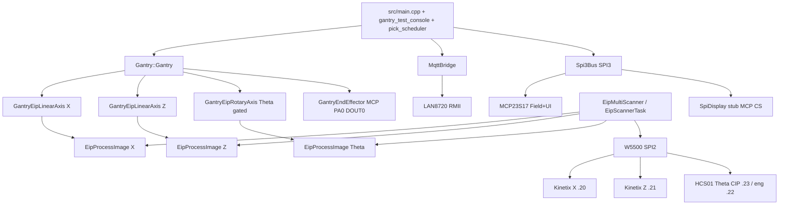
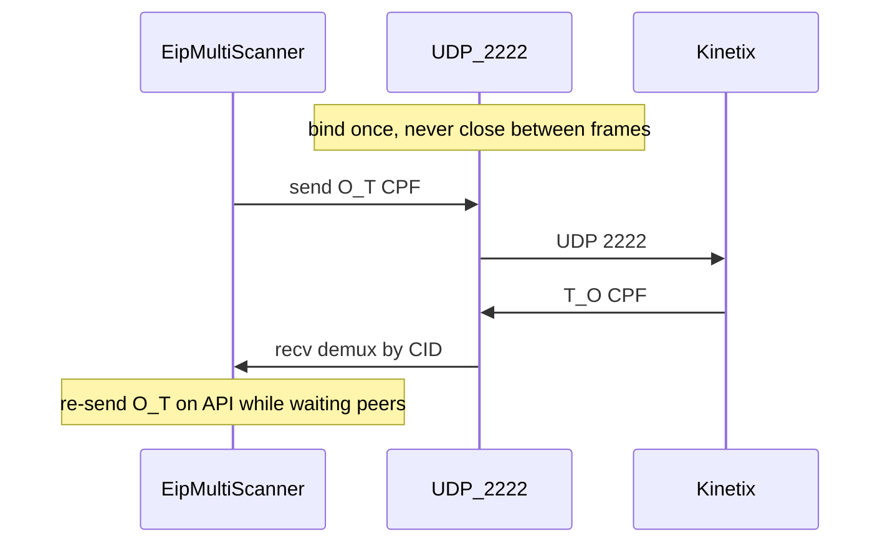

# Low-Level Gantry Control (for software)

**Status:** Canonical software design document (EIP production architecture).  
**Companions:** [EXPECTED_ELECTROMECHANICAL_ASSEMBLY.md](EXPECTED_ELECTROMECHANICAL_ASSEMBLY.md),
[HV_LV_SCHEMATICS.md](HV_LV_SCHEMATICS.md), [`pinout.csv`](../pinout.csv).

Application code commands motion **only** through `Gantry::Gantry`. There is no
supported PulseMotor / step-dir production path. MCP23S17 is used for Field I/O
and TFT control on SPI3 — not for motion or endstops.

This document explains **how the firmware software works** end-to-end: bring-up,
Gantry orchestration, process-image mailbox, Class 1 UDP lifecycle (including
why bind/send/recv/close fails), Absolute PTP state machines, console gates, and
host-test anchors. Electromechanical detail lives in the companions above.
MQTT bridge design: [`MQTT_comms_subsys.md`](../MQTT_comms_subsys.md); pick wiring
status is in §10.

---

## 1. Architecture and bring-up



| Layer | Path |
|-------|------|
| Application | [`src/main.cpp`](../src/main.cpp), [`src/gantry_test_console.cpp`](../src/gantry_test_console.cpp) |
| Motion API | [`lib/Gantry/src/Gantry.h`](../lib/Gantry/src/Gantry.h) |
| X/Z adapters | [`GantryEipLinearAxis`](../lib/Gantry/src/GantryEipLinearAxis.cpp) |
| Theta adapter | [`GantryEipRotaryAxis`](../lib/Gantry/src/GantryEipRotaryAxis.cpp) (`CONFIG_EIP_AXIS_THETA`) |
| SPI3 / Field / TFT | [`lib/Spi3Bus/`](../lib/Spi3Bus/), [`lib/MCP23S17/`](../lib/MCP23S17/), [`lib/SpiDisplay/`](../lib/SpiDisplay/) |
| Scanner / Class 1 | [`lib/EtherNetIP/`](../lib/EtherNetIP/) |
| SPI Ethernet | [`lib/W5500/`](../lib/W5500/) |
| Pins / tasks | [`include/gantry_app_constants.h`](../include/gantry_app_constants.h) |
| Mechanics | [`include/axis_drivetrain_params.h`](../include/axis_drivetrain_params.h) |

**Decision:** EIP — drive-native Position Absolute meets ±1 mm
at 200 mm/s; host Speed+TM10 StopMotion does **not** meet that accuracy at speed.

### Dual Ethernet & Cell Network Architecture

The WT32-ETH01 gantry controller utilizes dual independent Ethernet controllers to separate cell-level coordination from real-time servo bus communication:

| PHY | Role | Network Segment | Connected Subsystems |
|-----|------|-----------------|----------------------|
| **LAN8720** (RMII on WT32) | Closed Cell Bus / Telemetry | Closed Cell Switch (100BASE-TX) | `zDdsNode_vision` (Ubuntu), `zDdsNode_conveyor` (WT32), `zDdsNode_supervisor` (Raspberry Pi Gateway) |
| **W5500** (SPI / WIZ850io) | Hard Real-Time Motion Bus | Dedicated EIP Daisy-Chain | Kinetix X (`.20`), Kinetix Z (`.21`), Rexroth HCS01 Theta (`.23`) |

LAN8720 and W5500 do **not** share physical cabling. An outage or packet flood on the cell network cannot disrupt the hard real-time $2\text{ ms}$ EtherNet/IP servo loop.

#### Closed Cell Switch vs EIP Motion Daisy-Chain (Do Not Merge)

```
[Closed Cell Switch]
  ├── Ubuntu IPC (Vision Detection)
  ├── Conveyor WT32 (500-PPR Encoder Tracking)
  ├── Gantry WT32 LAN8720 (Trajectory & Intercept Execution)
  └── Raspberry Pi (Identifier & Gateway to External Plant L4 via eth0)

[Dedicated Motion Bus (W5500 SPI Daisy-Chain Only)]
  └── WT32 W5500 ──► Kinetix X ──► Kinetix Z ──► Rexroth Theta (HCS01)
```

**Do not** plug drive Port 2 (e.g. HCS01 / Kinetix) or the WIZ850io into the cell unmanaged switch. That merges the domains, causing IP collisions (`.10`), ARP storms, and lost packets.

* **Cell Subnet (LAN8720):** `192.168.1.0/24` (WT32 LAN8720 = `.100`, TCP console `:2323`, Zenoh / Raw L2 frames).
* **Motion Subnet (W5500):** `192.168.1.0/24` isolated segment (W5500 = `.10`, X = `.20`, Z = `.21`, Theta = `.23`).

### W5500 pins and IPs

| Signal | GPIO / value |
|--------|----------------|
| MOSI / MISO / SCLK | **17** / 35 / **5** |
| CS / RST / INT | **15** (VDM frame edges) / **MCP PB7** / unused (polled) |
| SPI clock | **20 MHz** default (`CONFIG_EIP_W5500_SPI_HZ`; GPIO-matrix full-duplex cap) |
| W5500 IP | `192.168.1.10` |
| Kinetix X / Z | `192.168.1.20` / `192.168.1.21` |
| Gripper | MCP23S17 **PA0** (Field DOUT0) |
| SPI3 (MCP + TFT) | SCLK **14** / MOSI **4** / MISO **36** / CS_MCP **2**; TFT CS **MCP PB2**; BLK hardwired ON |
| Free ADC | GPIO **12**, **32**, **33**, **39** |
| Field 24 V I/O | MCP23S17 Port A (4 DOUT + 4 DIN) |
| TFT DC/RES/BLK + encoder + W5500 RST | MCP23S17 Port B (BLK hardwired; KO on PB6) |

#### W5500 SPI mode: keep VDM (CS GPIO15) — do not hardwire SCSn

The W5500 SPI frame is Address + Control + Data. Control bits `OM[1:0]` select:

| Mode | OM | Data phase | SCSn |
|------|-----|------------|------|
| **VDM** (firmware today) | `00` | Arbitrary N bytes | **Must toggle per frame** (edges delimit start/end) |
| FDM | `01` / `10` / `11` | Fixed **1 / 2 / 4** bytes only | May stay low |

**CIP Class 1 sizes are not FDM sizes.** FDM’s 1/2/4-byte limit is the **SPI data phase to the chip**, not the UDP/CIP payload on the wire. Assemblies and CPF still ship at full size; FDM only **chunks** the SPI copy into many tiny transactions.

| Traffic | Size | Fits in one FDM frame? |
|---------|------|------------------------|
| Kinetix O→T assy 104 | 40 B | No |
| Kinetix T→O assy 154 | 52 B | No |
| Class 1 O→T CPF UDP (~104 + seq + run/idle) | ~64 B | No |
| Class 1 T→O CPF UDP (~154) | ~72 B | No |
| HCS01 cmd / actual | 18 / 14 B | No |
| Explicit CIP / Forward Open (TCP) | tens–hundreds B | No |
| W5500 register R/W | 1–2 B (MAC 6, IP 4) | Yes (per SPI frame) |

For buffer copies the largest useful FDM length is **4 bytes** (`OM=11`). Register writes still need **OM=1 or 2** — using a 4-byte data phase for a 1-byte register would overwrite adjacent registers.

**Hardwiring SCSn low (sole SPI2 device) is invalid under VDM.** Symptom seen on bench: `VERSIONR=0xFF` (MISO idle-high / frames not delimited). FDM rewrite could free GPIO15, but:

- Each ~64–80 B UDP payload becomes **⌈N/4⌉** SPI frames (~1.7× bit traffic plus far more `spi_device_transmit` calls).
- Dual X+Z `exchangeOnce` SPI call count rises from ~O(10) to ~O(70+); driver overhead dominates bit time at 20 MHz.
- Class 1 does **not** become more deterministic — more SPI calls increase FreeRTOS/IRQ jitter exposure and shrink RPI margin.

| Setup | Practical RPI floor if FDM-4 were used |
|-------|----------------------------------------|
| Single axis | **≥ ~2 ms** (1 ms / 500 µs gate likely fails) |
| Dual X+Z | **≥ ~4–5 ms** with SPI3 contention |
| + Theta / TCP reconnect | **≥ ~5–10 ms** during FO / explicit |

**Decision:** stay on **VDM + CS GPIO15**. Class 1 UDP SENDOK/CR waits must **busy-spin** (no `taskYIELD` on short polls) — at FreeRTOS 1000 Hz a yield costs ~1 ms and dual-axis O→T was measured at ~3 ms from yields alone. SPI uses **`spi_device_polling_transmit`** with the bus acquired for the whole exchange (ISR path was ~40–60 µs per register). O→T uses dest caching + burst DIPR/DPORT; exchange is **produce-then-drain** (no blocking wait for T→O phase). Target: exchange p99 **under RPI** (default **2 ms** with `CONFIG_EIP_X_RPI_US=2000`).

### Boot order (`CONFIG_EIP_SCANNER_ENABLED`)

From [`src/main.cpp`](../src/main.cpp):

1. **SPI3 + MCP** — bus init, Field/UI/TFT CS/W5500 RST; optional TFT stub.
2. **W5500** — `w5500.init(...)` with MCP-driven RST (static; must outlive the scanner).
3. **Process images** — `eipImageX` / `eipImageZ` / `eipImageTheta`.
4. **Axes + Gantry** — `GantryEipLinearAxis` X/Z (and `GantryEipRotaryAxis` when
   `CONFIG_EIP_AXIS_THETA=y`) → `Gantry::Gantry(..., PIN_GRIPPER)` → joint limits →
   `gantry.begin()`.
5. **`gantry.enable()` is deferred** until Class 1 + `GantryUpdate` are running (operator `enable` / console).
6. **Scanner** — `eip::startScannerTask(...)` **before** MQTT (priority **6**, above gantry/SPI3 users).
7. **MQTT objects constructed** (not started yet).
8. **FreeRTOS tasks** — PickScheduler → GantryUpdate (100 Hz) → SerialCmd (UART).
9. **LAN8720 `EthernetLink::start()` + `waitForUp()`** — then **TCP net console** on port **2323**.
10. **MQTT `Bridge::start()`** — non-fatal; reuses EthernetLink.
11. Print console help → `vTaskDelete(nullptr)`.

### Tasks and rates

| Task | Priority | Core | Stack | Rate / role |
|------|----------|------|-------|-------------|
| `EipScannerM` / `EipScannerT` | **6** | **1** | 8192 | Class 1 exchange (highest vs SPI3 users) |
| `EipHoldKA` | **7** | **1** | 4096 | ~5 ms O→T keepalive during 2nd FO only |
| `GantryUpdate` | 5 | 1 | 4096 | **100 Hz** (10 ms) — axis SMs + orchestration |
| `PickScheduler` | 4 | 1 | 4096 | MQTT pick queue (motion not wired) |
| `SerialCmd` | 1 | 0 | 4096 | UART console poll |
| `NetConsole` | 1 | 0 | 4096 | TCP line console on LAN8720 `:2323` |

App constants: [`gantry_app_constants.h`](../include/gantry_app_constants.h).  
Net console port / auth: menuconfig **TCP gantry console (LAN8720)**
(`CONSOLE_TCP_*` via [`ethernet_app_config.h`](../include/ethernet_app_config.h)).  
Plant IP: menuconfig **LAN8720 plant Ethernet**.  
Scanner / HoldKA: [`EipScannerTask.cpp`](../lib/EtherNetIP/src/EipScannerTask.cpp).  
X/Z RPI default: `CONFIG_EIP_X_RPI_US` = **2000** µs ([`lib/EtherNetIP/Kconfig`](../lib/EtherNetIP/Kconfig)). Kinetix rejects **1000** µs with FO extended **0x0112** (RPI not acceptable). Class 1 path uses polling SPI + dest-cached O→T (deferred SENDOK on cached dests) + batched T→O drain so exchange fits under 2 ms. Class 1 pacing uses `xTaskDelayUntil` at `class1PaceTicks(granted_api)` (2 ticks at RPI 2000 µs; FreeRTOS stays at 1000 Hz). Console `eiptiming` dumps exchange/O→T/drain/cycle/cmd-to-StartMotion p50/p99, `pace overrun`/`yield`, plus
reliability counters (soft_miss / sendok_fail / chip_recover / reconnect);
**GO/NO-GO** is exchange p99 vs granted/configured RPI.

### Wiring checklist

| Item | Status |
|------|--------|
| W5500 + dual process images + X/Z Absolute | **Live** |
| `GantryUpdate` 100 Hz + UART console | **Live** |
| TCP console on LAN8720 (`:2323`) | **Live** (when plant ETH up) |
| Soft-home / soft-calibrate (no GPIO limits) | **Live** (bench) |
| Drive endstops (TBIO + `EIP_ENDSTOP_FROM_DRIVE`) | **X trip/recover + home/cal PASS** (2026-08-10); **Z ready** (motor mounted; TBIO = axis stroke only, not conveyor height; conveyor sensor unwired) |
| Boot `gantry.enable()` | **Not** — deferred |
| Theta / `GantryEipRotaryAxis` | **Enabled** (`CONFIG_EIP_AXIS_THETA=y`; CIP `192.168.1.23` FKM, eng `.22`; FO config **0** / 101/102, Class 1 **24/16** from 18/14 + seq + Run/Idle; HIPERFACE soft-home) |
| Field 24 V DOUT/DIN + SPI TFT UI | **MCP23S17 on SPI3** (8 Field ch; TFT CS on update only) |
| Pick → `moveTo(EndEffectorPose)` | **Not wired** (`SKIP:pick_motion_not_wired`) |
| PulseMotor / MCP motion path | **Removed** (MCP restored only for Field/UI) |

---

## 2. Coordinate frame and two datums

| Symbol | Meaning |
|--------|---------|
| X | Across belt (sign unchanged) |
| Y | Along belt; **+Y downstream**; **no joint** |
| Z | Vertical; **+Z down** (toward belt) |
| Theta | Rotation about Z (right-handed about +Z) |

- **Joint:** `(x, z, theta)`. Joint Z=0 is the firmware soft-home datum (`zero_puu_`).
- **Pose:** `(x, y, z, theta)` with `pose.z = joint.z + GANTRY_Z_DATUM_OFFSET_ABOVE_BED_MM`.
- MQTT / pick planner owns belt **Y**; Gantry does not.

**Two datums (do not conflate):**

| Mechanism | Who sets it | Effect |
|-----------|-------------|--------|
| HomingMethod **34** (on arm) | Drive via Class 1 | Sets drive `HomedStatus`; on success firmware syncs `zero_puu_ = actual_position` and `target_mm_ = 0` |
| `softHomeJointDatum()` | Firmware only | Sets `zero_puu_` so current actual reads as joint 0 — does **not** set drive Homed |

Joint PUU ↔ absolute PUU:

```
joint_puu = abs_puu - zero_puu_
command_abs_puu = toAbsPuu(mmToPuu(target_mm))
```

Absolute PTP still needs the drive Homed (Home34 on arm, or already-homed drive). Soft-home alone is a **joint-frame** zero for the console / planner; skipping Home34 risks E237 / rejected Absolute.

---

## 3. Gantry public API and orchestration

Construction: DI with `unique_ptr` axes + gripper pin. PulseMotor constructor
**removed**.

| Call | Behavior |
|------|----------|
| `begin()` / `enable()` / `disable()` | Lifecycle; enable arms EIP axes (settle → Home34 if needed → hold) |
| `isBusy()` | True while `motionState_ != IDLE`, any axis busy, or homing/calibration flags |
| `moveTo(EndEffectorPose)` | PnP path: 2-D path planner + gripper staging; post-grip retract to clearance |
| `moveTo(JointConfig)` / `moveTo(x,z,theta,…)` | **JOINT_DIRECT**: 2-D path to joint target (no gripper) |
| `softHomeJointDatum()` | Zeros firmware `zero_puu_` on X+Z (not drive Homed) |
| `requestAbort()` | Abort motion only — does **not** disable servos |
| Console `stop` | `requestAbort()` + `disable()`; requires home+calibrate again |
| Gripper open/close | MCP Field DOUT0 (PA0) via `GantryEndEffector` |

`update()` must run ~100 Hz (`gantryUpdateTask`). Order inside `update()`:

1. `updateAxisPositions()` — each axis `update()` + X limit polling.
2. `processSequentialMotion()` — so `isBusy()` sees StartMotion preload/pulse before sequencing advances.

### 2-D path motion profile (X-Z)

Console / Gantry `speed`, `accel`, and `decel` are the **resultant** along the
X-Z path (defaults 50 mm/s, 3000 / 3000 mm/s²; ceiling `GANTRY_PATH_MAX_*` =
3000 mm/s²). There are no per-axis motion-tuning knobs — Absolute components
are derived from path direction:

`v_i = V · |d_i| / L`, `a_i = A · |d_i| / L`, with `L = hypot(dx, dz)`.

Helpers live in [`GantryPathProfile.h`](../lib/Gantry/src/GantryPathProfile.h)
(`decompose`, `planSegments`). Protective clamp: Z ballscrew critical-RPM
derived speed cap still applies to the path speed ceiling.

**Traverse clearance** (`GANTRY_SAFE_Z_HEIGHT_MM`, default **35.7 mm**): margin
from Z− / A015 (retracted joint min). This corresponds to **4.5 inches (114.3 mm)** clearance
above the lowest drop limit ($Z_{\text{lowest}} = 150.0\text{ mm} - 114.3\text{ mm} = 35.7\text{ mm}$). Any X Absolute (home/cal/path/EIP seek)
is allowed only while joint Z is in that traverse band
(`z <= z_min + margin`). Beyond it (further +Z / toward the belt), Z moves
alone with X held; console `home x` / `calibrate x` refuse.
SAFE_Z is an **X and theta interlock**, not a path via: in-band X and Z may
run together; theta may turn only while Z is in the band. Retract from above
the band to an in-band target is one Z Absolute (X starts
once Z is in-band). Above the band, Z-only. Theta on a combined move is
scheduled against the **in-band X+Z traverse segment**: start at **25%** of
that segment, finish by **75%**. Required theta speed is
`|dTheta| / (0.5 * T_seg)` (constant-speed `T_seg = L / V`), clamped to
`AXIS_THETA_MAX_SPEED_DEG_PER_S` (360 deg/s). If the cap forces finish past 75%, the
below-band descent segment is **held** until theta is idle. Theta-only
commands while Z is out of band are refused (linear path still runs).
Limit warning codes: **X** A014/PL = joint min,
A015/NL = joint max; **Z** A015/NL = joint min (retract), A014/PL = joint max
(+Z down / toward belt). Z Absolute joint sense is **inverted** so joint −
seeks A015.
**Joint 0** is the sample at min-switch disable (warning deassert / post-creep
instant) — no extra offset after clear. That datum is the **retracted** end.

**EIP bring-up** (`calibrate all`): Z- A015 → creep until switch disabled →
**Z=0** → X home (A014 clear → X=0) / cal → park X at
`GANTRY_CAL_X_PARK_MM` (35) → Z+ stroke (A014) → return to SAFE_Z ceiling (35.7 mm).
Seek, park, and SAFE_Z return are locked at **100 mm/s** and **2000 mm/s²**
(not console `speed`/`accel`). Switch-clear creep stays **1 mm/s**.

**`test_cycle`**: after boot, one console command runs enable (waits for servo
arm), the same EIP bring-up as `calibrate all` (home + calibrate), then:
1. Stage 1: Servo arming verification
2. Stage 2: EIP Bring-up (Z- -> X- -> X+ -> Park X=35 -> Z+ -> SAFE_Z=35.7 mm -> Theta=0.000 deg)
3. Stage 3: Software safety limit rejection checks (-X, +Z out of bounds)
4. Stage 4: Standard 2D/3D Kinematic Legs A–F (`(220,8)` → `(220,130)` → `(0,0)` → `(350,130)` → `(80,110)` → `(0,0)`)
5. Stage 5: Pick-and-Place Automation Flow with Gripper DOUT staging (P1–P6)
6. Stage 6: Multi-Velocity Dynamics & Creep Positioning Validation (V1 15 mm/s creep, V2 150 mm/s traverse, V3 return)
7. Stage 7: Theta Full-Envelope Capacity Rotation (G -180°, H +180°, I 0°)
8. Stage 8: Accuracy Verification & Telemetry Summary

Pass requires linear pose error within 1.5 mm (typical $< 1\text{ }\mu\text{m}$) and Theta error within $0.01^\circ$ (typical $\le 0.003^\circ$). Segment counts are checked on the commanded X–Z waypoint chain. `stop` aborts. Safe continuous pass-through rotation is supported for any number of revolutions.

### Orchestration state machine

Private `MotionState` in [`Gantry.cpp`](../lib/Gantry/src/Gantry.cpp):

| State | Role |
|-------|------|
| `IDLE` | No sequenced motion |
| `Z_DESCENDING` / `Z_RETRACTING` | Z-alone toward belt (+Z) / toward A015 (retract) |
| `GRIPPER_ACTUATING` | Timed open/close (PnP only) |
| `X_MOVING` | X-alone path segment (Z in SAFE_Z band) |
| `XZ_MOVING` | In-band X+Z, or retract with X unlocked once Z is in-band |
| `THETA_MOVING` | Present; used when `CONFIG_EIP_AXIS_THETA=y` |

JOINT_DIRECT skips gripper choreography; both joint and pose moves use the
same path planner / clearance rule.

**X-Z path (production):** in-band X+Z together; above SAFE_Z, Z-alone. X
Absolute and theta are interlocked unless Z is in the retract/traverse band.
Retract from pick height to an in-band target does not stop at SAFE_Z.
Theta window: 25–75% of the in-band traverse; descent below the band waits
for theta idle if the speed cap is hit.

Arm Z first, then X (or defer X until the interlock is true) before publishing
`motionState_` (A603 / StartMotion race guard).

### Abort matrix

| Path | Stops motion | ServoOff | Session home/cal flags |
|------|--------------|----------|------------------------|
| `Gantry::requestAbort()` | Yes (`stopAllMotion`) | No | Cleared by stop path |
| Console `stop` | Yes | Yes (`disable`) | Must home+calibrate again before `move` |
| Axis timeout / fault | Axis enters StopMotion / hold | Depends | See §6 |

---

## 4. Process image mailbox

[`EipProcessImage`](../lib/EtherNetIP/src/EipProcessImage.h) is the **only** coupling between Gantry axes and the scanner task.

| API | Writer | Reader | Meaning |
|-----|--------|--------|---------|
| `setCommand` / `getCommand` | Gantry axis | Scanner (each O→T) | Opaque assembly bytes (104 or 101) |
| `setFeedback` / `getFeedback` | Scanner (on demux hit) | Gantry axis | Opaque assembly bytes (154 or 102) |
| `feedbackFresh` / `consumeFeedbackFresh` | Scanner sets | Axis consumes | One-shot “new T→O applied” |
| `setOnline` / `isOnline` | Scanner | Axis / app | Cleared on disconnect |

- One `std::mutex` guards all fields (scanner task ↔ `GantryUpdate`).
- **Opaque `Bytes`** — no assembly knowledge in the mailbox; Kinetix 104/154 (or HCS01 101/102) live in the adapters.
- Missing / invalid command → scanner sends **idle output** (servo-off idle for Kinetix).
- Motion must gate on `isOnline()`; offline image rejects moves.

---

## 5. Class 1 I/O — wire format and UDP lifecycle

This section is the normative explanation of cyclic EtherNet/IP on this project.

### Explicit vs implicit

| Path | Port | Content | Lifetime |
|------|------|---------|----------|
| Explicit (TCP) | **44818** | Encap header + RegisterSession / SendRRData(ForwardOpen 0x54) / ForwardClose 0x4E / UnRegisterSession | Only for open/close and rare explicit CIP |
| Implicit Class 1 (UDP) | **2222** | **Raw CPF only** — no 24-byte encap header | Every RPI for as long as torque must hold |

Session + FO live in [`EipSession`](../lib/EtherNetIP/src/EipSession.cpp) /
[`EipConnectionManager`](../lib/EtherNetIP/src/EipConnectionManager.cpp) /
[`EipScanner`](../lib/EtherNetIP/src/EipScanner.cpp).  
Cyclic frames live in [`EipIoConnection`](../lib/EtherNetIP/src/EipIoConnection.cpp) /
[`EipCpf`](../lib/EtherNetIP/src/EipCpf.cpp).

ForwardOpen path (Kinetix X/Z): config assembly **191 (0xBF)** + O→T **104** + T→O **154**
(`buildAssemblyConnectionPath`; EDS-style path `20 04 24 BF 2C 68 2C 9A`).
Transport class/trigger = Class 1 cyclic (`0x01`). Granted API (`ot_api_us` /
`to_api_us`) drives RPI pacing and recv timeout (`API_ms * 8 + 50`).

Firmware FO overrides in `makeKinetixConfig` ([`EipScannerTask.cpp`](../lib/EtherNetIP/src/EipScannerTask.cpp)):

- CTM = **7** (RPI×512 ≈ 2.5 s of slack)
- P2P T→O by default
- O→T CID seeds `0x10000001` (X) / `0x10000002` (Z)
- T→O CID `0x20000000 | serial`
- Run/Idle **bytes** on the wire; **bit 8 in network params left clear** (Kinetix quirk)

### CPF frame shape

Datagram = CPF only:

1. Sequenced address item type **`0x8002`** — connection ID + 32-bit encap sequence.
2. Connected data item type **`0x00B1`** — CIP sequence (u16) + optional Run/Idle (u32, typically `0x1`) + assembly payload.

| Direction | Builder / parser | Demux key |
|-----------|------------------|-----------|
| O→T (originator → target) | `buildOutputFrame` → `buildClass1OutputCpf` | Sent to drive IP:2222 with O→T CID |
| T→O (target → originator) | `parseInputFrame` / `parseClass1InputCpf` | Sequenced-address CID (usually T→O CID) |

Kinetix T→O typically has **no** Run/Idle strip on parse (`to_include_run_idle_header` false for input). Sequence counters reset on reconnect.

O→T connected size on wire when Run/Idle enabled = 40 (assy 104) + 2 (CIP seq) + 4 (Run/Idle) = **46**.

### Persistent UDP invariant (do not regress)



**Correct pattern:** bind UDP **2222 once** for the Class 1 lifetime → loop send O→T / recv T→O → only close on ForwardClose / teardown.

**Wrong pattern:** bind → send → recv → **close** → bind again next frame.

Why wrong fails:

1. In the gap after close, the drive’s T→O unicast hits a closed port.
2. The host stack replies **ICMP port unreachable**.
3. The drive tears down Class 1 and **releases torque with no keypad fault**.

PC harness history (same invariant): [`tools/eip_test.py`](../tools/eip_test.py) module docstring — fixed with `exchange_io_frame(..., reuse_socket=True, drain=True)` and a persistent `io_sock`. Firmware P2P keeps T→O on one W5500 UDP socket bound to **2222** and opens one TX socket per dest IP so DIPR stays cached ([`EipSocketW5500Udp`](../lib/EtherNetIP/src/EipSocketW5500.cpp)).

A Class 1 connection only holds torque while O→T keeps arriving within the connection timeout. Stalling longer than CTM×RPI silently drops the connection.

### Dual-axis scanner loop

[`EipMultiScanner`](../lib/EtherNetIP/src/EipMultiScanner.cpp) + task in [`EipScannerTask.cpp`](../lib/EtherNetIP/src/EipScannerTask.cpp):

1. `openAxis(0)` (TCP FO on X).
2. `bindSharedUdp()` — one socket on 2222 for both axes.
3. Spawn **`EipHoldKA`** (~5 ms) so X keeps receiving O→T while Z’s FO runs.
4. `openAxis(1)` (Z); then `openAxis(2)` (HCS01 theta, non-fatal if FO fails).
5. HoldKA **drains T→O** so the shared UDP RX cannot overflow. After FO, a short prime loop sends O→T to every dest (ARP / DIPR) and drains again.
6. Cyclic `exchangeOnce`:
   - Send O→T for all axes starting at a **rotating** index (fairness). P2P O→T uses **one W5500 UDP socket per dest** so DIPR/DPORT stay cached. Cached-dest SEND returns without polling SENDOK; the next send on that socket confirms it (TIMEOUT/DISCON still escalates `kOutputSendFailed`, one cycle late). Dest-change SENDOK wait is **10 ms** so the first packet to a new IP is not aborted mid-ARP. TCP `socketSend` stays blocking.
   - Drain T→O in **one RX burst** (settled Sn_RX_RSR+Sn_RX_RD, one payload read, one `Sn_RX_RD` advance + `RECV`). Iterate datagram views until each connected axis has one datagram this cycle (or RX empty / `kMaxDrainPerCycle`). First packet per axis wins (`last_got_[]`). Surplus frames in the burst are consumed so they cannot stale-feed the next cycle.
   - Demux by connection ID (`matchAxisByConnectionId`; fallback O→T CID).
   - Track **per-axis** T→O miss streaks. Kinetix stale still tears down. **HCS01-only stale does not chip-recover X/Z.**
7. Pace with `xTaskDelayUntil` at `class1PaceTicks(granted_api)` (2 ticks at RPI 2000 µs). Cutting serialized SENDOK/RECV waits targets exchange p99 near **1000 µs**, which is meant to leave ~1 ms of slack so on-time cycles always block on the 2-tick grid. Live 2026-08-18 image `0x9c6c0` (n=128, 6 s settle): exchange p99 **938 GO**, cycle min/p50/p99 **1342/1999/2659**, ot_send p99 **452**, drain p99 **421**, `pace overrun=23 yield=2`, `soft_miss=0`. The 1.4 ms zero-block lobe is gone; cycle did not collapse onto 2000 µs. On overrun, catch up without reseeding `last_wake`; yield one tick every 8 consecutive overruns ([`EipClass1Timing.h`](../lib/EtherNetIP/src/EipClass1Timing.h) `class1OverrunAction`) as the TWDT safety net. `eiptiming` prints a `drain` line and `pace overrun=N yield=M`. Do not switch to `esp_timer` unless overruns dominate.

Exchange outcomes:

| Status | Meaning | Action |
|--------|---------|--------|
| `kOk` | T→O fresh on Kinetix (HCS01 may be isolated) | Sleep RPI remainder |
| `kInputMiss` | Kinetix T→O stale | Soft-retry; tear down after **3** consecutive Kinetix misses |
| `kOutputSendFailed` | Kinetix O→T / W5500 SENDOK fail | Disconnect → `W5500::recover()` immediately |

### Recover ladder

From [`EipScannerTask.cpp`](../lib/EtherNetIP/src/EipScannerTask.cpp) / [`W5500::recover`](../lib/W5500/src/W5500.cpp):

| Step | Behavior |
|------|----------|
| Link gate | Wait `ILinkStatus::isUp()`; settle **300 ms** before FO (avoid ARP INIT→CLOSED) |
| Soft T→O miss | **Per-axis** streak up to **3** consecutive misses before teardown; soft-miss `ESP_LOGW` rate-limited (~1 Hz) |
| Hard O→T fail | Disconnect → GPIO **32** hard reset + reconfigure (`recover` under SPI bus mutex) |
| Recover streak | Cap **3** consecutive recovers; then **`esp_restart()`** |
| Backoff | Exponential on recover fail (cap 30 s); post-reset settle; reconnect idle **2500 ms** |
| SENDOK wait | P2P cached dest: deferred to next send; dest-change **10 ms**; TCP still blocking; polling SPI under bus acquire |

### Failure modes (root cause → fix)

| Failure | Symptom | Root cause | Fix |
|---------|---------|------------|-----|
| **Ephemeral UDP → ICMP** | Silent Class 1 drop; torque free; **no** drive fault | Per-frame UDP open/close; T→O hits closed :2222 | Persistent bind for hold lifetime (`reuse_socket` / shared W5500 UDP) |
| **Disk stall (PC harness)** | Same silent torque loss | JSON rewrite every frame starved RPI | Throttle disk I/O; CTM **7** |
| **W5500 SENDOK wedge** | O→T send fails | Chip/socket stuck waiting `Sn_IR_SENDOK` | `kOutputSendFailed` → `W5500::recover()` |
| **E602** | Fault `0x0602` Control connection lost | Missed O→T beyond timeout; cascade teardown on one UDP miss | Soft-miss policy; CTM 7; HoldKA during 2nd FO |
| **Ownership 0x0106** | FO reject after home/move | Competing TCP while hold still owns Class 1; ForwardClose never sent | Pause hold + settle before new FO (`eip_test.py` handoff rules) |
| **PHY early LNK** | FO/ARP fail after cable recover | PHYCFGR LNK before autoneg done | `kLinkSettleMs` before connect |

Distinguish **silent drop** (no keypad fault) from **latched E602**. Same software invariant on PC and ESP: **never leave 2222 unbound between frames**.

### Normative constants

| Constant | Value | Source |
|----------|-------|--------|
| Explicit TCP port | 44818 | `EipSession::kDefaultPort` |
| Class 1 UDP port | 2222 | `EipIoConnection::kDefaultUdpPort` |
| O→T / T→O / config assemblies | 104 / 154 / 191 | `Kinetix5100Assembly.h` / Kconfig |
| Assembled sizes | 40 B out / 52 B in | same |
| X/Z RPI | 2000 µs | `CONFIG_EIP_X_RPI_US` (Kinetix FO 0x0112 rejects 1000; polling SPI + drain) |
| CTM (firmware) | 7 | `makeKinetixConfig` |
| Soft T→O misses before teardown | 3 | `shouldTeardownAfterInputMisses` |
| Max chip recovers then restart | 3 | `kMaxChipRecovers` |
| HoldKA period | ~5 ms | `KeepaliveCtx` |
| Link settle / reconnect idle | 300 ms / 2500 ms | `EipScannerTask.cpp` |
| O→T CID seeds | `0x10000001` / `0x10000002` | same |
| E602 / A603 | `0x0602` / `0x0603` | `KinetixFaultCodes.h` |
| CPF item types | `0x8002`, `0x00B1` | `CpfItemType` |

Transport interfaces ([`EipTransport.h`](../lib/EtherNetIP/src/EipTransport.h)) allow host fakes; production uses [`EipSocketW5500`](../lib/EtherNetIP/src/EipSocketW5500.cpp). SPI register access stays inside [`W5500Socket`](../lib/W5500/src/W5500Socket.cpp) (mutex must not be held across recv wait so O→T can proceed).

---

## 6. X/Z Position Absolute (arm + move)

| Field | Value |
|-------|-------|
| Assemblies | O→T **104**, T→O **154**, Class 1, RPI 2 ms |
| IO Mode | `P1.001 = 0xC` |
| OperatingMode | **1** Position |
| TravelMode | **2** non-cyclic |
| NonCyclicMoveType | **0** Absolute |
| Done | `(AtReference ∧ in-band) \|\| (in-band ∧ nearly stopped)`; else timeout → StopMotion |

**Still used (not PTP):** OM=0 + TM=10 for settle / hold / abort StopMotion.  
**Rejected for PTP:** OM=2 Speed + TM=10 + host StopMotion; Index/PR (OM=6) for dynamic picks; CIP Motion / Motion Group.

PC prove: [`tools/eip_position_abs.py`](../tools/eip_position_abs.py).  
Firmware SM: [`GantryEipLinearAxis`](../lib/Gantry/src/GantryEipLinearAxis.cpp) (ticks @ **100 Hz**).

### ArmPhase (enable)

```
kIdle → kServoLow → kServoSettle → [kHomePreload → kHomeStart → kHomeWait] → kHolding
```

| Phase | Ticks | Behavior |
|-------|-------|----------|
| `kServoLow` | 4 | ServoOff settle |
| `kServoSettle` | 40 (~400 ms) | OM=0 TM=10, ServoOn edge, wait Active; up to 2 FaultReset on A603 |
| `kHomePreload` / `kHomeStart` | 4 / 5 | Only if `!HomedStatus`: OM=Home, method **34**, TM=2, StartMotion edge |
| `kHomeWait` | ≤200 (~2 s) | Wait HomedStatus; on success sync `zero_puu_`; timeout → hold + E237 risk warning |
| `kHolding` | — | Settle image (OM=0 TM=10); moves allowed |

Never command Position before Active (A603). `moveToMm` rejects unless arm is `kIdle` or `kHolding`.

### MovePhase (Absolute PTP)

```
kIdle → kPreload → kStart → kRun → (kStopping on abort/timeout) → hold
```

| Phase | Ticks | Behavior |
|-------|-------|----------|
| `kPreload` | 4 | `moveToMm` publishes OM=1 TM=2 Absolute, **StartMotion=0** (latch Position) |
| `kStart` | 5 | StartMotion=1 edge (same cadence as Home34) |
| `kRun` | ≤6000 (~60 s) | StartMotion=0; wait done predicate |
| `kStopping` | stop pulse 5; stable 10 | `stop_motion` pulse; wait ±0.02 mm stable and speed low; then hold |

Done predicate (`kArrivalBandMm = 0.5`):

```
(at_reference && inPositionBand)
  || (inPositionBand && nearly_stopped)
```

`nearly_stopped` = `isMotionStopped()` OR `|actual_speed| ≤ 50` (5.0 RPM in 0.1 RPM units).

Already-there short-circuit: `|here - target| ≤ 0.05 mm` → hold, no StartMotion.  
`finishMoveHold` clears busy, republishes settle hold, keeps commanded Absolute target (for `puuinfo`).

### Assembly 104 / 154 (essentials)

Full maps: [`Kinetix5100Assembly.h`](../lib/EtherNetIP/src/Kinetix5100Assembly.h).

**Output 104:** OM @0, control bits @1 (ServoOn / StopMotion / StartMotion / FaultReset / …),
HomingMethod @3, Speed/Accel/Decel refs @4/8/12 (0.1 RPM / 0.1 RPM/s),
PositionReference @16, HomeReturnSpeed @20, NonCyclicMoveType @24, TravelMode @26.

**Input 154:** status @9 (Active / Ready / CIP / Homed / Stopped / AtReference),
Fault/Warning codes @20/22, ActualPosition @24.

---

## 7. Scaling

`speed_ref_per_mm_s = 600 × i / lead` (Kinetix 0.1 RPM units):

```
rpm = mm/s × i / lead × 60
ref = rpm × 10
```

| Axis | i | lead | PUU/mm | speed_ref/mm_s |
|------|---|------|--------|----------------|
| X | 5 | 200 | 52428.8 | 15 |
| Z | 1 | 20 | 104857.6 | 30 |

**Worked example (X @ 200 mm/s):**  
`move_speed_ref = round(200 × 15) = 3000` → 300.0 RPM commanded cruise.

Position: `puu = round(mm × puu_per_mm)`; Absolute commands use `toAbsPuu(...)`.  
Accel/decel refs: `round(mm_s2 × accel_ref_per_mm_s2)`; EDS floor applies in axis code.

Menuconfig: **Gantry kinematics** + EtherNet/IP originator (IPs, PUU/mm,
`EIP_ENDSTOP_SOURCE`: drive vs legacy MCP). Host tests use header defaults without
`sdkconfig.h`.

---

## 8. Homing, limits, safety

| Mode | Behavior |
|------|----------|
| Soft-home (joint zero) | Only when **no** GPIO limits and **no** drive-managed endstops; `softHomeJointDatum()`; Home34 on arm |
| Drive endstops (TBIO) | KNX Forward/Reverse Limit on INPUT1–4; `CONFIG_EIP_ENDSTOP_FROM_DRIVE` → external `GantryLimitSwitch` |
| Drive home / calibrate | Console `home`/`calibrate` (`x`/`z`/`all`) when drive-managed: **X** A014→min / A015→max; **Z** A015→min (−Z) / A014→max (+Z). `calibrate all` = full bring-up. Seek/park 100 mm/s, 2000 mm/s²; creep 1 mm/s. Absolute Run aborts on A014/A015 so busy clears; escape `move` still allowed |
| Hard envelope | Measured stroke from calibrate, or SCHUNK `AXIS_*_HARD_LIMIT_*` via soft-calibrate |
| Abort | See §3 abort matrix |

**Bench procedure:** see [EXPECTED §4](EXPECTED_ELECTROMECHANICAL_ASSEMBLY.md).  
**Author invariants:** motion only via `Gantry`; respect hard limits; never bypass
STO / Servo On checks when debugging EIP arm failures.

---

## 9. Console contract

Shared command core: `gantryConsoleProcessLine()` in
[`gantry_test_console.cpp`](../src/gantry_test_console.cpp). Transports:

| Transport | Path | Notes |
|-----------|------|-------|
| **UART0** | `SerialCmd` / `getchar` | Flash + pre-link logs; always available |
| **TCP :2323** | [`gantry_net_console.cpp`](../src/gantry_net_console.cpp) on **LAN8720** | After plant ETH IP up; **not** on W5500/EIP |

Config (idf.py menuconfig): **LAN8720 plant Ethernet** and **TCP gantry console
(LAN8720)** — bridged by [`ethernet_app_config.h`](../include/ethernet_app_config.h).
Defaults: gantry IP **`192.168.1.100/24`**, TCP **`:2323`**, password **`LTU_1932`**,
up to **4** remembered IPs for **600 s** (timer resets on reconnect). UART has no
password. Single TCP client (backlog 1).

### Connect from a PC (plant / LAN8720 subnet)

Prerequisites: PC on `192.168.1.0/24`, gantry at `192.168.1.100`, link up.

```powershell
# Windows (ncat from Nmap)
ncat 192.168.1.100 2323

# PuTTY: Connection type Raw, Host 192.168.1.100, Port 2323
```

```bash
# Linux / macOS
nc 192.168.1.100 2323
```

1. At `Password:` prompt, enter the menuconfig password (`CONSOLE_TCP_PASSWORD`,
   default `LTU_1932`) and press Enter. Recent IPs skip this for
   **`CONSOLE_TCP_AUTH_REMEMBER_S`** seconds (default **600**); the timer resets
   on each reconnect from that IP (max **`CONSOLE_TCP_AUTH_REMEMBER_MAX`**, default **4**).
2. On success, type the same commands as serial (`help`, `status`, …), one line each.
3. `logout` / `exit` / `quit` closes the TCP session.

UART remains for bring-up before Ethernet is ready (no password).

### Commands

Primary: `help`, `status`, `faults` / `alarms`, `enable`, `disable`, `home`,
`calibrate`, `test_cycle`, `speed`, `accel`, `move`, `grip`, `stop`, `alarmreset`,
`puuinfo`, `puucal`, `puu t`, `thetalim`, `livepos`, `units`, `selftest`.

Also present (see `help`): `limits`, `pins`, `gpio_drive`, `rangelimit`,
`axislog` (EIP axes emit START/END always; periodic MOVE when `axislog` Hz > 0).

| Command | EIP-specific behavior |
|---------|------------------------|
| `enable` / `disable` | Arms / ServoOff via Gantry |
| `home` | Drive-managed: seek joint min per axis (`home x` A014; `home z` A015; `all` = Z then X); else soft-home |
| `calibrate` | Drive-managed: seek joint max (`calibrate x` A015; `calibrate z` A014); **`calibrate all`** = bring-up Z−→band→X→Z+→band; else SCHUNK hard envelope (X soft-cal) |
| `test_cycle` | Enable + bring-up (home/cal) + path legs A–F at live `speed`/`accel`, then theta G–I at `thetalim` min/max using kinematic speed/accel caps; `stop` aborts |
| `test_theta_path` | Combined in-band X+Z+theta (25–75% window) with live thetalim-safe dθ; enable + bring-up first |
| `move` | Requires **home + calibrate this session** (X gates) |
| `stop` | Abort + disable; does **not** clear session home/cal gates |
| `alarmreset` / `arst` | EIP **FaultReset** (Kinetix) and HCS01 C0500 **bit5**; if Gantry is disabled, theta stays Drive OFF (no WaitAf / AF). HTTP `hcs01_eng.py c0500` if theta T→O is stale |
| `faults` / `alarms` | Decode FaultCode/WarningCode (e.g. A603) |
| `puuinfo` / `puucal` / `puu t` | Scale / suggest PUU/mm; theta PUU/deg is live-settable |
| `speed` / `accel` | Path mm/s and mm/s²; optional theta deg/s and deg/s² |
| `thetalim` | Software theta joint min/max (deg) |

MCP diagnostic commands (`mcp_*`) are **legacy leftovers** — MCP hardware is
removed; do not rely on them.

---

## 10. Theta (HCS01) and MQTT boundary

### Theta (HCS01)
- Assemblies **101/102** (18 / 14 bytes), freely configurable profile (`P-0-4084 = 0xFFFE`). Map: `P-0-4081` = 4077, 0282, 0259, 0260, 0359; `P-0-4080` = 4078, 0051, 0040, 0390. See `Hcs01Assembly.h`.
- Class 1 ForwardOpen (third slot on the X/Z multi-scanner): T→O still demuxes on shared UDP **2222**; O→T uses one W5500 UDP socket per dest so DIPR stays cached. Config instance **0** (HCS01 has no 110), O→T **24** (18+2 seq+4 Run/Idle), T→O **16** (14+2), Run/Idle **bytes on / net-params bit 8 clear**, serial `0x0003`, O→T CID `0x10000003`, T→O CID `0x20000003`, RPI **2000** µs. Theta FO reject is **non-fatal** (X/Z stay up).
- `CONFIG_EIP_AXIS_THETA` default **y** in `idf/sdkconfig.defaults`. `main.cpp` constructs `GantryEipRotaryAxis` with `CONFIG_EIP_AXIS_THETA_PUU_PER_DEG` (**10000** = 0.0001 deg LSB; live S-0-0079 = 3600000 inc/rev). Override with `puu t` / `puucal t c m`.
- **Absolute Encoder Tracking & Zero-Offset Architecture**: `GantryEipRotaryAxis` operates in pure absolute frame without software offsets (`zero_puu_` eliminated). `getCurrentDeg()` directly reflects the HIPERFACE absolute encoder position (`S-0-0051`). Because end-effector cabling and pneumatics are routed over pass-through slip-rings, continuous multi-turn rotation is supported for any number of revolutions.
- **High-Precision Tolerance ($0.01^\circ$)**: Positioning precision is enforced at **$0.01^\circ$** (`AXIS_THETA_POSITION_TOLERANCE_DEG = 0.01f`, `kArrivalEpsDeg = 0.01f`). Command velocity is clamped to $360^\circ/\text{s}$ ($60\text{ RPM}$ = $360,000,000\text{ PUU}$) and acceleration/deceleration to $1800^\circ/\text{s}^2$ ($31.416\text{ rad}/\text{s}^2 = 31416\text{ units}$) to eliminate signed 32-bit integer overflow risks.
- **Home & Bring-up**: `home t` captures the absolute encoder datum and commands Theta to return directly to physical zero ($0.000^\circ$). Bring-up synchronizes until Theta reaches $\le 0.01^\circ$ error before opening subsequent path stages.
- **Embedded Autotuning (Zero External Scripting)**: Autotuning runs 100% autonomously on the WT32 microcontroller without requiring host scripts:
  - **HCS01 Theta (`autotune theta [inertia|tune|zero]`)**: Executed via embedded `Hcs01ComwsClient` over HTTP port 80 to trigger C1800 load inertia identification and C2200 non-volatile parameter backup.
  - **Kinetix 5100 X/Z (`autotune <x|z> [mode1|lock|read|gain]`)**: Executed via embedded `Kinetix5100ParamAccess` over CIP Explicit Messaging (Class 0x0F Parameter Object) to configure real-time adaptive tuning (Mode 1 / Mode 0).
- `CONFIG_GANTRY_THETA_SEQUENTIAL` default **n**: theta is scheduled on the
  in-band X+Z segment (start 25%, finish 75%) unless sequential choreography
  is enabled (theta after the linear path, still SAFE_Z-gated).
- F2174 after HCS01 reboot is expected until `home t` recaptures origin. Status `in_ref=0` is the cue. **Do not** seek X31.

### MQTT / pick

`MqttBridge` (LAN8720) → queue → `pick_scheduler` → (future)
`Gantry::moveTo(EndEffectorPose)`. Today pick motion is **not wired**
(`SKIP:pick_motion_not_wired`). Bridge design:
[`MQTT_comms_subsys.md`](../MQTT_comms_subsys.md).

---

## 11. Build, host tests, bench acceptance

```powershell
# Firmware (from idf/)
idf.py build

# Host regression (required before finalize)
cmake -S test/host -B build/host && cmake --build build/host
ctest --test-dir build/host --output-on-failure
```

| Suite | Locks |
|-------|-------|
| [`test_eip_encoding.cpp`](../test/host/test_eip_encoding.cpp) | Encap, CPF, FO, Kinetix 104/154 wire bytes |
| [`test_eip_transport.cpp`](../test/host/test_eip_transport.cpp) | Session, Class 1 frames, multi-scanner demux, RPI miss policy |
| [`test_eip_axis.cpp`](../test/host/test_eip_axis.cpp) | Process image, soft-home joint frame, Absolute busy/target, HCS01 rotary soft-home/halt, A603, scanner↔image |
| [`test_path_profile.cpp`](../test/host/test_path_profile.cpp) | 2-D path decompose + clearance segment planner |
| W5500 / SOEM / kinematics suites | SPI HAL, OSAL, trajectory math |

**Bench acceptance (2026-07-20):** `speed 200` / `accel 3000`;
`move 150 150 0` and `move 0 0 0` → reported **150.000 / 0.000 mm** (within ±1 mm).

**SPI3 / MCP / TFT smoke (after bring-up):**

| Check | How |
|-------|-----|
| MCP alive | `mcp_dump a` / `mcp_dump b` — IODIR/OLAT match Field+UI config |
| Field DOUT | `field_dout 0 1` then `0` — SSR/LED follows; boot state LOW |
| Field DIN + encoder | `field_din` — isolator and A/B/PUSH/KO bits change with input |
| TFT CS policy | After boot / `refreshStub`, MCP TFT CS idle HIGH; Class 1 still OK |
| Free ADC | GPIO 12/32/33/39 available for isolated analogs |
| W5500 Class 1 | `eiptiming` / jog — no regression vs SPI2-only |
| Boot / console | UART0 works; hold IO0 low **only while flashing** — do not leave USB-UART DTR on IO0 |

Known note: ETH uses REFCLK **input** on GPIO0; GPIO17 is W5500 MOSI (not RMII CLK-out).
**Gotcha (2026-08-17):** USB-UART **DTR hard-wired to IO0** fights the 50 MHz REFCLK. Symptom: GPIO16 high but RJ45 LEDs dark + LAN8720 `power up timeout` / no MDIO.

**DTR / RTS pin policy (no alternate ESP GPIO for DTR):**

| Adapter signal | WT32 connection | Notes |
|----------------|-----------------|--------|
| TX | IO3 (RXD0) | Crossed |
| RX | IO1 (TXD0) | Crossed |
| GND | GND | |
| **RTS** | **EN** via auto-reset transistor circuit (preferred) or reset button | Pulses reset for esptool |
| **DTR** | **IO0** only via Espressif 2-transistor auto-reset circuit (idle = float) — **or leave DTR NC** | ROM bootloader samples **IO0 only**; cannot remap DTR to GPIO12/32/etc. |
| BOOT (manual) | Momentary IO0→GND while EN reset | Use when DTR is NC |

**Deployment (accepted limitation — no PCB change):** the field programming connector includes IO0. **Unplug that harness to run plant Ethernet** (TCP `:2323` / MQTT). Plug in only for flash/UART service. Do not permanently strap DTR→IO0.

---

## 12. Explicitly not supported

- PulseMotor / LEDC step-dir production control
- MCP23S17 as **motion / limit-switch** path (Field I/O + TFT on SPI3 is supported)
- Opto PTI interface board as production control path
- **Ephemeral Class 1 UDP** (bind/send/recv/close per frame)
- OM=2 Speed + TM=10 + host StopMotion for PTP accuracy
  (OM=0 TM=10 settle/hold/abort remains)
- CIP Motion / Motion Group / assembly 106 ECAM for picks
- LVGL / encoder menu on TFT (stub only)

---

## 13. Dual-OTA & Ethernet Firmware Flashing

The WT32-ETH01 firmware supports redundant A/B partition flashing over the LAN8720 Ethernet interface (`192.168.1.100:8032`).

### 13.1 Partition Map (4 MB Flash)

```
# Name,   Type, SubType, Offset,   Size,     Flags
nvs,      data, nvs,     0x9000,   16 KB
otadata,  data, ota,     0xd000,   8 KB
phy_init, data, phy,     0xf000,   4 KB
ota_0,    app,  ota_0,   0x10000,  1920 KB (1.875 MB)
ota_1,    app,  ota_1,   0x1F0000, 1920 KB (1.875 MB)
```

- **Rollback Safety:** Bootloader automatic rollback (`CONFIG_BOOTLOADER_APP_ROLLBACK_ENABLE=y`) cancels and switches back to the previous partition if a newly flashed firmware panics or fails to confirm valid boot via `gantryOtaConfirmBootValid()`.
- **Motion Safety:** OTA flash requests are strictly rejected if the gantry is `ENABLED` or `BUSY`.

### 13.2 How to Flash Over Ethernet

1. **Build firmware:**
   ```powershell
   idf.py -C idf build
   ```
2. **Execute OTA update:**
   ```powershell
   py tools/eth_ota_flash.py --host 192.168.1.100 idf/build/wt32_eth01_gantry.bin
   ```
3. **Console commands:**
   - `ota` - prints running slot (`ota_0` vs `ota_1`), next slot, compile timestamp, and rollback status.

