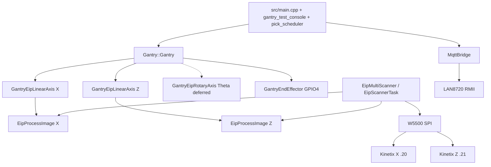
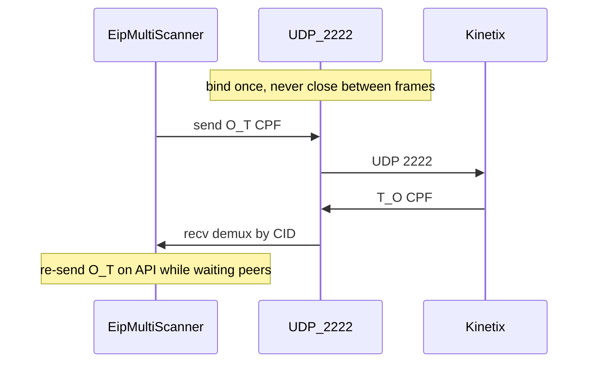

# Low-Level Gantry Control (for software)

**Status:** Canonical software design document (EIP production architecture).  
**Companions:** [EXPECTED_ELECTROMECHANICAL_ASSEMBLY.md](EXPECTED_ELECTROMECHANICAL_ASSEMBLY.md),
[HV_LV_SCHEMATICS.md](HV_LV_SCHEMATICS.md), [`pinout.csv`](../pinout.csv).

Application code commands motion **only** through `Gantry::Gantry`. There is no
supported PulseMotor / MCP23S17 / step-dir production path.

This document explains **how the firmware software works** end-to-end: bring-up,
Gantry orchestration, process-image mailbox, Class 1 UDP lifecycle (including
why bind/send/recv/close fails), Absolute PTP state machines, console gates, and
host-test anchors. Electromechanical detail lives in the companions above.
MQTT/pick requirements live in the SRS docs (§10).

---

## 1. Architecture and bring-up



| Layer | Path |
|-------|------|
| Application | [`src/main.cpp`](../src/main.cpp), [`src/gantry_test_console.cpp`](../src/gantry_test_console.cpp) |
| Motion API | [`lib/Gantry/src/Gantry.h`](../lib/Gantry/src/Gantry.h) |
| X/Z adapters | [`GantryEipLinearAxis`](../lib/Gantry/src/GantryEipLinearAxis.cpp) |
| Theta adapter | [`GantryEipRotaryAxis`](../lib/Gantry/src/GantryEipRotaryAxis.cpp) (not wired in `main`) |
| Scanner / Class 1 | [`lib/EtherNetIP/`](../lib/EtherNetIP/) |
| SPI Ethernet | [`lib/W5500/`](../lib/W5500/) |
| Pins / tasks | [`include/gantry_app_constants.h`](../include/gantry_app_constants.h) |
| Mechanics | [`include/axis_drivetrain_params.h`](../include/axis_drivetrain_params.h) |

**Decision:** EIP — drive-native Position Absolute meets ±1 mm
at 200 mm/s; host Speed+TM10 StopMotion does **not** meet that accuracy at speed.

### Dual Ethernet

| PHY | Role | Network |
|-----|------|---------|
| **W5500** (SPI / WIZ850io) | EtherNet/IP Class 1 to X/Z (daisy-chain) | Lab EIP segment (e.g. 192.168.1.0/24) |
| **LAN8720** (RMII on WT32) | MQTT / plant Ethernet (`MqttBridge`) | Separate from EIP daisy-chain |

EIP and MQTT do **not** share one cable to the drives. LAN8720 down does not stop EIP.

### W5500 pins and IPs

| Signal | GPIO / value |
|--------|----------------|
| MOSI / MISO / SCLK | 12 / 35 / 5 |
| CS / RST / INT | 15 / 14 / 33 (INT optional; polled OK) |
| SPI clock | 20 MHz |
| W5500 IP | `192.168.1.10` |
| Kinetix X / Z | `192.168.1.20` / `192.168.1.21` |
| Gripper | GPIO **4** |

### Boot order (`CONFIG_EIP_SCANNER_ENABLED`)

From [`src/main.cpp`](../src/main.cpp):

1. **W5500** — `w5500.init(...)` (static; must outlive the scanner; `app_main` deletes itself).
2. **Process images** — `eipImageX` / `eipImageZ`.
3. **Axes + Gantry** — `GantryEipLinearAxis` X/Z → `Gantry::Gantry(..., theta=nullptr, PIN_GRIPPER)` → joint limits → `gantry.begin()`.
4. **`gantry.enable()` is deferred** until Class 1 + `GantryUpdate` are running (operator `enable` / console). Boot enable used to race A603 before cyclic I/O.
5. **Scanner** — `eip::startScannerTask(...)` **before** MQTT so the daisy-chain stays alive if LAN8720 fails.
6. **MQTT objects constructed** (not started yet).
7. **FreeRTOS tasks** — PickScheduler → GantryUpdate (100 Hz) → SerialCmd console.
8. **MQTT `start()`** — non-fatal; EIP/console already running.
9. Print console help → `vTaskDelete(nullptr)`.

### Tasks and rates

| Task | Priority | Core | Stack | Rate / role |
|------|----------|------|-------|-------------|
| `GantryUpdate` | 5 | 1 | 4096 | **100 Hz** (10 ms) — axis SMs + orchestration |
| `PickScheduler` | 4 | 1 | 4096 | MQTT pick queue (motion not wired) |
| `EipHoldKA` | 4 | — | 4096 | ~5 ms O→T keepalive during 2nd FO only |
| `EipScanner` | 3 | — | 8192 | Class 1 loop at granted RPI (~5 ms) |
| `SerialCmd` | 1 | 0 | 4096 | Console poll |

App constants: [`gantry_app_constants.h`](../include/gantry_app_constants.h).  
Scanner / HoldKA: [`EipScannerTask.cpp`](../lib/EtherNetIP/src/EipScannerTask.cpp).  
X/Z RPI default: `CONFIG_EIP_X_RPI_US` = **5000** µs ([`lib/EtherNetIP/Kconfig`](../lib/EtherNetIP/Kconfig)).

### Wiring checklist

| Item | Status |
|------|--------|
| W5500 + dual process images + X/Z Absolute | **Live** |
| `GantryUpdate` 100 Hz + serial console | **Live** |
| Soft-home / soft-calibrate (no GPIO limits) | **Live** (bench) |
| Boot `gantry.enable()` | **Not** — deferred |
| Theta / `GantryEipRotaryAxis` | **Deferred** (`nullptr`) |
| Drive endstop GPIO pins | **Off** (`limit_switches_active=false`) |
| Pick → `moveTo(EndEffectorPose)` | **Not wired** (`SKIP:pick_motion_not_wired`) |
| PulseMotor / MCP23S17 | **Removed** |

---

## 2. Coordinate frame and two datums

| Symbol | Meaning |
|--------|---------|
| X | Across belt (Beta 100-ZRS) |
| Y | Along belt; **−Y downstream**; **no joint** |
| Z | Vertical; **+Z up** |
| Theta | Rotation about Z |

- **Joint:** `(x, z, theta)`. Joint Z=0 is the firmware soft-home datum (`zero_puu_`).
- **Pose:** `(x, y, z, theta)` with `pose.z = joint.z + GANTRY_Z_DATUM_OFFSET_ABOVE_BED_MM`.
- MQTT / pick planner owns belt **Y**; Gantry does not.

**Two datums (do not conflate):**

| Mechanism | Who sets it | Effect |
|-----------|-------------|--------|
| HomingMethod **34** (on arm) | Drive via Class 1 | Sets drive `HomedStatus`; on success firmware syncs `zero_puu_ = actual_position` and `target_mm_ = 0` |
| `softHomeJointDatum()` | Firmware only | Sets `zero_puu_` so current actual reads as joint 0 — does **not** set drive Homed |

Joint PUU ↔ absolute PUU:

```
joint_puu = abs_puu - zero_puu_
command_abs_puu = toAbsPuu(mmToPuu(target_mm))
```

Absolute PTP still needs the drive Homed (Home34 on arm, or already-homed drive). Soft-home alone is a **joint-frame** zero for the console / planner; skipping Home34 risks E237 / rejected Absolute.

---

## 3. Gantry public API and orchestration

Construction: DI with `unique_ptr` axes + gripper pin. PulseMotor constructor
**removed**.

| Call | Behavior |
|------|----------|
| `begin()` / `enable()` / `disable()` | Lifecycle; enable arms EIP axes (settle → Home34 if needed → hold) |
| `isBusy()` | True while `motionState_ != IDLE`, any axis busy, or homing/calibration flags |
| `moveTo(EndEffectorPose)` | PnP path: safe-Z retract before X when below safe Z |
| `moveTo(JointConfig)` / `moveTo(x,z,theta,…)` | **JOINT_DIRECT**: Z then X; skips full PnP choreography |
| `softHomeJointDatum()` | Zeros firmware `zero_puu_` on X+Z (not drive Homed) |
| `requestAbort()` | Abort motion only — does **not** disable servos |
| Console `stop` | `requestAbort()` + `disable()`; requires home+calibrate again |
| Gripper open/close | Digital GPIO4 via `GantryEndEffector` |

`update()` must run ~100 Hz (`gantryUpdateTask`). Order inside `update()`:

1. `updateAxisPositions()` — each axis `update()` + X limit polling.
2. `processSequentialMotion()` — so `isBusy()` sees StartMotion preload/pulse before sequencing advances.

### Orchestration state machine

Private `MotionState` in [`Gantry.cpp`](../lib/Gantry/src/Gantry.cpp):

| State | Role |
|-------|------|
| `IDLE` | No sequenced motion |
| `Z_DESCENDING` / `Z_RETRACTING` | PnP Z legs |
| `GRIPPER_ACTUATING` | Timed open/close |
| `X_MOVING` | X leg after safe Z |
| `THETA_MOVING` | Present; unused while theta is `nullptr` |

JOINT_DIRECT skips SAFE_Z retract and gripper choreography (Z then X only).

Start each axis move **before** publishing the next `motionState_` (avoids dual StartMotion / A603 races) — see comment in `startSequentialMotion()`.

### Abort matrix

| Path | Stops motion | ServoOff | Session home/cal flags |
|------|--------------|----------|------------------------|
| `Gantry::requestAbort()` | Yes (`stopAllMotion`) | No | Cleared by stop path |
| Console `stop` | Yes | Yes (`disable`) | Must home+calibrate again before `move` |
| Axis timeout / fault | Axis enters StopMotion / hold | Depends | See §6 |

---

## 4. Process image mailbox

[`EipProcessImage`](../lib/EtherNetIP/src/EipProcessImage.h) is the **only** coupling between Gantry axes and the scanner task.

| API | Writer | Reader | Meaning |
|-----|--------|--------|---------|
| `setCommand` / `getCommand` | Gantry axis | Scanner (each O→T) | Opaque assembly bytes (104 or 101) |
| `setFeedback` / `getFeedback` | Scanner (on demux hit) | Gantry axis | Opaque assembly bytes (154 or 102) |
| `feedbackFresh` / `consumeFeedbackFresh` | Scanner sets | Axis consumes | One-shot “new T→O applied” |
| `setOnline` / `isOnline` | Scanner | Axis / app | Cleared on disconnect |

- One `std::mutex` guards all fields (scanner task ↔ `GantryUpdate`).
- **Opaque `Bytes`** — no assembly knowledge in the mailbox; Kinetix 104/154 (or HCS01 101/102) live in the adapters.
- Missing / invalid command → scanner sends **idle output** (servo-off idle for Kinetix).
- Motion must gate on `isOnline()`; offline image rejects moves.

---

## 5. Class 1 I/O — wire format and UDP lifecycle

This section is the normative explanation of cyclic EtherNet/IP on this project.

### Explicit vs implicit

| Path | Port | Content | Lifetime |
|------|------|---------|----------|
| Explicit (TCP) | **44818** | Encap header + RegisterSession / SendRRData(ForwardOpen 0x54) / ForwardClose 0x4E / UnRegisterSession | Only for open/close and rare explicit CIP |
| Implicit Class 1 (UDP) | **2222** | **Raw CPF only** — no 24-byte encap header | Every RPI for as long as torque must hold |

Session + FO live in [`EipSession`](../lib/EtherNetIP/src/EipSession.cpp) /
[`EipConnectionManager`](../lib/EtherNetIP/src/EipConnectionManager.cpp) /
[`EipScanner`](../lib/EtherNetIP/src/EipScanner.cpp).  
Cyclic frames live in [`EipIoConnection`](../lib/EtherNetIP/src/EipIoConnection.cpp) /
[`EipCpf`](../lib/EtherNetIP/src/EipCpf.cpp).

ForwardOpen path (Kinetix X/Z): config assembly **191 (0xBF)** + O→T **104** + T→O **154**
(`buildAssemblyConnectionPath`; EDS-style path `20 04 24 BF 2C 68 2C 9A`).
Transport class/trigger = Class 1 cyclic (`0x01`). Granted API (`ot_api_us` /
`to_api_us`) drives RPI pacing and recv timeout (`API_ms * 8 + 50`).

Firmware FO overrides in `makeKinetixConfig` ([`EipScannerTask.cpp`](../lib/EtherNetIP/src/EipScannerTask.cpp)):

- CTM = **7** (RPI×512 ≈ 2.5 s of slack)
- P2P T→O by default
- O→T CID seeds `0x10000001` (X) / `0x10000002` (Z)
- T→O CID `0x20000000 | serial`
- Run/Idle **bytes** on the wire; **bit 8 in network params left clear** (Kinetix quirk)

### CPF frame shape

Datagram = CPF only:

1. Sequenced address item type **`0x8002`** — connection ID + 32-bit encap sequence.
2. Connected data item type **`0x00B1`** — CIP sequence (u16) + optional Run/Idle (u32, typically `0x1`) + assembly payload.

| Direction | Builder / parser | Demux key |
|-----------|------------------|-----------|
| O→T (originator → target) | `buildOutputFrame` → `buildClass1OutputCpf` | Sent to drive IP:2222 with O→T CID |
| T→O (target → originator) | `parseInputFrame` / `parseClass1InputCpf` | Sequenced-address CID (usually T→O CID) |

Kinetix T→O typically has **no** Run/Idle strip on parse (`to_include_run_idle_header` false for input). Sequence counters reset on reconnect.

O→T connected size on wire when Run/Idle enabled = 40 (assy 104) + 2 (CIP seq) + 4 (Run/Idle) = **46**.

### Persistent UDP invariant (do not regress)



**Correct pattern:** bind UDP **2222 once** for the Class 1 lifetime → loop send O→T / recv T→O → only close on ForwardClose / teardown.

**Wrong pattern:** bind → send → recv → **close** → bind again next frame.

Why wrong fails:

1. In the gap after close, the drive’s T→O unicast hits a closed port.
2. The host stack replies **ICMP port unreachable**.
3. The drive tears down Class 1 and **releases torque with no keypad fault**.

PC harness history (same invariant): [`tools/eip_test.py`](../tools/eip_test.py) module docstring — fixed with `exchange_io_frame(..., reuse_socket=True, drain=True)` and a persistent `io_sock`. Firmware P2P uses one W5500 UDP socket for both send and recv on 2222 ([`EipSocketW5500Udp`](../lib/EtherNetIP/src/EipSocketW5500.cpp)).

A Class 1 connection only holds torque while O→T keeps arriving within the connection timeout. Stalling longer than CTM×RPI silently drops the connection.

### Dual-axis scanner loop

[`EipMultiScanner`](../lib/EtherNetIP/src/EipMultiScanner.cpp) + task in [`EipScannerTask.cpp`](../lib/EtherNetIP/src/EipScannerTask.cpp):

1. `openAxis(0)` (TCP FO on X).
2. `bindSharedUdp()` — one socket on 2222 for both axes.
3. Spawn **`EipHoldKA`** (~5 ms) so X keeps receiving O→T while Z’s FO runs.
4. `openAxis(1)` (Z); stop HoldKA; abort connect if `ka.failed`.
5. Cyclic `exchangeOnce`:
   - Send O→T for all axes (command from process image, else idle).
   - Drain T→O until all freshened or timeout; **re-send O→T on API** while waiting (`sendKeepaliveAll`) so peers do not starve.
   - Demux by connection ID (`matchAxisByConnectionId`; fallback O→T CID).
6. Pace with `rpiRemainderMs(granted_api_ms, elapsed)` so period ≈ API, not ~2× API ([`EipClass1Timing.h`](../lib/EtherNetIP/src/EipClass1Timing.h)).

Exchange outcomes:

| Status | Meaning | Action |
|--------|---------|--------|
| `kOk` | All T→O freshened | Clear miss streak; sleep RPI remainder |
| `kInputMiss` | Partial / timeout on T→O | Soft-retry; tear down only after **3** consecutive misses |
| `kOutputSendFailed` | O→T / W5500 SENDOK fail | Disconnect → `W5500::recover()` immediately |

### Recover ladder

From [`EipScannerTask.cpp`](../lib/EtherNetIP/src/EipScannerTask.cpp) / [`W5500::recover`](../lib/W5500/src/W5500.cpp):

| Step | Behavior |
|------|----------|
| Link gate | Wait `ILinkStatus::isUp()`; settle **300 ms** before FO (avoid ARP INIT→CLOSED) |
| Soft T→O miss | Up to **3** consecutive `kInputMiss` before teardown (avoids cascading E602) |
| Hard O→T fail | Disconnect → GPIO14 hard reset + reconfigure (`recover`) |
| Recover streak | Cap **3** consecutive recovers; then **`esp_restart()`** |
| Backoff | Exponential on recover fail (cap 30 s); post-reset settle; reconnect idle **2500 ms** |

### Failure modes (root cause → fix)

| Failure | Symptom | Root cause | Fix |
|---------|---------|------------|-----|
| **Ephemeral UDP → ICMP** | Silent Class 1 drop; torque free; **no** drive fault | Per-frame UDP open/close; T→O hits closed :2222 | Persistent bind for hold lifetime (`reuse_socket` / shared W5500 UDP) |
| **Disk stall (PC harness)** | Same silent torque loss | JSON rewrite every frame starved RPI | Throttle disk I/O; CTM **7** |
| **W5500 SENDOK wedge** | O→T send fails | Chip/socket stuck waiting `Sn_IR_SENDOK` | `kOutputSendFailed` → `W5500::recover()` |
| **E602** | Fault `0x0602` Control connection lost | Missed O→T beyond timeout; cascade teardown on one UDP miss | Soft-miss policy; CTM 7; HoldKA during 2nd FO |
| **Ownership 0x0106** | FO reject after home/move | Competing TCP while hold still owns Class 1; ForwardClose never sent | Pause hold + settle before new FO (`eip_test.py` handoff rules) |
| **PHY early LNK** | FO/ARP fail after cable recover | PHYCFGR LNK before autoneg done | `kLinkSettleMs` before connect |

Distinguish **silent drop** (no keypad fault) from **latched E602**. Same software invariant on PC and ESP: **never leave 2222 unbound between frames**.

### Normative constants

| Constant | Value | Source |
|----------|-------|--------|
| Explicit TCP port | 44818 | `EipSession::kDefaultPort` |
| Class 1 UDP port | 2222 | `EipIoConnection::kDefaultUdpPort` |
| O→T / T→O / config assemblies | 104 / 154 / 191 | `Kinetix5100Assembly.h` / Kconfig |
| Assembled sizes | 40 B out / 52 B in | same |
| X/Z RPI | 5000 µs | `CONFIG_EIP_X_RPI_US` |
| CTM (firmware) | 7 | `makeKinetixConfig` |
| Soft T→O misses before teardown | 3 | `shouldTeardownAfterInputMisses` |
| Max chip recovers then restart | 3 | `kMaxChipRecovers` |
| HoldKA period | ~5 ms | `KeepaliveCtx` |
| Link settle / reconnect idle | 300 ms / 2500 ms | `EipScannerTask.cpp` |
| O→T CID seeds | `0x10000001` / `0x10000002` | same |
| E602 / A603 | `0x0602` / `0x0603` | `KinetixFaultCodes.h` |
| CPF item types | `0x8002`, `0x00B1` | `CpfItemType` |

Transport interfaces ([`EipTransport.h`](../lib/EtherNetIP/src/EipTransport.h)) allow host fakes; production uses [`EipSocketW5500`](../lib/EtherNetIP/src/EipSocketW5500.cpp). SPI register access stays inside [`W5500Socket`](../lib/W5500/src/W5500Socket.cpp) (mutex must not be held across recv wait so O→T can proceed).

---

## 6. X/Z Position Absolute (arm + move)

| Field | Value |
|-------|-------|
| Assemblies | O→T **104**, T→O **154**, Class 1, RPI 5 ms |
| IO Mode | `P1.001 = 0xC` |
| OperatingMode | **1** Position |
| TravelMode | **2** non-cyclic |
| NonCyclicMoveType | **0** Absolute |
| Done | `(AtReference ∧ in-band) \|\| (in-band ∧ nearly stopped)`; else timeout → StopMotion |

**Still used (not PTP):** OM=0 + TM=10 for settle / hold / abort StopMotion.  
**Rejected for PTP:** OM=2 Speed + TM=10 + host StopMotion; Index/PR (OM=6) for dynamic picks; CIP Motion / Motion Group.

PC prove: [`tools/eip_position_abs.py`](../tools/eip_position_abs.py).  
Firmware SM: [`GantryEipLinearAxis`](../lib/Gantry/src/GantryEipLinearAxis.cpp) (ticks @ **100 Hz**).

### ArmPhase (enable)

```
kIdle → kServoLow → kServoSettle → [kHomePreload → kHomeStart → kHomeWait] → kHolding
```

| Phase | Ticks | Behavior |
|-------|-------|----------|
| `kServoLow` | 4 | ServoOff settle |
| `kServoSettle` | 40 (~400 ms) | OM=0 TM=10, ServoOn edge, wait Active; up to 2 FaultReset on A603 |
| `kHomePreload` / `kHomeStart` | 4 / 5 | Only if `!HomedStatus`: OM=Home, method **34**, TM=2, StartMotion edge |
| `kHomeWait` | ≤200 (~2 s) | Wait HomedStatus; on success sync `zero_puu_`; timeout → hold + E237 risk warning |
| `kHolding` | — | Settle image (OM=0 TM=10); moves allowed |

Never command Position before Active (A603). `moveToMm` rejects unless arm is `kIdle` or `kHolding`.

### MovePhase (Absolute PTP)

```
kIdle → kPreload → kStart → kRun → (kStopping on abort/timeout) → hold
```

| Phase | Ticks | Behavior |
|-------|-------|----------|
| `kPreload` | 4 | OM=1 TM=2 Absolute=0; `position_reference` = abs PUU; **StartMotion=0** |
| `kStart` | 5 | StartMotion=1 edge |
| `kRun` | ≤6000 (~60 s) | StartMotion=0; wait done predicate |
| `kStopping` | stop pulse 5; stable 10 | `stop_motion` pulse; wait ±0.02 mm stable and speed low; then hold |

Done predicate (`kArrivalBandMm = 0.5`):

```
(at_reference && inPositionBand)
  || (inPositionBand && nearly_stopped)
```

`nearly_stopped` = `isMotionStopped()` OR `|actual_speed| ≤ 50` (5.0 RPM in 0.1 RPM units).

Already-there short-circuit: `|here - target| ≤ 0.05 mm` → hold, no StartMotion.  
`finishMoveHold` clears busy, republishes settle hold, keeps commanded Absolute target (for `puuinfo`).

### Assembly 104 / 154 (essentials)

Full maps: [`Kinetix5100Assembly.h`](../lib/EtherNetIP/src/Kinetix5100Assembly.h).

**Output 104:** OM @0, control bits @1 (ServoOn / StopMotion / StartMotion / FaultReset / …),
HomingMethod @3, Speed/Accel/Decel refs @4/8/12 (0.1 RPM / 0.1 RPM/s),
PositionReference @16, HomeReturnSpeed @20, NonCyclicMoveType @24, TravelMode @26.

**Input 154:** status @9 (Active / Ready / CIP / Homed / Stopped / AtReference),
Fault/Warning codes @20/22, ActualPosition @24.

---

## 7. Scaling

`speed_ref_per_mm_s = 600 × i / lead` (Kinetix 0.1 RPM units):

```
rpm = mm/s × i / lead × 60
ref = rpm × 10
```

| Axis | i | lead | PUU/mm | speed_ref/mm_s |
|------|---|------|--------|----------------|
| X | 5 | 200 | 52428.8 | 15 |
| Z | 1 | 20 | 104857.6 | 30 |

**Worked example (X @ 200 mm/s):**  
`move_speed_ref = round(200 × 15) = 3000` → 300.0 RPM commanded cruise.

Position: `puu = round(mm × puu_per_mm)`; Absolute commands use `toAbsPuu(...)`.  
Accel/decel refs: `round(mm_s2 × accel_ref_per_mm_s2)`; EDS floor applies in axis code.

Menuconfig: **Gantry kinematics** + EtherNet/IP originator (IPs, PUU/mm,
`EIP_ENDSTOP_SOURCE`: drive vs legacy MCP). Host tests use header defaults without
`sdkconfig.h`.

---

## 8. Homing, limits, safety

| Mode | Behavior |
|------|----------|
| Soft-home (current bench) | `limit_switches_active=false`; `softHomeJointDatum()`; Home34 on arm |
| Drive endstops (planned) | TBIO INPUT1–4 / HCS01 X31; Fault/Stopped via EIP — do not dual-poll GPIO |
| Hard envelope | `AXIS_*_HARD_LIMIT_*` from SCHUNK stroke via soft-calibrate |
| Abort | See §3 abort matrix |

**Author invariants:** motion only via `Gantry`; respect hard limits; never bypass
STO / Servo On checks when debugging EIP arm failures.

---

## 9. Console contract

Primary: `help`, `status`, `faults` / `alarms`, `enable`, `disable`, `home`,
`calibrate`, `speed`, `accel`, `move`, `grip`, `stop`, `alarmreset`,
`puuinfo`, `puucal`, `livepos`, `units`, `selftest`.

Also present (see `help`): `limits`, `pins`, `gpio_drive`, `rangelimit`,
`axislog` (no-op on EIP axes today).

| Command | EIP-specific behavior |
|---------|------------------------|
| `enable` / `disable` | Arms / ServoOff via Gantry |
| `home` | Soft-home: `softHomeJointDatum()` (joint datum = current actuals) |
| `calibrate` | Soft-calibrate: SCHUNK hard envelope into joint limits (no GPIO sweep) |
| `move` | Requires **home + calibrate this session** |
| `stop` | Abort + disable; clears session gates |
| `alarmreset` / `arst` | EIP **FaultReset** bit (not ARST GPIO) |
| `faults` / `alarms` | Decode FaultCode/WarningCode (e.g. A603) |
| `puuinfo` / `puucal` | Scale / suggest PUU/mm from commanded vs measured |

MCP diagnostic commands (`mcp_*`) are **legacy leftovers** — MCP hardware is
removed; do not rely on them.

---

## 10. Theta (deferred) and MQTT boundary

### Theta (HCS01)

- Assemblies **101/102**, freely configurable profile (`P-0-4084 = 0xFFFE`); map in
  EtherNet/IP HCS01 sources (`Hcs01Assembly.h`).
- `GantryEipRotaryAxis` has no Absolute Arm/Move SM — enable + command-accept /
  command-reached / halt / clear-errors.
- `main.cpp` passes `theta = nullptr`.
- Needs 3-phase power, IndraWorks, EDS / ForwardOpen validation.
- When enabled, use the EtherNet/IP originator theta IP Kconfig (not X/Z `.20`/`.21`).

### MQTT / pick

`MqttBridge` (LAN8720) → queue → `pick_scheduler` → (future)
`Gantry::moveTo(EndEffectorPose)`. Today pick motion is **not wired**
(`SKIP:pick_motion_not_wired`). Specs:
[`Pickup_algo_and_MQTTBridge_SRS.md`](../Pickup_algo_and_MQTTBridge_SRS.md),
[`MQTT_comms_subsys.md`](../MQTT_comms_subsys.md).

---

## 11. Build, host tests, bench acceptance

```powershell
# Firmware (from idf/)
idf.py build

# Host regression (required before finalize)
cmake -S test/host -B build/host && cmake --build build/host
ctest --test-dir build/host --output-on-failure
```

| Suite | Locks |
|-------|-------|
| [`test_eip_encoding.cpp`](../test/host/test_eip_encoding.cpp) | Encap, CPF, FO, Kinetix 104/154 wire bytes |
| [`test_eip_transport.cpp`](../test/host/test_eip_transport.cpp) | Session, Class 1 frames, multi-scanner demux, RPI miss policy |
| [`test_eip_axis.cpp`](../test/host/test_eip_axis.cpp) | Process image, soft-home joint frame, Absolute busy/target, A603, scanner↔image |
| W5500 / SOEM / kinematics suites | SPI HAL, OSAL, trajectory math |

**Bench acceptance (2026-07-20):** `speed 200` / `accel 3000`;
`move 150 150 0` and `move 0 0 0` → reported **150.000 / 0.000 mm** (within ±1 mm).

---

## 12. Explicitly not supported

- PulseMotor / LEDC step-dir production control
- MCP23S17 GPIO expander path
- Opto PTI interface board as production control path
- **Ephemeral Class 1 UDP** (bind/send/recv/close per frame)
- OM=2 Speed + TM=10 + host StopMotion for PTP accuracy
  (OM=0 TM=10 settle/hold/abort remains)
- CIP Motion / Motion Group / assembly 106 ECAM for picks
