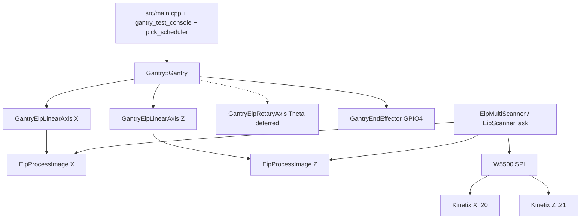

# Low-Level Gantry Control (for software)

**Status:** Canonical software design document (EIP production architecture).  
**Companions:** [EXPECTED_ELECTROMECHANICAL_ASSEMBLY.md](EXPECTED_ELECTROMECHANICAL_ASSEMBLY.md),
[HV_LV_SCHEMATICS.md](HV_LV_SCHEMATICS.md).

Application code commands motion **only** through `Gantry::Gantry`. There is no
supported PulseMotor / MCP23S17 / step-dir production path.

---

## 1. Architecture



| Layer | Path |
|-------|------|
| Application | [`src/main.cpp`](../src/main.cpp), [`src/gantry_test_console.cpp`](../src/gantry_test_console.cpp) |
| Motion API | [`lib/Gantry/src/Gantry.h`](../lib/Gantry/src/Gantry.h) |
| X/Z adapters | [`GantryEipLinearAxis`](../lib/Gantry/src/GantryEipLinearAxis.cpp) |
| Theta adapter | [`GantryEipRotaryAxis`](../lib/Gantry/src/GantryEipRotaryAxis.cpp) (not wired in `main`) |
| Scanner | [`lib/EtherNetIP/`](../lib/EtherNetIP/) |
| Pins / tasks | [`include/gantry_app_constants.h`](../include/gantry_app_constants.h) |
| Mechanics | [`include/axis_drivetrain_params.h`](../include/axis_drivetrain_params.h) |

**Decision:** EIP over Pulse-Train — drive-native Position Absolute meets ±1 mm
at 200 mm/s; host Speed+TM10 StopMotion does not.

---

## 2. Coordinate frame

| Symbol | Meaning |
|--------|---------|
| X | Across belt (Beta 100-ZRS) |
| Y | Along belt; **−Y downstream**; **no joint** |
| Z | Vertical; **+Z up**; joint Z=0 = soft-home / Home34 datum |
| Theta | Rotation about Z |

- Joint: `(x, z, theta)`.
- Pose: `(x, y, z, theta)` with `pose.z = joint.z + GANTRY_Z_DATUM_OFFSET_ABOVE_BED_MM`.
- MQTT / pick planner owns belt **Y**; Gantry does not.

---

## 3. Public motion API (summary)

Construction: DI with `unique_ptr` axes + gripper pin. PulseMotor constructor
**removed**.

| Call | Behavior |
|------|----------|
| `begin()` / `enable()` / `disable()` | Lifecycle; enable arms EIP axes (settle → Home34 → hold) |
| `moveTo(EndEffectorPose)` | PnP path: safe-Z retract before X when below safe Z |
| `moveTo(JointConfig)` / `moveTo(x,z,theta,…)` | **JOINT_DIRECT**: Z then X; skips full PnP choreography |
| `softHomeJointDatum()` | Zeros firmware `zero_puu_` on X+Z (not drive Homed) |
| `requestAbort()` / `stop` console | Abort + disable; requires re-home/calibrate session flags |
| Gripper open/close | Digital GPIO4 via `GantryEndEffector` |

`update()` must run ~100 Hz (`gantryUpdateTask`).

---

## 4. X/Z Position Absolute (production PTP)

| Field | Value |
|-------|-------|
| Assemblies | O→T **104**, T→O **154**, Class 1, RPI 5 ms |
| IO Mode | `P1.001 = 0xC` |
| OperatingMode | **1** Position |
| TravelMode | **2** non-cyclic |
| NonCyclicMoveType | **0** Absolute |
| Done | **AtReference** (+ in-band backup) |

**Arm sequence:** settle OM=0 TM=10 ServoOn → Active → HomingMethod **34** if
not Homed → hold. Soft-home remains firmware joint frame only.

**Move sequence:** preload Absolute (StartMotion=0) → StartMotion edge → wait
AtReference → hold.

**Rejected:** OM=2 + TM=10 + host StopMotion; Index/PR (OM=6) for dynamic picks;
CIP Motion / Motion Group.

PC prove: [`tools/eip_position_abs.py`](../tools/eip_position_abs.py).

### Assembly 104 / 154 (essentials)

Output 104: OM @0, control bits @1 (ServoOn/StopMotion/StartMotion/…),
Speed/Accel/Decel refs @4/8/12 (0.1 RPM / 0.1 RPM/s), PositionReference @16,
NonCyclicMoveType @24, TravelMode @26.

Input 154: status @9 (Active/Ready/CIP/Homed/Stopped/AtReference),
ActualPosition @24, Fault/Warning codes @20/22.

Dual X+Z: `EipMultiScanner` shares UDP 2222, demux by connection ID.

---

## 5. Scaling

`ref = 600 × i × mm_s / lead` (Kinetix 0.1 RPM units).

| Axis | i | lead | PUU/mm | speed_ref/mm_s |
|------|---|------|--------|----------------|
| X | 5 | 200 | 52428.8 | 15 |
| Z | 1 | 20 | 104857.6 | 30 |

Menuconfig: **Gantry kinematics** + EtherNet/IP originator (IPs, PUU/mm,
`EIP_ENDSTOP_SOURCE`). Host tests use header defaults without `sdkconfig.h`.

---

## 6. Homing, limits, safety

| Mode | Behavior |
|------|----------|
| Soft-home (current bench) | `limit_switches_active=false`; `softHomeJointDatum()`; Home34 on arm |
| Drive endstops (planned) | TBIO INPUT1–4 / HCS01 X31; Fault/Stopped via EIP |
| Hard envelope | `AXIS_*_HARD_LIMIT_*` from SCHUNK stroke |
| Abort | `requestAbort()` + disable; console requires home+calibrate again |

Safety rules for authors: [`.cursor/rules/motion-safety.mdc`](../.cursor/rules/motion-safety.mdc).

---

## 7. Console (EIP-valid subset)

Primary commands: `help`, `status`, `faults`, `enable`, `disable`, `home`,
`calibrate`, `speed`, `accel`, `move`, `grip`, `stop`, `alarmreset`,
`puuinfo`, `puucal`, `livepos`, `units`, `selftest`.

With soft-home: `home` / `calibrate` set session flags without GPIO limits.
`move` requires home+calibrate this session.

MCP diagnostic commands (`mcp_*`) are **legacy leftovers** — MCP hardware is
removed; do not rely on them.

---

## 8. MQTT / pick boundary

`MqttBridge` → queue → `pick_scheduler` → (future) `Gantry::moveTo(EndEffectorPose)`.
Today pick motion is **not wired** (`SKIP:pick_motion_not_wired`). Specs:
[`Pickup_algo_and_MQTTBridge_SRS.md`](../Pickup_algo_and_MQTTBridge_SRS.md),
[`MQTT_comms_subsys.md`](../MQTT_comms_subsys.md).

---

## 9. Theta (HCS01) — deferred

- Assemblies 101/102 configurable (`P-0-4084=0xFFFE`); map in EtherNet/IP sources.
- `main.cpp` passes `theta = nullptr`.
- Needs 3-phase power, IndraWorks, EDS / ForwardOpen validation.

---

## 10. Build, test, bench

```powershell
# Firmware (from idf/)
idf.py build

# Host regression (required before finalize)
cmake -S test/host -B build/host && cmake --build build/host
ctest --test-dir build/host --output-on-failure
```

Host suites: kinematics, trajectory, EIP encoding/transport/HCS01, **test_eip_axis**,
W5500 SPI.

**Bench acceptance (2026-07-20):** `speed 200` / `accel 3000`;
`move 150 150 0` and `move 0 0 0` → reported **150.000 / 0.000 mm** (within ±1 mm).

---

## 11. Explicitly not supported

- PulseMotor / LEDC step-dir production control
- MCP23S17 GPIO expander path
- Opto PTI interface board as production control path
- Speed+TM10 host StopMotion for PTP accuracy
- CIP Motion / Motion Group / assembly 106 ECAM for picks
