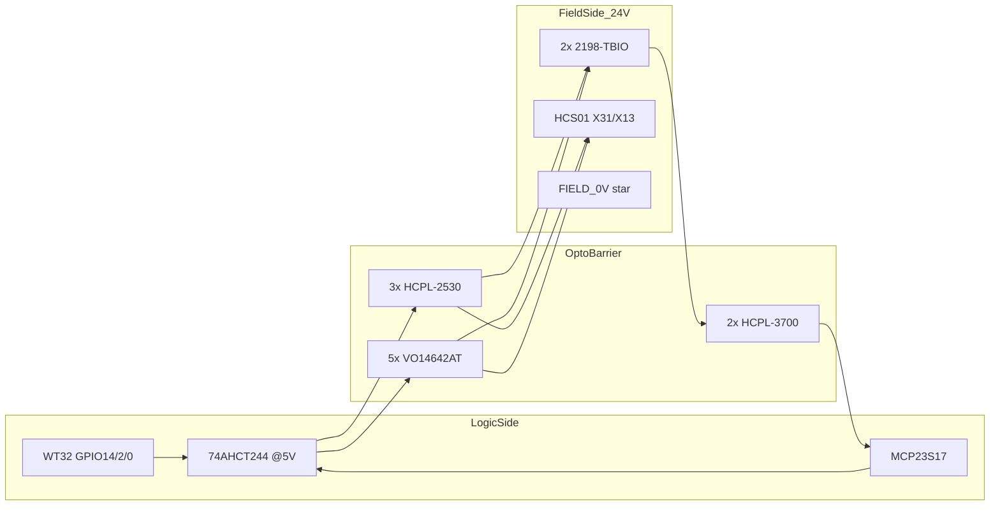

# Motion I/O Interface (WT32 → Opto → Drives)

Hand-wired prototype interface between the WT32-ETH01 + MCP23S17 controller and:

- **2× Allen-Bradley Kinetix 5100** (`2198-E1020-ERS` X, `2198-E1004-ERS` Z) via `2198-TBIO`
- **1× Bosch Rexroth HCS01.1E-W0005-A-03-B-ET-EC** (theta) via **X31** Step/Dir

Firmware pin names are unchanged — see [`include/gantry_app_constants.h`](../include/gantry_app_constants.h) and [`pinout.csv`](../pinout.csv).

---

## Architecture



```
  LOGIC (3.3V + 5V)                    OPTO BARRIER              FIELD (24V)
  ─────────────────                    ─────────────             ────────────
  GPIO14 ──► 74AHCT ──► U1-A HCPL-2530 ──► X TBIO APWR/AX±
  MCP A0   ──► 74AHCT ──► U1-B HCPL-2530 ──► X TBIO BPWR/BX±
  MCP A1   ──► 74AHCT ──► U4   VO14642AT ──► X TBIO SON (INPUTx)
  MCP A5   ──► 74AHCT ──► U5   VO14642AT ──► X TBIO ARST (INPUTx)
  X ALM    ◄── 74AHCT ◄── U9   HCPL-3700 ◄── X TBIO OUTPUTx

  GPIO2  ──► U2-A ──► Z TBIO APWR/AX±
  MCP B0 ──► U2-B ──► Z TBIO BPWR/BX±
  MCP B1 ──► U6   ──► Z SON
  MCP B13──► U7   ──► Z ARST
  Z ALM    ◄── U10 ◄── Z OUTPUTx

  GPIO0  ──► U3-A ──► HCS01 X31 step (TBD pin)
  MCP B14──► U3-B ──► HCS01 X31 dir  (TBD pin)
  MCP B15──► U8   ──► HCS01 X31 enable (TBD pin)

  Limits, gripper, SPI: direct MCP — NOT through motion optos
```

---

## Power rails

| Rail | Source | Ground | Notes |
|------|--------|--------|-------|
| 3.3 V | WT32 | LOGIC_GND | MCP + ESP32 |
| 5 V | Reg from panel 24 V (~300 mA) | LOGIC_GND | 74AHCT244 + opto LEDs |
| 24 V | `1606-XL` (panel) | FIELD_0V | K5100 CP, HCS01 X13, APWR/BPWR, X31.8, opto output side |

**FIELD_0V star:** Tie K5100 **DCOM** (both drives) and HCS01 **X31.9 (0 V)** at one terminal block. Keep LOGIC_GND isolated from FIELD_0V except through optocouplers.

**Inversion:** Wire every opto channel the same way. Compensate direction and active levels in firmware via `AXIS_*_INVERT_DIR` and `AXIS_*_INVERT_OUTPUT_LOGIC` in [`include/axis_pulse_motor_params.h`](../include/axis_pulse_motor_params.h). Each opto inverts once (LED on → output transistor conducts).

---

## Parts list (prototype)

| Ref | Part | Qty | Role |
|-----|------|-----|------|
| U-IF1 | HCPL-2530 | 1 | X pulse + dir |
| U-IF2 | HCPL-2530 | 1 | Z pulse + dir |
| U-IF3 | HCPL-2530 | 1 | Theta pulse + dir |
| U-IF4..8 | VO14642AT | 5 | X SON, X ARST, Z SON, Z ARST, Theta enable |
| U-IF9..10 | HCPL-3700 | 2 | X ALM in, Z ALM in |
| U-IF11..12 | 74AHCT244 | 2 | 3.3 V → 5 V LED drivers (11 gates used) |
| PS-IF1 | 5 V regulator module | 1 | From 24 V, e.g. LM2596 or 7805 + heat sink |
| TB-IF | Screw terminals | 1 set | Logic-side + field-side harness landing |

---

## Signal routing table

TBIO pin numbers from Rockwell **2198-IN020** (single-ended PTI, current sinking per **2198-UM004** Fig. 30). K5100 digital inputs: ON **15…26.4 V**, **6 mA** max. PTI single-ended max **200 kHz** (matches `AXIS_X/Z_MAX_PULSE_FREQ_HZ`).

| Axis | Logic source | IF ref | Opto | Field terminal | Drive endpoint |
|------|--------------|--------|------|----------------|----------------|
| X pulse | GPIO14 | U1-A | HCPL-2530 | IF_X_AX | TBIO **43** AX+, **41** AX−; **39** APWR ← +24 V |
| X dir | MCP A0 | U1-B | HCPL-2530 | IF_X_BX | TBIO **36** BX+, **37** BX−; **35** BPWR ← +24 V |
| X SON | MCP A1 | U4 | VO14642AT | IF_X_SON | TBIO INPUT (assign SON in KNX5100C) + **11** DCOM |
| X ARST | MCP A5 | U5 | VO14642AT | IF_X_ARST | TBIO INPUT (assign ARST) + DCOM |
| X ALM | MCP A4 ← | U9 | HCPL-3700 | IF_X_ALM | TBIO OUTPUT (ALM) → 3700 input |
| Z pulse | GPIO2 | U2-A | HCPL-2530 | IF_Z_AX | Z TBIO APWR/AX± (same pin numbers) |
| Z dir | MCP B0 | U2-B | HCPL-2530 | IF_Z_BX | Z TBIO BPWR/BX± |
| Z SON | MCP B9 | U6 | VO14642AT | IF_Z_SON | Z TBIO SON + DCOM |
| Z ARST | MCP B13 | U7 | VO14642AT | IF_Z_ARST | Z TBIO ARST + DCOM |
| Z ALM | MCP B12 ← | U10 | HCPL-3700 | IF_Z_ALM | Z TBIO ALM out |
| Θ pulse | GPIO0 | U3-A | HCPL-2530 | IF_T_STEP | HCS01 **X31** step (TBD — MPB doc) |
| Θ dir | MCP B14 | U3-B | HCPL-2530 | IF_T_DIR | HCS01 **X31** dir (TBD) |
| Θ enable | MCP B15 | U8 | VO14642AT | IF_T_EN | HCS01 **X31** enable (TBD) |

**Not on this board:** limit switches (MCP direct), gripper (MCP A7 → 24 V valve driver), MCP SPI, Ethernet.

---

## Circuit notes

### HCPL-2530 (pulse + direction)

- **LED side:** 74AHCT244 @ 5 V → **~270 Ω** → LED → LOGIC_GND. Target **~10–13 mA** IF (verify CTR on datasheet at 200 kHz).
- **Output side (K5100):** +24 V → **APWR** (39) and **BPWR** (35). Opto transistor switches **AX+** (43) / **BX+** (36) vs **DCOM** (11) per UM004 single-ended sinking diagram.
- **Do not** use line-driver PTI mode (2.8–3.6 V differential) with opto collectors.

### VO14642AT (SON / ARST / enable)

- **LED side:** 74AHCT → **330–470 Ω** → LED → LOGIC_GND.
- **Output side:** Switch K5100 **INPUTx** vs **DCOM** (24 V sinking, 6 mA). Assign functions in KNX5100C.
- **HCS01:** X31 digital inputs are **24 V** IEC 61131; supply **X31.8 (+24 V)** / **X31.9 (0 V)** per Rexroth commissioning manual. Confirm polarity vs K5100 before reusing the same VO14642 wiring pattern.

### HCPL-3700 (alarm in)

- **Input side:** K5100 open-collector **OUTPUT** (ALM) → **2.2–4.7 kΩ** → 3700 input; return to FIELD_0V.
- **Output side:** Open collector → MCP alarm pin with **10 kΩ** pull-up to 3.3 V. Firmware expects active-low alarm — tune `getAlarmStatus()` interpretation at bench if needed.

---

## Encoder feedback (Phase B — deferred)

Phase A bring-up uses **open-loop** pulse counting. Set `AXIS_X_ENCODER_FEEDBACK_ENABLED` and `AXIS_Z_ENCODER_FEEDBACK_ENABLED` to **0** in [`include/axis_pulse_motor_params.h`](../include/axis_pulse_motor_params.h).

When **AM26LV32E** (or equivalent) is available:

- Wire K5100 **AMOUT± / BMOUT±** (TBIO pins 21–25, 46–50) through diff receiver to GPIO4/36 (X) and GPIO39/32 (Z).
- Set encoder feedback flags to **1** and match drive electronic gear to `AXIS_*_ENCODER_PPR`.

---

## Commissioning checklist (per axis)

After opto interface is wired:

1. Apply 24 V to both K5100 **CP** connectors and HCS01 **X13**; verify FIELD_0V star.
2. **SON only** — confirm drive ready / no fault (KNX5100C or drive display).
3. **Pulse @ 1 kHz** — scope at TBIO AX±; then ramp toward **200 kHz** (X/Z firmware max).
4. **Direction** — slow jog; flip `AXIS_*_INVERT_DIR` if motion reverses.
5. **Enable polarity** — flip `AXIS_*_INVERT_OUTPUT_LOGIC` if SON inverted.
6. **ALM** — force fault; confirm console alarm status; adjust interpretation if needed.
7. **Gantry** — `home` / `calibrate` / `move` on X, then Z; theta last after X31 pins confirmed.

Wire **HCS01 X47.1–X47.2 (Bb ready)** before expecting theta torque (panel task, not on opto board).

---

## Bench bring-up order

1. One HCPL-2530 channel + one VO14642 on **X** only.
2. Full **X** channel set; validate X homing with limits (limits bypass opto board).
3. Duplicate for **Z**.
4. **Theta** after MPB-xxVRS Functional Description assigns X31 Step/Dir/Enable pins.

---

## Non-goals (this prototype)

- Safe Torque Off (STO) wiring
- Encoder receiver on interface board
- KiCad / PCB layout
- Direct WT32 → TBIO wiring (superseded by this interface)

---

## Reference PDFs (vendor folder)

| Document | Path |
|----------|------|
| Kinetix 5100 user manual (2198-UM004) | [`../driver_datasheets_and_calculations/AB_Kinetix5100_user_manual.pdf`](../driver_datasheets_and_calculations/AB_Kinetix5100_user_manual.pdf) |
| HCS01 commissioning | [`../driver_datasheets_and_calculations/R911325518_07_EN_IndraDrive Drive Controllers Power Sections HCS01_Commissioning Manual.pdf`](../driver_datasheets_and_calculations/R911325518_07_EN_IndraDrive%20Drive%20Controllers%20Power%20Sections%20HCS01_Commissioning%20Manual.pdf) |
| HCS01 project planning | [`../driver_datasheets_and_calculations/Rexroth HCS-01 Drive Project Planning Manual R911322210_03.pdf`](../driver_datasheets_and_calculations/Rexroth%20HCS-01%20Drive%20Project%20Planning%20Manual%20R911322210_03.pdf) |

### Missing documents (recorded here)

| Document | Needed for |
|----------|------------|
| **2198-IN020** | TBIO pinout (summarized above from public Rockwell pub) |
| **MPB-xxVRS Functional Description** | HCS01 X31 Step/Dir pin assignment |

---

## Related repo artifacts

- [`pinout.csv`](../pinout.csv) — logic pin map + interface channel columns
- [`tools/generate_bom.py`](../tools/generate_bom.py) — §9.1 interface BOM lines
- [`tools/generate_wire_size_selection.py`](../tools/generate_wire_size_selection.py) — harness hop via IF-BOARD
