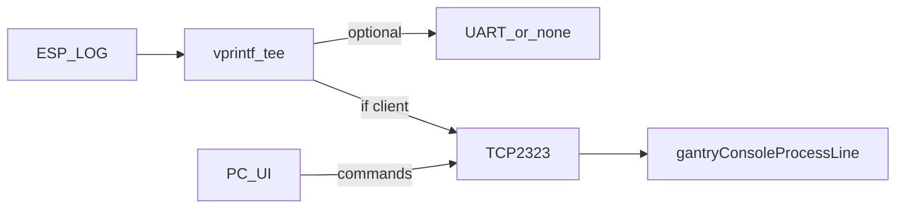

# Plan: Serial debug over LAN8720 (free GPIO 1 / 3)

**Goal:** Move complete ESP_LOG + gantry console I/O to plant Ethernet (LAN8720), free **UART0 TX/RX (GPIO1/3)** for other use, keep or improve debug UX via a Python UI on the developer PC.

**Networks (do not confuse):**

| Link | Role | Example IPs |
|------|------|-------------|
| LAN8720 (plant) | MQTT + TCP debug console | WT32 **192.168.1.100**, PC **192.168.1.10** |
| W5500 (EIP daisy-chain) | Class 1 only | WT32 192.168.1.10 on **separate** cable/subnet |

Same numeric host `.10` on PC vs EIP WT32 is fine — different PHYs / L2 segments.

**Bench note:** An unmanaged plant switch (e.g. Brainboxes SW-008) may connect PC + WT32 LAN8720 only. Do **not** land HCS01/Kinetix Port 2 or WIZ on that switch — both sides use `192.168.1.x`, so merging causes `.10` clash, port LED storms, and TCP `:2323` timeouts. See [LOW_LEVEL_GANTRY_CONTROL.md](LOW_LEVEL_GANTRY_CONTROL.md) § Dual Ethernet.

---

## Current state

- TCP console already listens on **`:2323`** (`gantry_net_console.cpp`).
- Commands work over TCP; `ESP_LOG` is only teed to the socket **during** `gantryConsoleProcessLine`.
- UART0 console task still owns GPIO1/3; `CONFIG_ESP_CONSOLE_UART_DEFAULT=y`.

## Gaps to close

1. **Session-long log stream** — while a TCP client is connected, all `ESP_LOG` (LIVE POS, EIP warnings, etc.) go to the client, not only command replies.
2. **UART optional / off** — Kconfig to skip UART console task and use `CONFIG_ESP_CONSOLE_NONE` so GPIO1/3 are free.
3. **Python UI** — connect to `192.168.1.100:2323`, show scrolling logs, send commands (auth password supported).

## Firmware design

- On TCP accept (+ auth): `gantryConsoleAttachLogSink(replyFn, &fd)`.
- On disconnect: detach sink; restore previous `esp_log` vprintf.
- Thread-safety: short critical section or mutex around `send()`; drop/ truncate if send would block Class 1 (best-effort debug).
- Kconfig `CONSOLE_UART_ENABLE` (default **n** for this bring-up target, or **y** with menuconfig note). When n: no `SerialCmd` task; sdkconfig console = none.

## Python UI (`tools/lan_debug_ui.py`)

- Defaults: host `192.168.1.100`, port `2323`, password from env/`LTU_1932`.
- Tkinter: log pane + command entry + Connect/Disconnect.
- Background socket reader → UI queue.
- Send line + `\n` on Enter.

## Flash / bench checklist (item 1 + this track)

1. Plant switch: PC `192.168.1.10`, WT32 LAN8720 `192.168.1.100`.
2. `idf.py fullclean build flash` (refresh ETH CLK_IN + console none).
3. Run `python tools/lan_debug_ui.py` — see boot logs, run `help` / `status` / `eiptiming` / `field_din`.
4. Confirm GPIO1/3 unused (no UART monitor required).
5. Mark tracker item 1 / LAN track as you validate.

## Out of scope

- Logging over W5500 / EIP subnet.
- Multi-client fan-out (single client keep-it-simple).
- Replacing MQTT with this channel.
