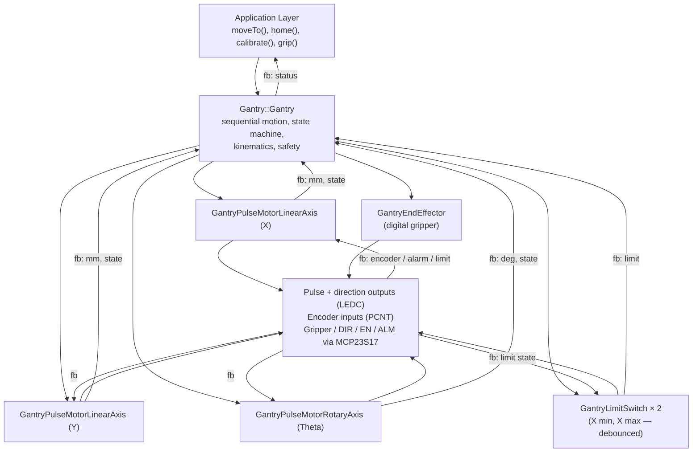

# Gantry Library Architecture

**Version:** 2.0.0
**Last Updated:** Apr 2026

Complete architecture documentation for the Gantry library.

> **Canonical layered flow.** The control-and-feedback tree, signal routing table, and layered invariants are maintained in [`ARCHITECTURE_FLOW.md`](ARCHITECTURE_FLOW.md). That file is the single source of truth; read it first. The sections below describe the Gantry library's **internal** architecture — the module breakdown, state machine, kinematics, and memory layout — and assume the reader is already familiar with the layered flow.
>
> **Driver refactor (2026-04, still current).** Every axis runs on top of the generic `PulseMotor` library. The pre-2026 `GantryAxisStepper` (step/dir Y) and `GantryRotaryServo` (PWM-hobby-servo Theta) classes were replaced by polymorphic interfaces:
>
> - `GantryLinearAxis` (mm domain) — implemented by `GantryPulseMotorLinearAxis` for ballscrew / belt / rack-pinion drivetrains.
> - `GantryRotaryAxis` (deg domain) — implemented by `GantryPulseMotorRotaryAxis` for rotary-direct drivetrains.
>
> If any section below still mentions `GantryAxisStepper` or `GantryRotaryServo` as concrete types, treat `Gantry.h` and the `GantryLinearAxis.h` / `GantryRotaryAxis.h` interface headers as authoritative.

---

## Table of Contents

- [System Overview](#system-overview)
- [Module Structure](#module-structure)
- [Data Flow](#data-flow)
- [Coordinate Systems](#coordinate-systems)
- [Motion Planning](#motion-planning)
- [State Machine](#state-machine)
- [Safety Systems](#safety-systems)
- [Memory Management](#memory-management)

---

## System Overview

The Gantry library provides a modular, extensible architecture for controlling a 3-axis gantry robot system. It exposes a single public class, `Gantry::Gantry`, which owns three sibling children — the axis wrappers, the end-effector, and the limit switches — and hides every hardware detail (pulse generation, encoder counting, MCP23S17 traffic) behind that one entry point.

### High-Level Architecture


```mermaid
flowchart TD
  App["Application Layer<br/>moveTo(), home(), calibrate(), grip()"]
  Gantry["Gantry::Gantry<br/>sequential motion, state machine,<br/>kinematics, safety"]
  AxisX["GantryPulseMotorLinearAxis (X)"]
  AxisY["GantryPulseMotorLinearAxis (Y)"]
  AxisT["GantryPulseMotorRotaryAxis (Theta)"]
  EE["GantryEndEffector<br/>(digital gripper)"]
  LSX["GantryLimitSwitch × 2<br/>(X min, X max — debounced)"]
  HW["Pulse + direction outputs (LEDC)<br/>Encoder inputs (PCNT)<br/>Gripper / DIR / EN / ALM via MCP23S17"]

  %% ----- downstream (control) -----
  App --> Gantry
  Gantry --> AxisX
  Gantry --> AxisY
  Gantry --> AxisT
  Gantry --> EE
  Gantry --> LSX
  AxisX --> HW
  AxisY --> HW
  AxisT --> HW
  EE --> HW
  LSX --> HW

  %% ----- upstream (feedback) -----
  HW -- "fb: encoder / alarm / limit" --> AxisX
  HW -- "fb" --> AxisY
  HW -- "fb" --> AxisT
  HW -- "fb: limit state" --> LSX
  AxisX -- "fb: mm, state" --> Gantry
  AxisY -- "fb: mm, state" --> Gantry
  AxisT -- "fb: deg, state" --> Gantry
  LSX   -- "fb: limit" --> Gantry
  Gantry -- "fb: status" --> App
```

The `fb:`-prefixed edges are upstream feedback. They flow back through the same ownership tree they came down, giving `Gantry` a consistent read-only view of axis position, limit state, and alarm status without the application layer having to reach past it. `GantryEndEffector` has no feedback edge because the gripper is a digital output with no sensed state in this revision. The full hardware-layer tree (`PulseMotorDriver → LEDC / PCNT / gpio_expander → MCP23S17`) is shown in [`ARCHITECTURE_FLOW.md`](ARCHITECTURE_FLOW.md) section 1; this diagram is deliberately abridged to focus on what the Gantry library itself owns.

---

## Module Structure

### Core Modules

#### 1. `Gantry` (Main Class)
**File:** `Gantry.h/cpp`

**Responsibilities:**
- Unified API for all axes
- Sequential motion planning
- State machine execution
- Coordinate transformations
- Error handling

**Key Components:**
- Motion state machine
- Target position storage
- Sequential motion logic

#### 2. `GantryConfig`
**File:** `GantryConfig.h/cpp`

**Responsibilities:**
- Data structure definitions
- Joint space representation
- Workspace representation
- Configuration parameters

**Key Structures:**
- `JointConfig`: Joint space coordinates
- `EndEffectorPose`: Workspace coordinates
- `JointLimits`: Limit validation
- `KinematicParameters`: Mechanical parameters

#### 3. `GantryKinematics`
**File:** `GantryKinematics.h/cpp`

**Responsibilities:**
- Forward kinematics (joint → workspace)
- Inverse kinematics (workspace → joint)
- Joint limit validation

**Key Methods:**
- `forward()`: Joint space → Workspace
- `inverse()`: Workspace → Joint space
- `validate()`: Limit checking

#### 4. `GantryTrajectory`
**File:** `GantryTrajectory.h/cpp`

**Responsibilities:**
- Trapezoidal velocity profiles
- Trajectory planning
- Waypoint management (future)

**Key Components:**
- `TrapezoidalProfile`: Motion profile parameters
- `TrajectoryPlanner`: Profile calculation

#### 5. `GantryPulseMotorLinearAxis` (X and Z)
**File:** `GantryPulseMotorLinearAxis.h/cpp`

**Responsibilities:**
- Linear axis control for both X (across-belt) and Z (vertical, `+Z = up`)
- Pulse/dir signal generation via `PulseMotorDriver` (LEDC)
- Trapezoidal motion profiles
- Limit checking (when limit pins configured)

**Key Features:**
- Cooperative update loop
- Acceleration/deceleration control
- Position tracking in pulses → mm via the axis `DrivetrainConfig`

#### 6. `GantryPulseMotorRotaryAxis` (Theta)
**File:** `GantryPulseMotorRotaryAxis.h/cpp`

**Responsibilities:**
- Theta axis control via `PulseMotorDriver` (pulse + direction, not PWM servo)
- Angle ↔ pulse conversion through `DrivetrainConfig` (steps/deg)
- Soft-limit enforcement against `AXIS_THETA_HARD_LIMIT_MIN/MAX_DEG`

**Key Features:**
- ESP32 LEDC pulse generation
- Custom rotary driver support (SCHUNK ERD)
- Configurable pulses/deg

#### 7. `GantryEndEffector`
**File:** `GantryEndEffector.h/cpp`

**Responsibilities:**
- Gripper control
- Digital output management
- Active high/low support

**Key Features:**
- Simple on/off control
- Configurable polarity

#### 8. `GantryUtils`
**File:** `GantryUtils.h`

**Responsibilities:**
- Constants definition
- Helper macros
- Common utilities

**Key Components:**
- `Constants` namespace: Default values
- Validation macros: Code simplification

---

## Data Flow

### Motion Command Flow

```
User Code
  │
  ├─► moveTo(JointConfig)
  │     │
  │     ├─► Validate limits
  │     ├─► Store targets
  │     └─► startSequentialMotion()
  │           │
  │           ├─► Determine motion sequence
  │           ├─► Set gripper target state
  │           └─► Initialize state machine
  │
  └─► update() (called frequently)
        │
        ├─► processSequentialMotion()
        │     │
        │     ├─► Z_DESCENDING: Move Z down (toward belt)
        │     ├─► GRIPPER_ACTUATING: Wait for gripper
        │     ├─► Z_RETRACTING: Move Z up to safe height
        │     └─► X_MOVING: Move X to target
        │
        └─► updateAxisPositions()
              │
              ├─► axisZ_.update()  (ballscrew via PulseMotor)
              └─► Update current positions
```

### Sequential Motion Sequence

```
┌─────────────────────────────────────────────────────┐
│  Sequential Motion State Machine                   │
└─────────────────────────────────────────────────────┘

START
  │
  ├─► Check current Z position (+Z = up)
  │
  ├─► [Current Z < Safe Height]
  │     │
  │     └─► Z_RETRACTING → Move Z up to safe height
  │           │
  │           └─► [Complete] → Check if need to descend
  │
  ├─► [Target Z < Current Z]
  │     │
  │     └─► Z_DESCENDING → Move Z down to target
  │           │
  │           └─► [Complete] → GRIPPER_ACTUATING
  │                 │
  │                 └─► Close/Open gripper (100ms)
  │                       │
  │                       └─► Z_RETRACTING → Move Z up to safe height
  │                             │
  │                             └─► [Complete] → X_MOVING
  │
  └─► [Z at safe height]
        │
        └─► X_MOVING → Move X to target
              │
              └─► [Complete] → IDLE

Theta moves independently throughout sequence
```

---

## Coordinate Systems

### Joint Space

**Definition:** Internal representation using joint positions. There are three joints (X, Z, Theta) — **no Y joint**.

- **X**: Across-belt horizontal (mm). Compile-time sign via `AXIS_X_INVERT_DIR`.
- **Z**: Vertical position (mm). `+Z = up`; `Z = 0` is the belt surface.
- **Theta**: Rotation about Z (degrees). Soft limits at `±AXIS_THETA_HARD_LIMIT_*_DEG` (cable management).

**Example:**
```cpp
JointConfig joint;
joint.x = 200.0f;    // 200 mm across belt
joint.z = 50.0f;     // 50 mm above belt
joint.theta = 45.0f; // 45° rotation about Z
```

### Workspace Space (End-Effector)

**Definition:** Cartesian coordinates of end-effector tip in the world frame.

- **X**: Across-belt (mm) — includes theta and gripper offsets.
- **Y**: Along-belt (mm). `-Y` is the conveyor downstream direction. Constant for a given carriage geometry (no Y joint).
- **Z**: Vertical (mm). `+Z = up`. Driven by the Z joint plus fixed gripper Z offset.
- **Theta**: Orientation (degrees).

**Transformation:**
```
X_workspace = X_joint + theta_x_offset (e.g. -55 mm)
Y_workspace = z_axis_y_offset_mm           (constant; e.g. -80 mm along belt)
Z_workspace = Z_joint + gripper_z_offset_mm
Theta_workspace = Theta_joint
```

**Example:**
```cpp
EndEffectorPose pose;
pose.x = 145.0f;     // 200 - 55
pose.y = -80.0f;     // Constant along-belt offset of the carriage
pose.z = 130.0f;     // 50 (joint) + 80 (gripper Z offset)
pose.theta = 45.0f;
```

### Coordinate Transformations

#### Forward Kinematics
```cpp
EndEffectorPose forward(const JointConfig& joints,
                        const KinematicParameters& params) {
    EndEffectorPose pose;
    pose.x = joints.x + params.theta_x_offset_mm;
    pose.y = params.z_axis_y_offset_mm;          // gantry has no Y joint
    pose.z = joints.z + params.gripper_z_offset_mm;
    pose.theta = joints.theta;
    return pose;
}
```

#### Inverse Kinematics
```cpp
JointConfig inverse(const EndEffectorPose& pose,
                    const KinematicParameters& params) {
    JointConfig joints;
    joints.x = pose.x - params.theta_x_offset_mm;
    joints.z = pose.z - params.gripper_z_offset_mm;
    joints.theta = pose.theta;
    // pose.y is constrained: caller must pass params.z_axis_y_offset_mm
    return joints;
}
```

---

## Motion Planning

### Sequential Motion Planning

The library implements a sequential motion planner that ensures safe operation:

1. **Z-axis Descent** (if target Z < current Z; `+Z = up`)
   - Descends (toward the belt) to target Z position
   - Uses configured speed/accel/decel

2. **Gripper Actuation**
   - Automatically determines action:
     - Descending → Close gripper (picking)
     - Ascending → Open gripper (placing)
   - Waits for actuation time (100 ms default)

3. **Z-axis Retraction**
   - Retracts upward to safe Z height
   - Prevents collision during X movement

4. **X-axis Movement**
   - Moves to target X position
   - Only occurs when Z is at safe height

5. **Theta Movement**
   - Moves independently
   - Can occur anytime during sequence

### Motion Profiles

#### Trapezoidal Profile (Z-axis)

```
Velocity
  ^
  |     ┌─────┐
  |    ╱       ╲
  |   ╱         ╲
  |  ╱           ╲
  | ╱             ╲
  └─────────────────► Time
   Accel  Cruise  Decel
```

**Parameters:**
- Maximum speed (mm/s)
- Acceleration (mm/s²)
- Deceleration (mm/s²)

#### X-axis Motion (SDF08NK8X)

X-axis uses the SDF08NK8X driver's built-in motion profiles:
- Trapezoidal velocity profiles
- Configurable acceleration/deceleration
- Encoder feedback for position control

---

## State Machine

### Motion States

```cpp
enum class MotionState {
    IDLE,              // No motion in progress
    Z_DESCENDING,      // Z-axis moving down toward belt
    GRIPPER_ACTUATING, // Gripper opening/closing
    Z_RETRACTING,      // Z-axis retracting up to safe height
    X_MOVING,          // X-axis moving to target
    THETA_MOVING       // Theta axis moving (independent)
};
```

### State Transitions

```
IDLE
  │
  ├─► [Start motion] → Z_DESCENDING or Z_RETRACTING or X_MOVING
  │
Z_DESCENDING
  │
  └─► [Z reached target] → GRIPPER_ACTUATING
        │
        └─► [Gripper complete] → Z_RETRACTING
              │
              └─► [Z at safe height] → X_MOVING
                    │
                    └─► [X reached target] → IDLE

Z_RETRACTING
  │
  ├─► [Need to descend] → Z_DESCENDING
  └─► [At safe height] → X_MOVING
```

### State Machine Execution

The state machine is executed in `update()`:

```cpp
void Gantry::update() {
    // Check alarms
    if (axisX_.isAlarmActive()) {
        stopAllMotion();
        return;
    }
    
    // Process state machine
    if (motionState_ != MotionState::IDLE) {
        processSequentialMotion();
    }
    
    // Update axis positions
    updateAxisPositions();
}
```

---

## Safety Systems

### Limit Switch Handling

**Architecture:** Limit switches are handled by actuator libraries, not the Gantry class.

- **X-axis**: `GantryPulseMotorLinearAxis` (X) + `GantryLimitSwitch` debouncing for MIN/MAX
- **Z-axis**: `GantryPulseMotorLinearAxis` (Z) with optional limit-switch debouncing (see section 12 of `PROGRAMMING_REFERENCE.md` for the wiring/software bring-up plan)
- **Gantry class**: Only calls actuator library methods

**Benefits:**
- Separation of concerns
- Consistent debouncing across axes
- Reduced code duplication

### Alarm Monitoring

```cpp
bool Gantry::isAlarmActive() const {
    return initialized_ && axisX_.isAlarmActive();
}
```

**Alarm Sources:**
- X-axis driver alarms (SDF08NK8X)
- Motion timeouts
- Limit switch violations

**Alarm Response:**
- Stop all motion
- Disable motors
- Reset state machine to IDLE

### Motion Validation

Before starting motion:
1. Check initialization state
2. Check motor enable state
3. Check if already moving
4. Validate joint limits
5. Check alarm status

---

## Memory Management

### Memory Layout

```
┌─────────────────────────────────────┐
│  Gantry Class Instance              │
│  • Axis drivers: ~2-5 KB            │
│  • State machine: ~0.5 KB           │
│  • Configuration: ~0.5 KB           │
│  • Position tracking: ~0.2 KB       │
│  Total: ~3-6 KB                      │
└─────────────────────────────────────┘

┌─────────────────────────────────────┐
│  Stack Allocations (temporary)       │
│  • JointConfig: 12 bytes            │
│  • EndEffectorPose: 16 bytes        │
│  • Calculations: <100 bytes         │
└─────────────────────────────────────┘
```

### Memory Optimization

- **No dynamic allocation**: All structures are stack-allocated
- **Template-based queues**: Compile-time size determination
- **Efficient data structures**: Minimal overhead

### RAM Usage Estimate

| Component | RAM Usage |
|-----------|-----------|
| Gantry class | ~3-6 KB |
| Stack (max) | ~200 bytes |
| **Total** | **~5-10 KB** |

Well within ESP32's 320KB RAM limit.

---

## Design Patterns

### 1. Strategy Pattern

Each axis selects an implementation at construction time based on the `DrivetrainConfig.type`:
- X-axis: `GantryPulseMotorLinearAxis` (belt drivetrain)
- Z-axis: `GantryPulseMotorLinearAxis` (ballscrew drivetrain)
- Theta: `GantryPulseMotorRotaryAxis` (rotary-direct drivetrain)

### 2. State Pattern

Sequential motion uses a state machine pattern:
- States: IDLE, Z_DESCENDING, GRIPPER_ACTUATING, Z_RETRACTING, X_MOVING, THETA_MOVING
- Transitions: Based on motion completion

### 3. Template Method Pattern

Common operations follow a template:
- Validate → Configure → Execute → Update

### 4. Facade Pattern

Gantry class provides a unified interface:
- Hides complexity of individual axis drivers
- Provides simple, consistent API

---

## Extension Points

### Adding New Axis Types

1. Create new driver class (e.g., `GantryAxisLinear`)
2. Implement required interface:
   - `begin()`, `enable()`, `disable()`
   - `isConfigured()`, `isBusy()`
   - `moveTo()`, `update()`
3. Add to Gantry class:
   - Member variable
   - Configuration methods
   - Integration in sequential motion

### Adding New Motion Profiles

1. Extend `GantryTrajectory` module
2. Add new profile type (e.g., S-curve)
3. Integrate into motion planning

### Adding New Safety Features

1. Extend alarm monitoring
2. Add new validation checks
3. Integrate into state machine

---

## Performance Considerations

### Update Rate

- **Recommended**: 10-100 Hz
- **Minimum**: 10 Hz (for smooth motion)
- **Maximum**: Limited by CPU and motion calculations

### Timing Constraints

- **Motion planning**: <1ms per update
- **Kinematics**: <100μs per calculation
- **State machine**: <10μs per update

### Optimization Strategies

1. **Cooperative updates**: Non-blocking operations
2. **Efficient calculations**: Minimal floating-point operations
3. **State caching**: Avoid redundant calculations

---

**Last Updated:** Feb 10th 2026  
**Version:** 1.0.0

