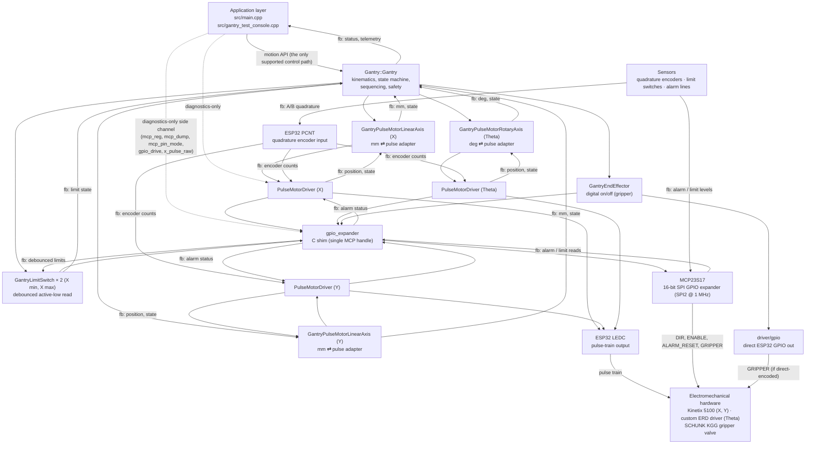

# Gantry Controller — Architecture Flow (canonical)

**Status:** canonical. This document is the single source of truth for the
layered architecture and the control/feedback signal routing. All other docs
(`LIBRARIES_OVERVIEW.md`, `lib/Gantry/docs/ARCHITECTURE.md`,
`PROGRAMMING_REFERENCE.md`) cross-reference this file instead of repeating the
diagram.

---

## 1. Control and feedback tree

Every `fb:`-prefixed edge is an **upstream feedback** edge. The feedback tree is the mirror image of the downstream control tree: sensors → peripherals (PCNT / MCP) → gpio_expander → PulseMotor + GantryLimitSwitch → axis wrappers → Gantry → Application. Note that there is no feedback edge from `GantryEndEffector`: the gripper is a digital output with no sensed state in this revision.

## 2. Invariants

1. **Single entry point.** Application code (`main.cpp`, the `GantryUpdate`
   task body, future MQTT bridge tasks) commands motion exclusively through
   `Gantry::Gantry`. It never constructs a `PulseMotorDriver`, never calls
   `gpio_expander_*`, and never calls `mcp23s17_*` on the normal control path.
2. **Gantry owns three downstream siblings,** not a single pipe:
   - Three axis wrappers (`GantryPulseMotorLinearAxis` for X and Y,
     `GantryPulseMotorRotaryAxis` for Theta), each owning exactly one
     `PulseMotorDriver`.
   - One `GantryEndEffector` (digital on/off, the gripper). It is a sibling of
     the axes, not a child of `PulseMotor` — a pulse-train driver is the wrong
     abstraction for a solenoid valve.
   - One or more `GantryLimitSwitch` instances (currently X min/max; Y and
     Theta are wired at the pin layer but not yet wrapped — backlog).
3. **PulseMotor's hardware surface is narrow.** `PulseMotorDriver` talks
   directly to two ESP32 peripherals (`LEDC` for pulse output, `PCNT` for
   encoder input) and uses `gpio_expander` for every other digital line
   (DIR, ENABLE/SON, ALARM status, ALARM_RESET). It does **not** know about
   the MCP23S17 chip; `gpio_expander` is the single owner of the MCP handle.
4. **gpio_expander is a routing shim, not a driver.** It decides whether a
   given integer pin is an MCP logical pin (`0..15`), a direct ESP32 GPIO
   (`>= 0x10` or flagged with `GPIO_EXPANDER_DIRECT_PIN`), or unwired (`-1`).
   All MCP traffic is serialised inside `lib/MCP23S17` by a per-device mutex.
5. **Intentional diagnostics side channel.** `gantry_test_console.cpp`
   includes commands (`mcp_reg`, `mcp_dump`, `mcp_pin_mode`, `gpio_drive`,
   `x_pulse_raw`, …) that deliberately reach past `Gantry` into
   `gpio_expander` and `PulseMotor` for bring-up and register-level debugging.
   This is **not** architectural leakage; it is a separate diagnostic product
   and is drawn with a dotted arrow in the diagram to keep it distinct from
   the control path.
6. **Boot-time pin seeding goes through Gantry.** The application may need to
   drive `ENABLE`, `GRIPPER`, and `ALARM_RESET` low before any module wakes
   up. That seeding happens through `Gantry::preparePinsForBoot(xDrv, yDrv,
   tDrv, gripperPin)` so the application keeps its single-entry-point
   contract.

## 3. Signal routing table

### 3.1 Downstream (control) signals

| Signal | Owner struct/class | Transport | Destination |
|---|---|---|---|
| `PULSE` (X, Y, Theta step train) | `PulseMotorDriver` | `ledc_*` → direct ESP32 GPIO | Motor driver STEP input |
| `DIR` (X, Y, Theta) | `PulseMotorDriver` | `gpio_expander_write` → `mcp23s17_write_pin` → SPI | Motor driver DIR input |
| `ENABLE` / `SON` (X, Y, Theta) | `PulseMotorDriver` | `gpio_expander_write` → MCP | Motor driver SON input |
| `ALARM_RESET` / `ARST` (X, Y) | `PulseMotorDriver` | `gpio_expander_write` → MCP (pulsed) | Motor driver ARST input |
| `GRIPPER` (digital on/off) | `GantryEndEffector` | `gpio_expander_write` → MCP **or** `gpio_set_level` (direct GPIO) | Gripper solenoid valve |

### 3.2 Upstream (feedback) signals

| Signal | Sensor | Transport | Consumer |
|---|---|---|---|
| Quadrature encoder A/B (X, Y, Theta) | Motor encoder | GPIO → `pulse_cnt` → 64-bit accumulator in `PulseMotorDriver` | `GantryPulseMotor{Linear,Rotary}Axis::getEncoderPulses()` → `Gantry::getXEncoder()` / `getCurrentY()` / `getCurrentTheta()` |
| `ALARM` status (X, Y) | Motor driver open-drain | MCP → `gpio_expander_read` → `PulseMotorDriver::getAlarmStatus()` | `Gantry::isAlarmActive()` / `Gantry::clearAlarm()` |
| `LIMIT_MIN` / `LIMIT_MAX` (X; Y and Theta wired, not yet wrapped) | Inductive switch | MCP → `gpio_expander_read` → `GantryLimitSwitch::read()` with N-sample debounce | `Gantry::home()` / `Gantry::calibrate()` / safety abort |

## 4. Where each layer lives in the repo

| Node in the diagram | Source path |
|---|---|
| Application layer | [`src/main.cpp`](../../../src/main.cpp), [`src/gantry_test_console.cpp`](../../../src/gantry_test_console.cpp) |
| `Gantry::Gantry` | [`lib/Gantry/src/Gantry.h`](../src/Gantry.h), [`lib/Gantry/src/Gantry.cpp`](../src/Gantry.cpp) |
| `GantryPulseMotorLinearAxis` | [`lib/Gantry/src/GantryPulseMotorLinearAxis.h`](../src/GantryPulseMotorLinearAxis.h), [`.cpp`](../src/GantryPulseMotorLinearAxis.cpp) |
| `GantryPulseMotorRotaryAxis` | [`lib/Gantry/src/GantryPulseMotorRotaryAxis.h`](../src/GantryPulseMotorRotaryAxis.h), [`.cpp`](../src/GantryPulseMotorRotaryAxis.cpp) |
| `GantryEndEffector` | [`lib/Gantry/src/GantryEndEffector.h`](../src/GantryEndEffector.h), [`.cpp`](../src/GantryEndEffector.cpp) |
| `GantryLimitSwitch` | [`lib/Gantry/src/GantryLimitSwitch.h`](../src/GantryLimitSwitch.h), [`.cpp`](../src/GantryLimitSwitch.cpp) |
| `PulseMotorDriver` | [`lib/PulseMotor/src/PulseMotor.h`](../../PulseMotor/src/PulseMotor.h), [`.cpp`](../../PulseMotor/src/PulseMotor.cpp) |
| `gpio_expander` (C shim) | [`include/gpio_expander.h`](../../../include/gpio_expander.h), [`src/gpio_expander.c`](../../../src/gpio_expander.c) |
| `MCP23S17` driver | [`lib/MCP23S17/src/MCP23S17.h`](../../MCP23S17/src/MCP23S17.h), [`.cpp`](../../MCP23S17/src/MCP23S17.cpp) |
| LEDC / PCNT / direct GPIO | ESP-IDF `driver/ledc.h`, `driver/pulse_cnt.h`, `driver/gpio.h` |

## 5. What this diagram deliberately does **not** show

- **`WaypointQueue`** — present as scaffolding in `Gantry.h` but not yet
  consumed by the motion state machine; it sits alongside `Gantry::Gantry`
  without changing the control path.
- **ESP-IDF networking (`esp_eth`, `esp_netif`, `esp-mqtt`)** — not currently
  active in the codebase. The planned MQTT pick-and-place bridge is tracked
  in its own plan; when it lands it will attach as an additional consumer of
  `Gantry::Gantry`, *not* as a sibling of `Gantry`.
- **Multiple MCP23S17 devices** — `gpio_expander` is deliberately single
  handle. Adding a second expander is an API change in `gpio_expander.c`, not
  a diagram change here.
